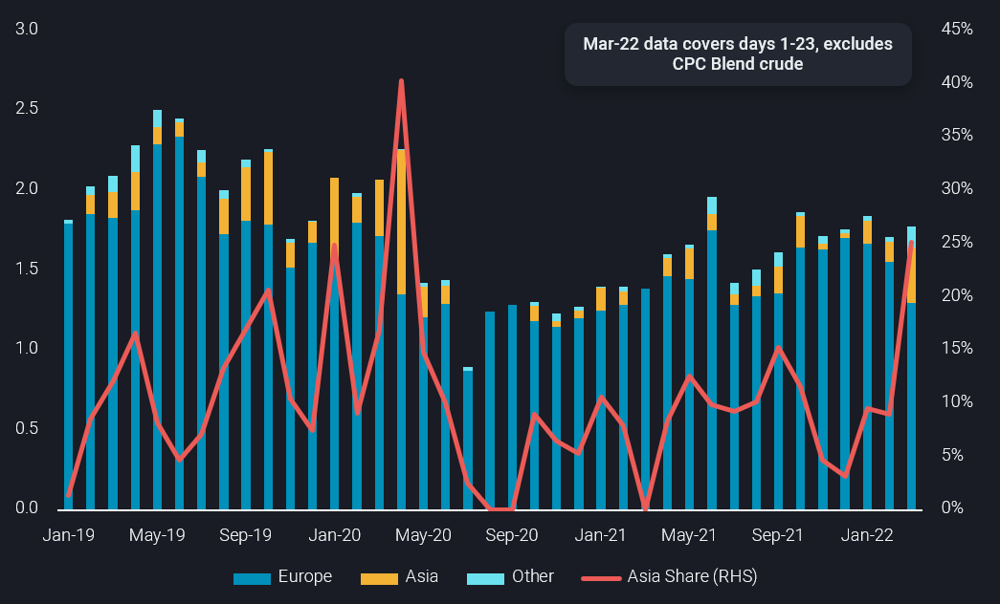

# Russian Baltic and Black Sea crude pivots away from Europe

**Date:** March 26, 2022  
**Publisher:** Breakwave Advisors | **Category:** Market Insights  
**Original URL:** [https://www.breakwaveadvisors.com/insights/2022/3/26/russian-baltic-and-black-sea-crude-pivots-away-from-europe](https://www.breakwaveadvisors.com/insights/2022/3/26/russian-baltic-and-black-sea-crude-pivots-away-from-europe)  

---

*By*[*Jay Maroo*](https://www.linkedin.com/in/jay-m-336a3633/)

A month on from Russia’s invasion into Ukraine, the impact of European and US buyers shunning Russian oil is no longer just moving prices, but also driving change in physcial cargo movements. In this insight, we explore how Russian crude oil is now pivoting away from Europe and shed light on tradeflows that were once deemed unusual, but now may be the start of a new trend.

Russian crude oil exports have been viewed by European and US buyers as highly risky or simply unwanted for a month now, with spot cargo prices for grades such as Urals having dropped and stayed low amid little-to-zero buying interest for weeks. Given the lead time between purchasing activity (or a lack of) in Russian crude, it makes sense that we are only just beginning to see changes in physical flows.

> **Figure 1: Ch1**  
> **Interactive Data & Source:** [Analytics Vortexa](https://analytics.vortexa.com/?dateRange=2019-01-01T00%3A00%3A00.000Z__2022-03-23T23%3A59%3A59.999Z&filtersEnabled=%5B%22p%22%2C%22o%22%2C%22d%22%2C%22d_r%22%2C%22v%22%2C%22intra%22%2C%22sts_o%22%2C%22c_o%22%2C%22c%22%2C%22v_c%22%2C%22v_i%22%2C%22sts%22%2C%22w%22%2C%22v_o%22%2C%22v_t%22%2C%22v_f%22%5D&from=%5B%22c48ec599431027d68fbdc85031399ba463394e0e7dbec392ba3ce6979ee01c15%22%2C%2244a1b0bb0e2afdb98d07b20184550b77449745bb650cb31628fb4c6ceeb64603%22%5D&geoBreakdownDestinationGlobal=trading_region&geoBreakdownOriginGlobal=trading_region&metric=bpd&page=Flows&products=%5B%2254af755a090118dcf9b0724c9a4e9f14745c26165385ffa7f1445bc768f06f11%22%5D&productsExcluded=%5B%22bb70cf56200f5b72ba69a90bda2c6b47ba29da23945c6f1994cfd4c2ef2fe0ff%22%5D&tabId=3c17f17a-304a-40e1-81d5-4197ddc8d2c3&timeSeriesProperty=destination_region&timeSeriesSeasonalToggle=0) | [Local Asset](file:///C:/Users/Dell/Github/Shipping/corpus/03-breakwave/insights/2022/assets/2022-03-26_russian-baltic-and-black-sea-crude-pivots-away-from-europe_img_ch1_1c13b9f67734.png)

The most important change we see so far in March is a marked shift in the destinations for Russian Black Sea and Baltic Sea crude. Total Russian Black Sea and Baltic sea crude exports to all destinations are acutally marginally higher, which suggests any impact of wider sanctions on Russia have not hit crude oil supply and production, at least for now.

The aversion to Russian crude from many European buyers in March is driving a sharp increase in flows to Asia, historically an unusual buyer of Russian Baltic/Black Sea crude. Exports to Europe stand at only 1.3mbd so far in March, down 280kbd m-o-m. In contrast, exports to Asia are up 220kbd over the same period.

Another more telling way to view this change is that Asia's share of Russian Baltic/Black Sea crude exports for March currently stands at 25%, the highest since April 2020 - this was when China scooped up record volumes of very cheap crude amid the price war and Covid-19 induced market glut.

Within Asia, China and India are the sole buyers of recent Russian Baltic/Black Sea crude exports. To date, Asia-bound (most likely China) VLCCs of Russian crude have been built up by Aframaxes loading at Baltic ports, and then transferring via STS offshore Skaw or terminals in ARA. An alternative to this we may see is the loading of Afra/Suezmax tankers from Russian Black Sea ports, which then discharge onto VLCCs in the Mediterranean, potentially offshore Malta, that head eastwards all around Africa.

Indian buyers have, to date, been keener on taking Suezmax cargoes from the Black Sea, along with a single Aframax loaded from the Baltic.

Looking ahead, given the ongoing geopolitical tensions between Russia and the West, Russian crude exports to Europe are likely to trend lower, even without any formal blockade of Russian energy. As a result, we are likely to see rising flows of Russian Baltic and Black Sea crude head east.

Data Source:[Vortexa](https://www.vortexa.com//oil-gas-data-traders-analysts-data-scientists?gclid=Cj0KCQjw8_qRBhCXARIsAE2AtRZKOvMnbilZ_6_91d7huSFFy71pWLrnPwGwOHVzXsmsG-1a1mZnQw8aAt89EALw_wcB&hsa_acc=1782073842&hsa_ad=548425387665&hsa_cam=14746637662&hsa_grp=125038601902&hsa_kw=&hsa_mt=&hsa_net=adwords&hsa_src=g&hsa_tgt=dsa-1431852288425&hsa_ver=3&utm_campaign=%5BCD%5D%20-%20DSA%20-%20EMEA&utm_medium=cpc&utm_medium=ppc&utm_source=google&utm_source=adwords&utm_term=)
