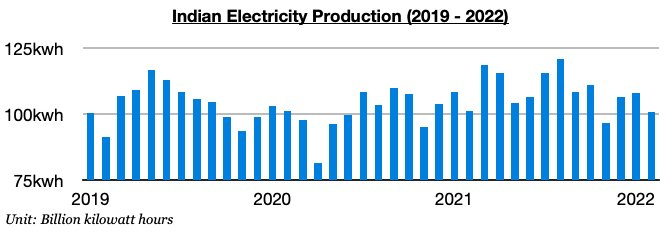
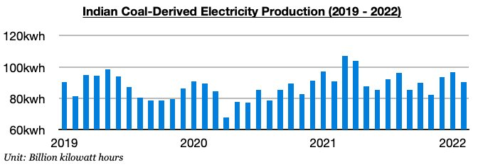
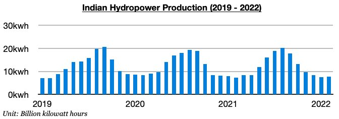

# Another Small Contraction in Indian Electricity Production

**Date:** April 01, 2022  
**Publisher:** Breakwave Advisors | **Category:** Market Insights  
**Original URL:** [https://www.breakwaveadvisors.com/insights/2022/4/1/another-small-contraction-in-indian-electricity-production](https://www.breakwaveadvisors.com/insights/2022/4/1/another-small-contraction-in-indian-electricity-production)  

---

*By*[*Jeffrey Landsberg*](https://www.linkedin.com/in/jeffrey-landsberg-70ab957/)

India produced approximately 100.9 billion kilowatt hours of electricity last month. This is down-on-month by 7.2 billion kilowatt hours (-7%) and down year-on-year by 200 million kilowatt hours. India's electricity production has now contracted on a year-on-year basis for two consecutive months.

> **Figure 1: Chart 1 (24)**  
> [Local Asset](file:///C:/Users/Dell/Github/Shipping/corpus/03-breakwave/insights/2022/assets/2022-04-01_another-small-contraction-in-indian-electricity-production_img_chart1282429_550a41216308.jpg)

India’s coal-derived electricity generation totaled approximately 90.2 billion kilowatt hours of electricity last month. This has marked a month-on-month decline of 6.2 billion kilowatt hours (-7%) and is down year-on-year by 700 million kilowatt hours (-1%). As with total electricity production, India’s coal-derived electricity generation has now contracted on a year-on-year basis for two consecutive months.

> **Figure 2: Chart 2 (21)**  
> [Local Asset](file:///C:/Users/Dell/Github/Shipping/corpus/03-breakwave/insights/2022/assets/2022-04-01_another-small-contraction-in-indian-electricity-production_img_chart2282129_dd23b5baf91f.jpg)

India’s hydropower production totaled approximately 7.8 billion kilowatt hours last month. This has marked a month-on-month increase of 200 million kilowatt hours (3%) and is up year-on-year by 600 million kilowatt hours (8%). In comparison, hydropower production contracted on a year-on-year basis by 4% in January.

> **Figure 3: Chart 3 (17)**  
> [Local Asset](file:///C:/Users/Dell/Github/Shipping/corpus/03-breakwave/insights/2022/assets/2022-04-01_another-small-contraction-in-indian-electricity-production_img_chart3281729_4852f198d62e.jpg)
