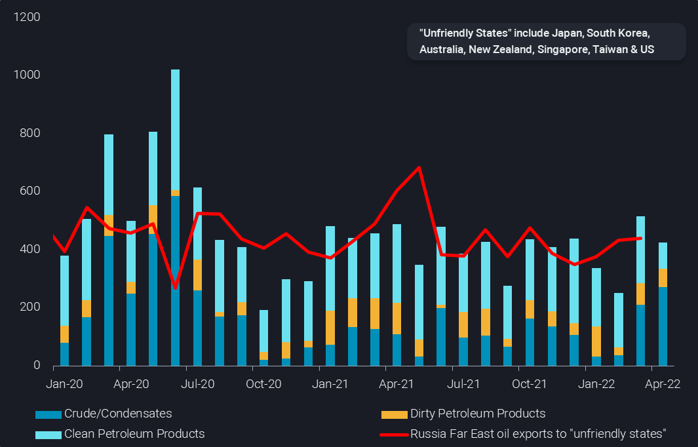
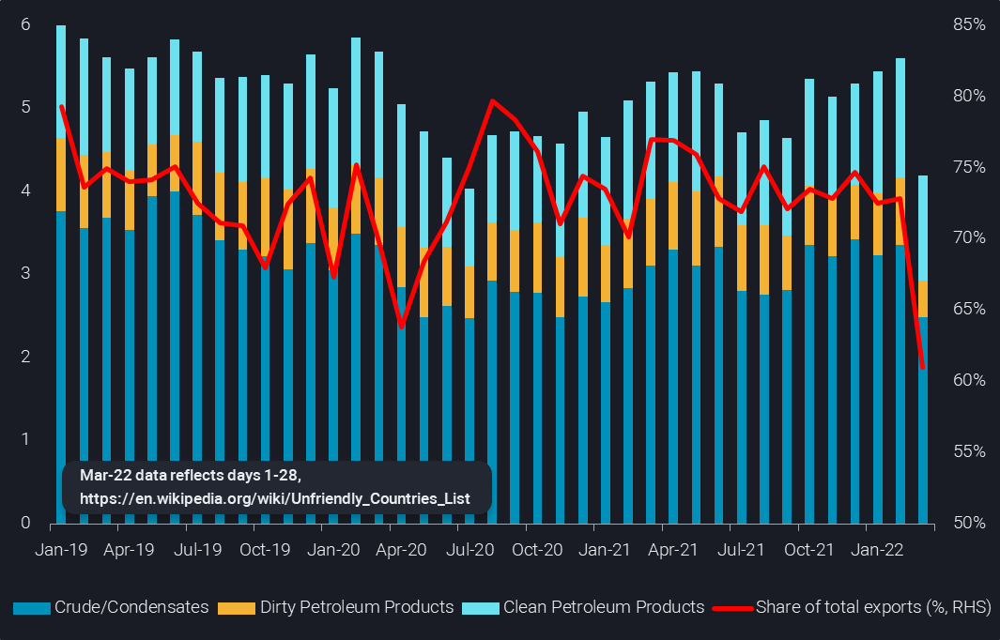
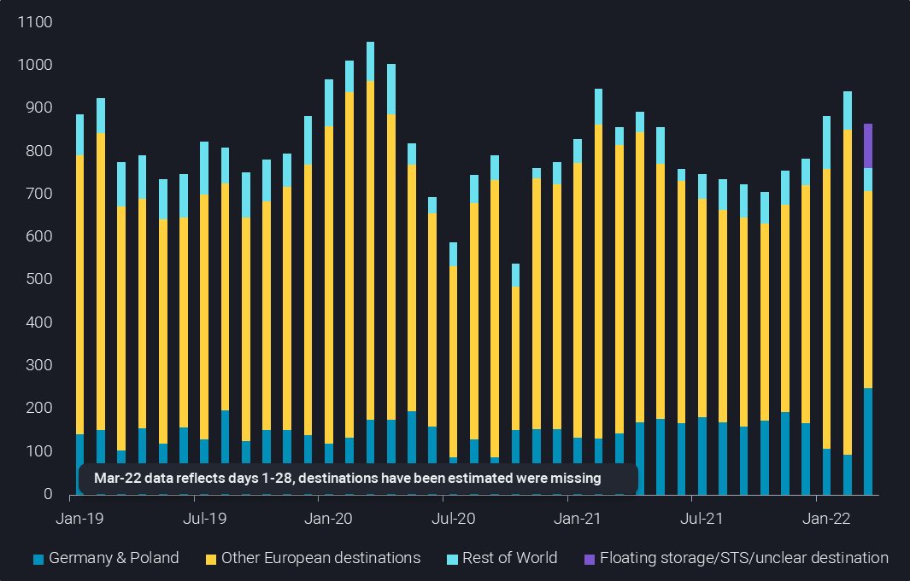
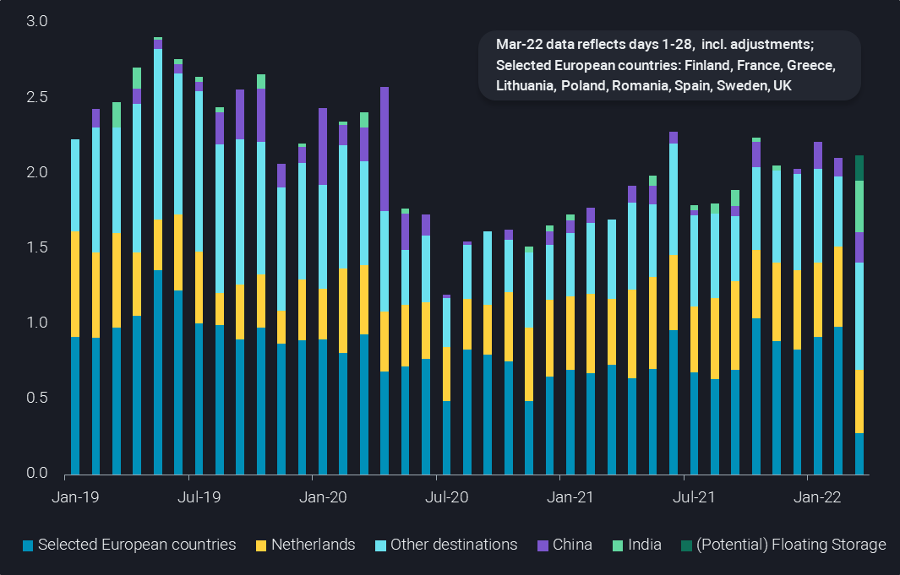

# Russia under strong pressure

**Date:** April 02, 2022  
**Publisher:** Breakwave Advisors | **Category:** Market Insights  
**Original URL:** [https://www.breakwaveadvisors.com/insights/2022/4/1/russia-under-strong-pressure](https://www.breakwaveadvisors.com/insights/2022/4/1/russia-under-strong-pressure)  

---

*By*[*David Wech*](https://www.linkedin.com/in/david-wech-83a163165/)

**As the first full month in the post-Ukraine-invasion era draws to an end, we highlight how much Russia struggles to place oil barrels, with clear cutbacks already visible in product exports. Things are unlikely to improve any time soon, and refinery run cuts are a reality while crude production shut-ins are imminent, if not already happening as well. The role of China, India and a few other countries (potentially) willing to take extra Russian oil is small and slow, when compared to the swift reaction by a huge majority of buyers, many of which Russia terms “unfriendly countries”.**

Some may think there is a big market in Asia for Russian oil, and of course China is a huge offtaker of piped and seaborne Far East crude oil. But apart from these short-haul crude imports, China and India play a minor role as destinations for Russian oil. Exports of seaborne oil, including products, from the European side of Russia (Arctic, Baltic and Black Sea) to China and India account for just some 410kbd since January 2021. In comparison, 450kbd of Russian oil from the Far East went to “unfriendly countries” (see chart), and may now be at risk. So just picking up these barrels would be quite an addition to China’s portfolio, especially as buyers appear to stay so far largely on the side-lines.

> **Figure 1: Ch1**  
> **Interactive Data & Source:** [Analytics Vortexa](https://analytics.vortexa.com/?dateRange=2019-01-01T00%3A00%3A00.000Z__2022-04-30T23%3A59%3A59.999Z&filtersEnabled=%5B%22p%22%2C%22o%22%2C%22d%22%2C%22d_r%22%2C%22v%22%2C%22intra%22%2C%22sts_o%22%2C%22c_o%22%2C%22w%22%5D&from=%5B%22b996521be9c996db3560ca234a56286ac38f798d34be229437555fab4f12a6a5%22%5D&fromExcluded=%5B%22445f0e6e1b4af0893ef0ee0c50786a17b7d1f9d2a186f1bb0454fbc7e3a64bec%22%5D&geoBreakdownOriginGlobal=shipping_region&metric=bpd&movementEvent=unloading_start&page=Flows&productsExcluded=%5B%229b0f7f5de0b111910f9f8a71b4008d4e0fd7542c55750f21dc905cda5f76bc08%22%2C%22bb70cf56200f5b72ba69a90bda2c6b47ba29da23945c6f1994cfd4c2ef2fe0ff%22%5D&tabId=c6f9e5c5-5194-4257-8a66-ff4ad1067951&timeSeriesProperty=product_group&to=%5B%22e6955a2c59dc90833986fe0894cf6718dddaa7816bb51bc955cdd3eb4470e554%22%2C%22b746356b9c2afdce96197d490c00d864c54c432d61f49dd99f70520ce199f8e8%22%5D) | [Local Asset](file:///C:/Users/Dell/Github/Shipping/corpus/03-breakwave/insights/2022/assets/2022-04-02_russia-under-strong-pressure_img_ch1_a46b6804e710.png)

[Asian imports of Russian oil via Europe by group](https://analytics.vortexa.com/?dateRange=2019-01-01T00%3A00%3A00.000Z__2022-04-30T23%3A59%3A59.999Z&filtersEnabled=%5B%22p%22%2C%22o%22%2C%22d%22%2C%22d_r%22%2C%22v%22%2C%22intra%22%2C%22sts_o%22%2C%22c_o%22%2C%22w%22%5D&from=%5B%22b996521be9c996db3560ca234a56286ac38f798d34be229437555fab4f12a6a5%22%5D&fromExcluded=%5B%22445f0e6e1b4af0893ef0ee0c50786a17b7d1f9d2a186f1bb0454fbc7e3a64bec%22%5D&geoBreakdownOriginGlobal=shipping_region&metric=bpd&movementEvent=unloading_start&page=Flows&productsExcluded=%5B%229b0f7f5de0b111910f9f8a71b4008d4e0fd7542c55750f21dc905cda5f76bc08%22%2C%22bb70cf56200f5b72ba69a90bda2c6b47ba29da23945c6f1994cfd4c2ef2fe0ff%22%5D&tabId=c6f9e5c5-5194-4257-8a66-ff4ad1067951&timeSeriesProperty=product_group&to=%5B%22e6955a2c59dc90833986fe0894cf6718dddaa7816bb51bc955cdd3eb4470e554%22%2C%22b746356b9c2afdce96197d490c00d864c54c432d61f49dd99f70520ce199f8e8%22%5D)&[Russia Far East oil exports to “unfriendly states”](https://analytics.vortexa.com/?dateRange=2019-01-01T00%3A00%3A00.000Z__2022-03-28T23%3A59%3A59.999Z&destinationGlobalXFilter=%5B%22bcd7dddaf951959ebf6076a3a594b426a246d3bffe13339b10d04e45f222e011%22%2C%2250182d9d05051a6c8d24f0514d4ee828da6eaa29eacbb11cfe368f51526328ce%22%2C%222d92cc08f22524dba59f6a7e340f132a9da0ce9573cca968eb8e3752ef17a963%22%2C%227fed43c640957555ddac588be64822538078409a0acdaf22126623203ef9954a%22%2C%2224075b270335ddb25b5f3f0fa8d9657f7a39df829ce9fa262f40a41a8758d21c%22%2C%22b15970adfcd316d11d698d13de23e2291a60e1fb05070feab30957c6645e576e%22%2C%22827416db130a1d192979079b62fbc868ccbab176b08412df8f4115efff31c075%22%5D&filtersEnabled=%5B%22p%22%2C%22o%22%2C%22d%22%2C%22d_r%22%2C%22v%22%2C%22intra%22%2C%22sts_o%22%2C%22c_o%22%2C%22w%22%5D&from=%5B%22445f0e6e1b4af0893ef0ee0c50786a17b7d1f9d2a186f1bb0454fbc7e3a64bec%22%5D&geoBreakdownOriginGlobal=shipping_region&metric=bpd&page=Flows&productsExcluded=%5B%229b0f7f5de0b111910f9f8a71b4008d4e0fd7542c55750f21dc905cda5f76bc08%22%5D&sortField=quantity&tabId=c6f9e5c5-5194-4257-8a66-ff4ad1067951)(kbd)

### “Unfriendly” Market for Russian Oil Is Huge

This already hints at how big and relevant the[list of “unfriendly countries”](https://en.wikipedia.org/wiki/Unfriendly_Countries_List)is, when it comes to Russian oil exports. In February, 5.6mbd of Russian seaborne crude and products or 73% of the total were exported to these countries, including pretty much all of Europe, but also the US, Japan, South Korea and Singapore. About a quarter, or 1.4mbd, of these volumes may already be lost for March-loading cargoes, which is extraordinary, given that no law was requiring this adjustment to barrels that were in all likelihood bought ahead of Russia’s invasion in Ukraine. In other words, the main impact of reduced buying on Russian exports and actual discharges is yet to come.

> **Figure 2: Ch2**  
> **Interactive Data & Source:** [Analytics Vortexa](https://analytics.vortexa.com/?dateRange=2019-01-01T00%3A00%3A00.000Z__2022-03-28T23%3A59%3A59.999Z&filtersEnabled=%5B%22p%22%2C%22o%22%2C%22d%22%2C%22d_r%22%2C%22v%22%2C%22intra%22%2C%22sts_o%22%2C%22c_o%22%2C%22w%22%5D&from=%5B%22b996521be9c996db3560ca234a56286ac38f798d34be229437555fab4f12a6a5%22%5D&geoBreakdownOriginGlobal=shipping_region&metric=bpd&page=Flows&productsExcluded=%5B%229b0f7f5de0b111910f9f8a71b4008d4e0fd7542c55750f21dc905cda5f76bc08%22%5D&sortField=quantity&tabId=c6f9e5c5-5194-4257-8a66-ff4ad1067951&timeSeriesProperty=product_group&to=%5B%22f39d455f5d38907394d6da3a91da4e391f9a34bd6a17e826d6042761067e88f4%22%2C%222d92cc08f22524dba59f6a7e340f132a9da0ce9573cca968eb8e3752ef17a963%22%2C%22ef3eaba74dcc1c3e6536e12d4a95d94fe3d32b29f1d217ce6b377049efe60511%22%2C%2250182d9d05051a6c8d24f0514d4ee828da6eaa29eacbb11cfe368f51526328ce%22%2C%22bcd7dddaf951959ebf6076a3a594b426a246d3bffe13339b10d04e45f222e011%22%2C%22b15970adfcd316d11d698d13de23e2291a60e1fb05070feab30957c6645e576e%22%2C%2224075b270335ddb25b5f3f0fa8d9657f7a39df829ce9fa262f40a41a8758d21c%22%2C%22827416db130a1d192979079b62fbc868ccbab176b08412df8f4115efff31c075%22%2C%227fed43c640957555ddac588be64822538078409a0acdaf22126623203ef9954a%22%2C%2274a86f62d0acd138c70368e4021620b4ff48666865d98580e35c55c3d5e72f8d%22%5D&toExcluded=%5B%2269c53542ac9ee1fc4ba65a2af2da93739443a6b6918591ed820793a165b7fb1c%22%2C%2280ccd59a719f2767156694923e74dcea96baa78e9220c697e1e8dddaeef7bd8f%22%2C%229b8bc70a7157cb4ae8712a23476fd320e98bc25ed523de6443ab3e9611d7f583%22%2C%225e4e7b5040b933b5a0f0d2357ed27ebec432c749b9d63ad395f059639a880253%22%2C%22d64020634ef61665444e23e74946dd02b6ab9961efc7aaf52d5c161f3f55a953%22%5D&vesselClassesExcluded=%5B%22tiny_tanker%22%5D) | [Local Asset](file:///C:/Users/Dell/Github/Shipping/corpus/03-breakwave/insights/2022/assets/2022-04-02_russia-under-strong-pressure_img_ch2_7e2b8aec73c2.png)

[Russian seaborne oil exports to “Unfriendly States”](https://analytics.vortexa.com/?dateRange=2019-01-01T00%3A00%3A00.000Z__2022-03-28T23%3A59%3A59.999Z&filtersEnabled=%5B%22p%22%2C%22o%22%2C%22d%22%2C%22d_r%22%2C%22v%22%2C%22intra%22%2C%22sts_o%22%2C%22c_o%22%2C%22w%22%5D&from=%5B%22b996521be9c996db3560ca234a56286ac38f798d34be229437555fab4f12a6a5%22%5D&geoBreakdownOriginGlobal=shipping_region&metric=bpd&page=Flows&productsExcluded=%5B%229b0f7f5de0b111910f9f8a71b4008d4e0fd7542c55750f21dc905cda5f76bc08%22%5D&sortField=quantity&tabId=c6f9e5c5-5194-4257-8a66-ff4ad1067951&timeSeriesProperty=product_group&to=%5B%22f39d455f5d38907394d6da3a91da4e391f9a34bd6a17e826d6042761067e88f4%22%2C%222d92cc08f22524dba59f6a7e340f132a9da0ce9573cca968eb8e3752ef17a963%22%2C%22ef3eaba74dcc1c3e6536e12d4a95d94fe3d32b29f1d217ce6b377049efe60511%22%2C%2250182d9d05051a6c8d24f0514d4ee828da6eaa29eacbb11cfe368f51526328ce%22%2C%22bcd7dddaf951959ebf6076a3a594b426a246d3bffe13339b10d04e45f222e011%22%2C%22b15970adfcd316d11d698d13de23e2291a60e1fb05070feab30957c6645e576e%22%2C%2224075b270335ddb25b5f3f0fa8d9657f7a39df829ce9fa262f40a41a8758d21c%22%2C%22827416db130a1d192979079b62fbc868ccbab176b08412df8f4115efff31c075%22%2C%227fed43c640957555ddac588be64822538078409a0acdaf22126623203ef9954a%22%2C%2274a86f62d0acd138c70368e4021620b4ff48666865d98580e35c55c3d5e72f8d%22%5D&toExcluded=%5B%2269c53542ac9ee1fc4ba65a2af2da93739443a6b6918591ed820793a165b7fb1c%22%2C%2280ccd59a719f2767156694923e74dcea96baa78e9220c697e1e8dddaeef7bd8f%22%2C%229b8bc70a7157cb4ae8712a23476fd320e98bc25ed523de6443ab3e9611d7f583%22%2C%225e4e7b5040b933b5a0f0d2357ed27ebec432c749b9d63ad395f059639a880253%22%2C%22d64020634ef61665444e23e74946dd02b6ab9961efc7aaf52d5c161f3f55a953%22%5D&vesselClassesExcluded=%5B%22tiny_tanker%22%5D)(mbd, LHS) & share in[total exports](https://analytics.vortexa.com/?dateRange=2019-01-01T00%3A00%3A00.000Z__2022-03-28T23%3A59%3A59.999Z&filtersEnabled=%5B%22p%22%2C%22o%22%2C%22d%22%2C%22d_r%22%2C%22v%22%2C%22intra%22%2C%22sts_o%22%2C%22c_o%22%2C%22w%22%5D&from=%5B%22b996521be9c996db3560ca234a56286ac38f798d34be229437555fab4f12a6a5%22%5D&geoBreakdownOriginGlobal=shipping_region&metric=bpd&page=Flows&productsExcluded=%5B%229b0f7f5de0b111910f9f8a71b4008d4e0fd7542c55750f21dc905cda5f76bc08%22%5D&sortField=quantity&tabId=c6f9e5c5-5194-4257-8a66-ff4ad1067951&vesselClassesExcluded=%5B%22tiny_tanker%22%5D)(%, RHS)

### Diesel and Crude Struggle to Find Final Takers

But already in March, Europe-facing exports of clean and dirty products may be down by close to 600kbd from 3mbd in February to just 2.4mbd. The last full week to March 27 saw just 2.1 mbd. This pattern is now also visible in the crucial diesel exports, where exports were down by a third or 340kbd last week. We also observe increasing cases of floating storage, STS transfers and slow-steaming without a clear destination, underpinning the difficulty to place cargoes. So far there is no indication that a wave of vessels is targeting destinations outside the usual European market, indicating limited long-haul interest (made also difficult by massive backwardation and financing needs). Germany and Poland have been the only countries seeing relevant upside so far this month, which is not particularly likely to continue going forward.

> **Figure 3: Ch3**  
> **Interactive Data & Source:** [Analytics Vortexa](https://analytics.vortexa.com/?dateRange=2019-01-01T00%3A00%3A00.000Z__2022-03-28T23%3A59%3A59.999Z&filtersEnabled=%5B%22p%22%2C%22o%22%2C%22d%22%2C%22d_r%22%2C%22v%22%2C%22intra%22%2C%22sts_o%22%2C%22c_o%22%2C%22w%22%5D&from=%5B%22488300bb8d94adfdd2e29bea7f692c69133b016810805dd012245882e2f2f6f7%22%2C%2244a1b0bb0e2afdb98d07b20184550b77449745bb650cb31628fb4c6ceeb64603%22%2C%22c48ec599431027d68fbdc85031399ba463394e0e7dbec392ba3ce6979ee01c15%22%5D&geoBreakdownDestinationGlobal=shipping_region&geoBreakdownOriginGlobal=shipping_region&metric=bpd&page=Flows&products=%5B%22deda35eb9ca56b54e74f0ff370423f9a8c61cf6a3796fcb18eaeeb32a8c290bb%22%5D&sortField=quantity&tabId=c6f9e5c5-5194-4257-8a66-ff4ad1067951&timeSeriesProperty=destination_country&vesselClassesExcluded=%5B%22tiny_tanker%22%5D) | [Local Asset](file:///C:/Users/Dell/Github/Shipping/corpus/03-breakwave/insights/2022/assets/2022-04-02_russia-under-strong-pressure_img_ch3_b27b00415888.png)

For seaborne Russian crude exports, the overall levels remain stable for now. But this hides a dramatic shift away from key buyers, with nine European countries cutting more than 70% or 700kbd on a month-on-month basis (see chart). In contrast to diesel, India is coming in as a strong marginal buyer, taking so far 340kbd of March-loading Russian crude, while China may also take at least 200kbd. As with diesel, various cargoes are drifting or in some form of floating state without evident direction.

> **Figure 4: Ch4**  
> **Interactive Data & Source:** [Analytics Vortexa](https://analytics.vortexa.com/?dateRange=2019-01-01T00%3A00%3A00.000Z__2022-03-28T23%3A59%3A59.999Z&filtersEnabled=%5B%22p%22%2C%22o%22%2C%22d%22%2C%22d_r%22%2C%22v%22%2C%22intra%22%2C%22sts_o%22%2C%22c_o%22%2C%22w%22%5D&from=%5B%2244a1b0bb0e2afdb98d07b20184550b77449745bb650cb31628fb4c6ceeb64603%22%2C%22c48ec599431027d68fbdc85031399ba463394e0e7dbec392ba3ce6979ee01c15%22%2C%22488300bb8d94adfdd2e29bea7f692c69133b016810805dd012245882e2f2f6f7%22%5D&geoBreakdownOriginGlobal=shipping_region&metric=bpd&page=Flows&products=%5B%2254af755a090118dcf9b0724c9a4e9f14745c26165385ffa7f1445bc768f06f11%22%5D&productsBreakdown=group&productsExcluded=%5B%22bb70cf56200f5b72ba69a90bda2c6b47ba29da23945c6f1994cfd4c2ef2fe0ff%22%5D&sortDirection=asc&sortField=vessel_name&tabId=c6f9e5c5-5194-4257-8a66-ff4ad1067951&timeSeriesProperty=destination_country) | [Local Asset](file:///C:/Users/Dell/Github/Shipping/corpus/03-breakwave/insights/2022/assets/2022-04-02_russia-under-strong-pressure_img_ch4_2ac211bb0e3a.png)

### Bold IEA Call Looks Plausible

The current trend suggests that IEA’s bold early call that 2.5-3mbd of Russian oil may have to be shut in as of April - generally embraced by trading companies last week - appears to be in the realm of possibilities. It would mean that roughly 50% of Russian oil exports to “unfriendly countries” would be lost for good, while the other close to 3mbd would partially continue to flow to the original destinations and partly be redirected towards Asia.

### But How Does This Fit with Range-Bound Pricing?

What is somewhat tough to reconcile with this perception - and the now widespread view that OPEC+ will at best only marginally counterbalance these losses - is the fact that WTI moved temporarily below $100/b early this week and diesel cracks and refinery margins are only strong at the very front end. Some combination of the following factors might be at play:

- Concerns about oil demand

- In the short term: direct price effects playing a role, potentially amplified as climate change and political/moral motives join personal expense limitations, especially in Europe
- China’s Covid wave and limited demand for Atlantic Basin crude oil
- More persistent and wider concerns about economic growth, related to the direct fallout of sanctions, and mixing with massive inflation and uncertainty into an increasingly likely global recession
- Interest in financial oil trading suffering from all the uncertainty, massive trading costs and margin calls, and perhaps even some moral responsibility to stay away from going long and thereby supporting Russia (institutional investors such as government or pension funds and banks)
- Hopes in rising oil supply, e.g. from US shale or Iran
- Potentially further SPR releases
- Permanent peace talks (and related hopes) and/or minor chances that Putin may be toppled
- On the diesel crack/refining margin side, hopes for strong refinery runs, especially in producer regions with feedstocks and energy cost advantages (Middle East already shows strong recovery, solid US runs, Brazilian crude throughput at 5-year high), possibly combined with yield shifts and a surprise in China exports

### Who Flinches First?

Overall there are some valid arguments on the list dampening the price upside, especially related to physical and paper demand for oil. But the market has been tight before the Ukraine war, and the downsides are unlikely to counterbalance the looming massive loss of Russian supplies. That would leave much lower Russian production cuts than the IEA projects as balancing factor.

On the one hand, currently relatively weak crude differentials (WAf, US and Middle East grades) could herald big buying plans in the form of private and confidential deals from China, India and a few other players. And on the other hand, the perception may gain grounds that Russia is soon forced to change course, on a combination of lacking military success and horrible energy export perspectives both in the short and long term.

Data Source:[Vortexa](https://www.vortexa.com//oil-gas-data-traders-analysts-data-scientists?gclid=Cj0KCQjw8_qRBhCXARIsAE2AtRZKOvMnbilZ_6_91d7huSFFy71pWLrnPwGwOHVzXsmsG-1a1mZnQw8aAt89EALw_wcB&hsa_acc=1782073842&hsa_ad=548425387665&hsa_cam=14746637662&hsa_grp=125038601902&hsa_kw=&hsa_mt=&hsa_net=adwords&hsa_src=g&hsa_tgt=dsa-1431852288425&hsa_ver=3&utm_campaign=%5BCD%5D%20-%20DSA%20-%20EMEA&utm_medium=cpc&utm_medium=ppc&utm_source=google&utm_source=adwords&utm_term=)
