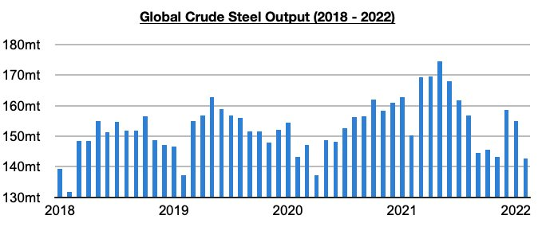
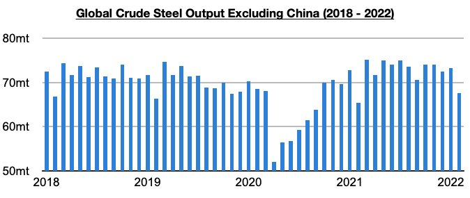
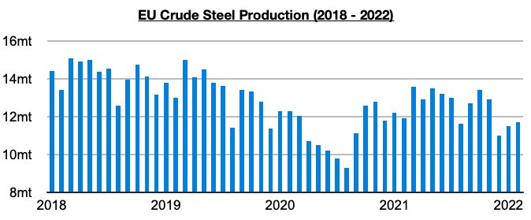
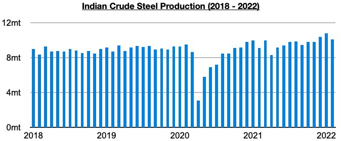
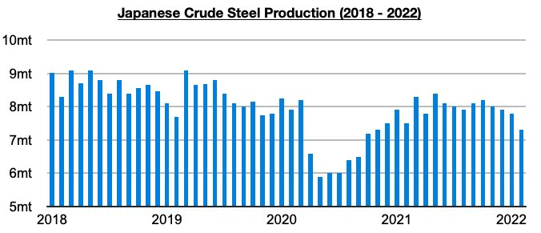

# Global Steel Output Remains Strong Outside China

**Date:** April 04, 2022  
**Publisher:** Breakwave Advisors | **Category:** Market Insights  
**Original URL:** [https://www.breakwaveadvisors.com/insights/2022/4/4/global-steel-output-remains-strong-outside-china](https://www.breakwaveadvisors.com/insights/2022/4/4/global-steel-output-remains-strong-outside-china)  

---

*By*[*Jeffrey Landsberg*](https://www.linkedin.com/in/jeffrey-landsberg-70ab957/)

Global crude steel production totaled 142.7 million tons in February. This is down month-on-month by 12.3 million tons (-8%) and is 7.5 million tons (-5%) less than was reported last year for February 2021’s production. The year-on-year contraction has remained mostly due to the contraction in China. Outside of China, steel production has continued to rise on a year-on-year basis.

> **Figure 1: Chart 1 (25)**  
> [Local Asset](file:///C:/Users/Dell/Github/Shipping/corpus/03-breakwave/insights/2022/assets/2022-04-04_global-steel-output-remains-strong-outside-china_img_chart1282529_a5b8c6e3dee6.jpg)

Global crude steel production outside of China totaled 67.6 million tons in February.. This is down month-on-month by 5.7 million tons (-8%) but is 2.2 million tons (3%) more than was reported last year for February 2021’s production and is still fairly close to the record 75.2 million tons produced in March. Global crude steel production outside of China has now increased on a year-on-year basis for twelve straight months. However, production has again fallen on a year-on-year basis in both the European Union and Japan.

> **Figure 2: Chart 2 (22)**  
> [Local Asset](file:///C:/Users/Dell/Github/Shipping/corpus/03-breakwave/insights/2022/assets/2022-04-04_global-steel-output-remains-strong-outside-china_img_chart2282229_8e80e44004ef.jpg)

The European Union produced approximately 11.7 million tons of crude steel in February.. This is 200,000 tons (2%) more than was produced in January but 200,000 tons (-2%) less than was reported last year for February 2021’s production. EU production has now contracted on a year-on-year basis for three straight months.

> **Figure 3: Chart 3 (18)**  
> [Local Asset](file:///C:/Users/Dell/Github/Shipping/corpus/03-breakwave/insights/2022/assets/2022-04-04_global-steel-output-remains-strong-outside-china_img_chart3281829_86ec258710ab.jpg)

India produced 10.1 million tons of crude steel in February. This is 700,000 tons (-7%) less than was produced in January but is 1 million tons (11%) more than was reported last year for February 2021’s production.

> **Figure 4: Chart 4 (11)**  
> [Local Asset](file:///C:/Users/Dell/Github/Shipping/corpus/03-breakwave/insights/2022/assets/2022-04-04_global-steel-output-remains-strong-outside-china_img_chart4281129_8dd2b7721967.jpg)

Japan produced approximately 7.3 million tons of crude steel in February. This is 500,000 tons (-6%) less than was produced in January and is 200,000 tons (-3%) less than was reported last year for February 2021’s production. Japanese production has now contracted on a year-on-year basis for two straight months.

> **Figure 5: Chart 5 (3)**  
> [Local Asset](file:///C:/Users/Dell/Github/Shipping/corpus/03-breakwave/insights/2022/assets/2022-04-04_global-steel-output-remains-strong-outside-china_img_chart528329_d17def0c4c7d.jpg)

---

**Tags:** Economy, Exports, Steel, China  
