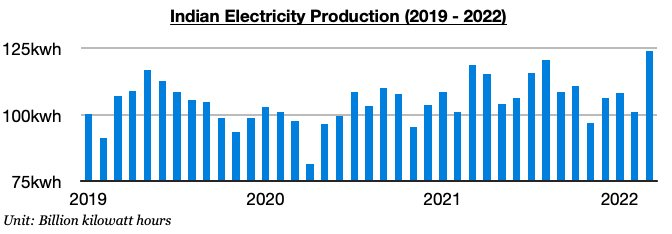
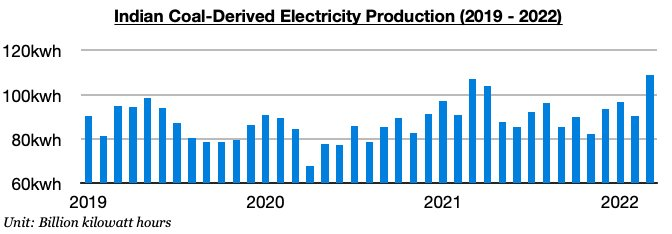
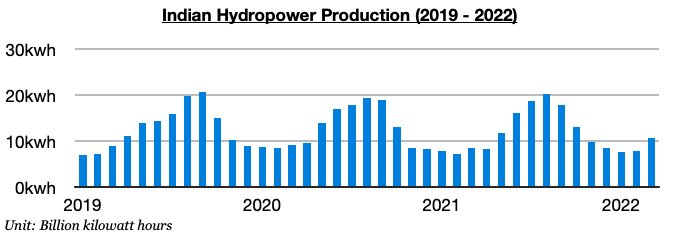

# India's Electricity Production Goes From Contraction To Setting New Record

**Date:** April 07, 2022  
**Publisher:** Breakwave Advisors | **Category:** Market Insights  
**Original URL:** [https://www.breakwaveadvisors.com/insights/2022/4/7/indias-electricity-production-goes-from-contraction-to-setting-new-record](https://www.breakwaveadvisors.com/insights/2022/4/7/indias-electricity-production-goes-from-contraction-to-setting-new-record)  

---

*By*[*Jeffrey Landsberg*](https://www.linkedin.com/in/jeffrey-landsberg-70ab957/)

India produced approximately 123.9 billion kilowatt hours of electricity last month, which is up month-on-month by 23 billion kilowatt hours (23%) and up year-on-year by 5.3 billion kilowatt hours (4%). Previously, electricity production had contracted on a year-on-year basis for two straight months. Electricity production last month set a new record (the previous record was 120.8 billion kilowatt hours produced in August). Also of note is that the 4% year-on-year growth seen last month has marked the strongest growth seen since August.

> **Figure 1: Chart 1 (26)**  
> [Local Asset](file:///C:/Users/Dell/Github/Shipping/corpus/03-breakwave/insights/2022/assets/2022-04-07_indias-electricity-production-goes-from-contraction-to-setting-new-record_img_chart1282629_f8d408c68281.jpg)

India’s coal-derived electricity generation totaled approximately 108.7 billion kilowatt hours of electricity last month. This has marked a month-on-month increase of 18.4 billion kilowatt hours (20%) and is up year-on-year by 1.7 billion kilowatt hours (2%). Coal-derived electricity generation also set a record last month (the previous record was 107 billion kilowatt hours produced in March 2021).

> **Figure 2: Chart 2 (23)**  
> [Local Asset](file:///C:/Users/Dell/Github/Shipping/corpus/03-breakwave/insights/2022/assets/2022-04-07_indias-electricity-production-goes-from-contraction-to-setting-new-record_img_chart2282329_cbe9925405a6.jpg)

India’s hydropower production totaled approximately 10.6 billion kilowatt hours last month. This has marked a month-on-month increase of 2.8 billion kilowatt hours (36%) and is up year-on-year by 2.2 billion kilowatt hours (26%). Although not a record level, hydropower production has now increased on a year-on-year basis during four of the last five months.

> **Figure 3: Chart 3 (19)**  
> [Local Asset](file:///C:/Users/Dell/Github/Shipping/corpus/03-breakwave/insights/2022/assets/2022-04-07_indias-electricity-production-goes-from-contraction-to-setting-new-record_img_chart3281929_e6dd8bda88c9.jpg)

---

**Tags:** Economy, Energy, Crisis, Electricity  
