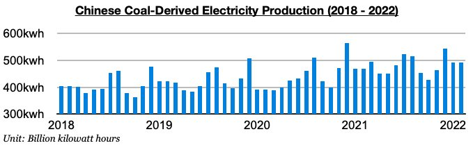

# Large Number of Coal Mine Deaths in China Recently

**Date:** April 11, 2022  
**Publisher:** Breakwave Advisors | **Category:** Market Insights  
**Original URL:** [https://www.breakwaveadvisors.com/insights/2022/4/11/large-number-of-coal-mine-deaths-in-china-recently](https://www.breakwaveadvisors.com/insights/2022/4/11/large-number-of-coal-mine-deaths-in-china-recently)  

---

*By*[*Jeffrey Landsberg*](https://www.linkedin.com/in/jeffrey-landsberg-70ab957/)

As we discussed in a special note sent to our clients last month, what has been going somewhat quietly under the radar recently has been that a large number of accidents and deaths have occurred at Chinese coal mines in recent weeks. This has been coinciding with the government's push to significantly increase domestic coal production. Late February through the end of March alone saw an accident occur at a Tongxin coal mine in Guizhou province resulting in the death of one worker, an accident occur at a Heyang coal mine in Shaanxi province resulting in the deaths of two workers, an accident occur at a Guiyang coal mine in Guizhou province resulting in the deaths of seven workers, and an accident occur at a Sanhe Shunxun coal mine in Guizhou province resulting in the deaths of 14 workers. Also of note is that January and February in total saw 15 coal mine accidents and 29 deaths throughout China, which is up year-on-year by 15% and 93% respectively.

In previous years, coal mine accidents received much more attention in China and were often followed by regional and national inspections and restrictions. After China began to experience a coal shortage leading up to last winter, however, a shift occurred in which increasing coal production became much more of a priority than new safety inspections and restrictions. This has remained the case so far this year.

The most recently released data shows that China's coal production grew year-on-year by 11% during January and February.

> **Figure 1: Chart 2 (24)**  
> [Local Asset](file:///C:/Users/Dell/Github/Shipping/corpus/03-breakwave/insights/2022/assets/2022-04-11_large-number-of-coal-mine-deaths-in-china-recently_img_chart2282429_8c9bdb6b9c8a.jpg)

In comparison, China's thermal coal-derived electricity generation grew year-on-year by just 5%.

> **Figure 2: Chart 2 (24)**  
> [Local Asset](file:///C:/Users/Dell/Github/Shipping/corpus/03-breakwave/insights/2022/assets/2022-04-11_large-number-of-coal-mine-deaths-in-china-recently_img_chart2282429_8c9bdb6b9c8a.jpg)

Going forward, it remains to be seen if the government will shift again and start focusing much more on safety in the near future. For now, coal production growth in China continues to fare much better than growth in the nation's thermal coal-derived generation.

---

**Tags:** China, Coal, Exports, Commodities, Economy  
