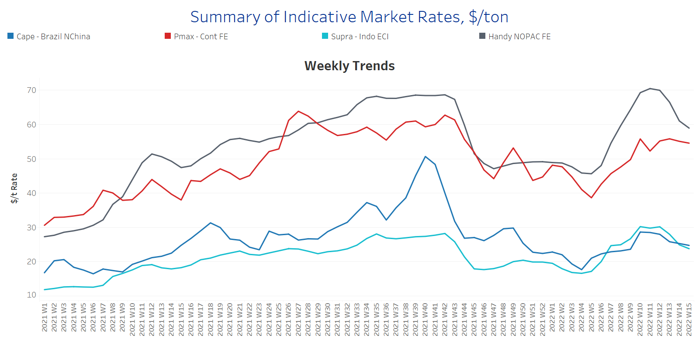
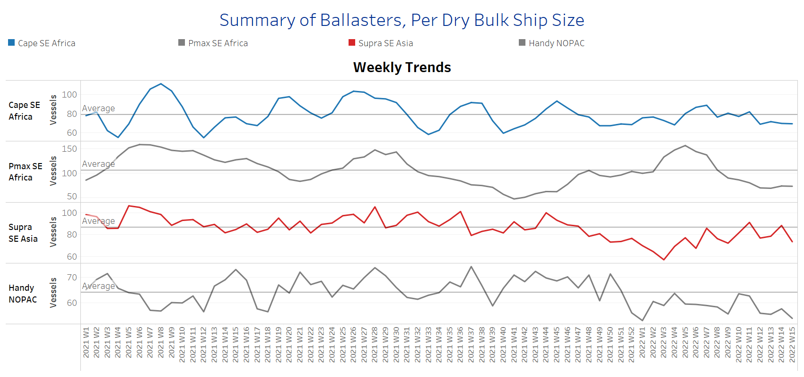
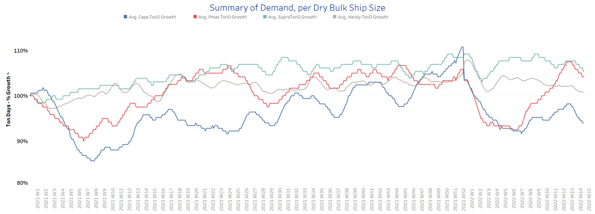
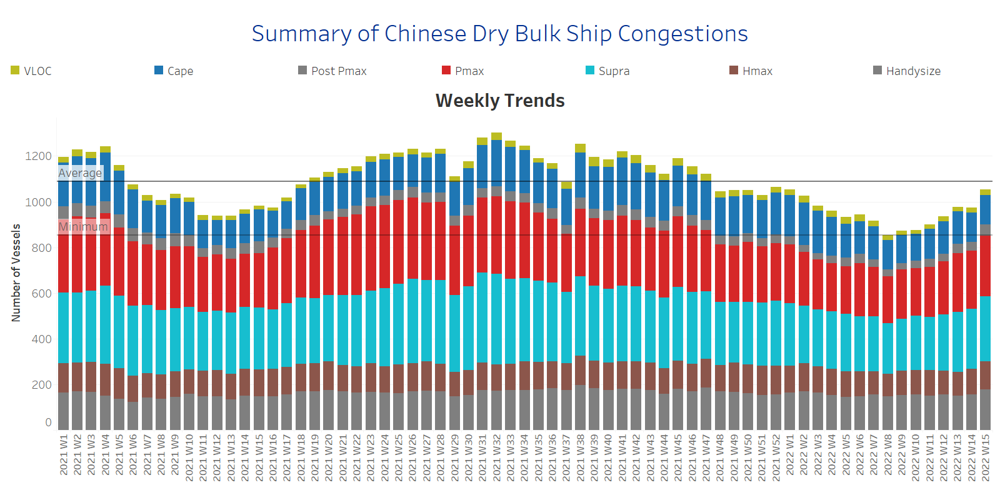

# Signal Dry Bulk Weekly Report

**Date:** April 13, 2022  
**Publisher:** Breakwave Advisors | **Category:** Market Insights  
**Original URL:** [https://www.breakwaveadvisors.com/insights/2022/4/13/signal-dry-bulk-weekly-report](https://www.breakwaveadvisors.com/insights/2022/4/13/signal-dry-bulk-weekly-report)  

---

Dry bulk freight rates have sustained a weaker momentum for the first half of April, while the demand ton-days growth continues to decrease, but is expected to recover once Covid-19 cases in China start to calm down.

In the iron ore market, seaborne iron ore prices dropped on Monday due to depressed market sentiment. Prices for iron ore cargoes with a 63.5% iron content for delivery into Tianjin dropped to below $150/t, pressured by fears that the coronavirus outbreak in China could dampen economic growth and metals demand in the world’s second-largest economy.

In the coal market, Newcastle coal futures, the benchmark for the top consuming region of Asia, consolidated around the $300/t after the European Union announced a ban on Russian coal imports from August onwards. In March, coal hit a record high of $430/t, as the Ukraine war prompted users to seek alternatives to Russian shipments and as an economic rebound from the pandemic sparked further demand for fossil fuels.

Chicago wheat futures rose past $10.70 per bushel, a two-week high and over 25% above prices before the war in Ukraine as investors weighed on the Food and Agriculture Organization (FAO) report and the impact of additional sanctions on grain supply. Wheat production data in 2022 is forecasted to drop below the 5-year average in Ukraine, with at least 20% of winter plantations not being harvested due to direct destruction, constrained access, or lack of resources to harvest the crop. The FAO report emphasized there is high uncertainty with the expected wheat output for Russia, as sweeping sanctions and a declining economy could raise shortages of agricultural inputs.

## Section 1 - Freight -Market Rates ($/T) - Weaker

‘The Big Picture’ - Capesize and Panamax Bulkers and Smaller Ship Sizes

> **Figure 1: Ch1**  
> **Interactive Data & Source:** [Signal Ocean Platform](https://www.thesignalgroup.com/signal-ocean-platform) | [Local Asset](file:///C:/Users/Dell/Github/Shipping/corpus/03-breakwave/insights/2022/assets/2022-04-13_signal-dry-bulk-weekly-report_img_ch1_a3e6a85b4ee8.png)

A weaker sentiment of freight rates is sustained for the second week of April with losses on small and large vessel size categories. Handysize presents the sharpest decrease among the vessel sizes.

- **Capesize**Brazil-to-North China freight rates dropped to less than $25/t, but are still above the lows of Week 10 of this year at levels of around $18/t.
- **Panamax**Continent-to-Far East freight hovers at levels less than $55/t but still keeps robust levels compared to the bottom of $39/t at the ending of Week 4.
- **Supramax**Indo-to-ECI freight rates continue their free-fall with levels now less than $24/t, which is around $6/t less than the peak of Week 12 ~ $30/t.
- **Handysize**NOPAC-to-Far East freight rates continued their decrease since the ending of Week 11. Rates decreased to less than $60/t in the second week of April, which is almost $10/t down from the peak of Week 11.

## Section 2 - Supply - Ballasters View

## Number of Vessels -Decreasing

Supply Trend Lines for Key Load Areas

> **Figure 2: Ch2**  
> **Interactive Data & Source:** [Signal Ocean Platform](https://www.thesignalgroup.com/signal-ocean-platform) | [Local Asset](file:///C:/Users/Dell/Github/Shipping/corpus/03-breakwave/insights/2022/assets/2022-04-13_signal-dry-bulk-weekly-report_img_ch2_5f2a9d3dea4b.png)

The number of ballasters signals a decreasing trend for all vessel size categories for the second week of April at levels below the one-year average in all vessel size categories, despite the upward movement last week.

- **Capesize**SE Africa: The number of vessels sailing in ballast held a pace of around 70 vessels, which is 12 vessels less than the last peak of Week 11.
- **Panamax**SE Africa: The number of vessels sailing in ballast is now around 76 vessels, which is 50% down from the accelerated figure during Week 5.
- **Supramax**SE Asia: The number of vessels sailing in ballast dropped to 70 vessels, which is around 19 vessels less than the last week, while it seems that the trend will continue with a sharp decrease over the next few days.
- **Handysize**NOPAC: The number of vessels sailing in ballast despite indications of an increase remains below the one-year average of 64 vessels and is now around 59 vessels.

## Section 3 - Demand - In Ton Days

## Decreasing

> **Figure 3: Ch3**  
> **Interactive Data & Source:** [Signal Ocean Platform](https://www.thesignalgroup.com/signal-ocean-platform) | [Local Asset](file:///C:/Users/Dell/Github/Shipping/corpus/03-breakwave/insights/2022/assets/2022-04-13_signal-dry-bulk-weekly-report_img_ch3_aed367817857.png)

The overall trend of demand ton-days keeps decreasing, while there is a sharp downward trajectory in the Capesize and Panamax segment.

- **Capesize**demand ton-days: There is a sustained decrease for two consecutive weeks compared to the peak during Week 12.
- **Panamax**demand ton-days: The downward trend comes almost in the same timeline as the demand evolution of the Capesize segment.
- **Supramax**demand ton-days: There is a sustained downward trend but with a softer pace of decrease compared to the large vessel sizes.
- **Handysize**demand ton-days: Ton days growth continues slowing while there are no signs of a rebound since the ending of Week 10.

## Section 4 - Chinese Port Congestions -

## Number of Vessels - Increasing

## Dry Bulk Ships Congested at Chinese Ports

> **Figure 4: Ch4**  
> **Interactive Data & Source:** [Signal Ocean Platform](https://www.thesignalgroup.com/signal-ocean-platform) | [Local Asset](file:///C:/Users/Dell/Github/Shipping/corpus/03-breakwave/insights/2022/assets/2022-04-13_signal-dry-bulk-weekly-report_img_ch4_632438262015.png)

Dry bulk ships in congestion have shown a sharp increase for the second week of April, stemming mainly from the Handysize and Supramax segment.

- **Capesize**: The number of ships in congestion increased to 132 vessels when last week we saw the figure not surpassing the limit of 130 vessels.
- **Panamax**: There is a slight increase to 262 ships in congestion, which is eventually almost 7 vessels more than the ending of the previous week.
- **Supramax**: There is a significant increase to 278 vessels when last week we saw numbers around 260 vessels.
- **Handysize**: The number of ships in congestion increased to 175 vessels, which is 12% up from the previous week.

Data Source:[Signal Ocean Platform](https://www.thesignalgroup.com/signal-ocean-platform)

---

**Tags:** Shipping, Dry Bulk, Freight, Rates  
