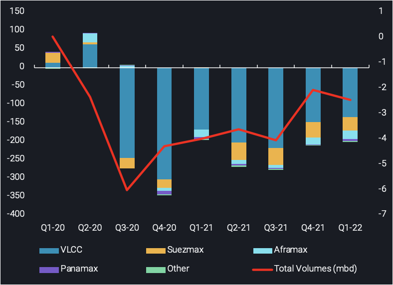
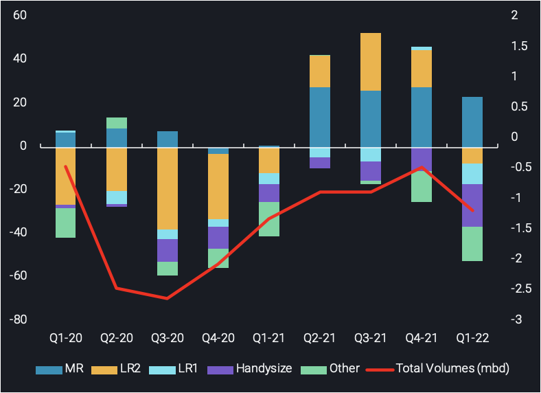

# Q1 2022 tonne-mile review

**Date:** April 16, 2022  
**Publisher:** Breakwave Advisors | **Category:** Market Insights  
**Original URL:** [https://www.breakwaveadvisors.com/insights/2022/4/16/q1-2022-tonne-mile-review](https://www.breakwaveadvisors.com/insights/2022/4/16/q1-2022-tonne-mile-review)  

---

*By*[*Dylan Simpson*](https://www.linkedin.com/in/dylan-simpson-225013135/)

**As we move into the second quarter of this year, we analyse the effects of recent developments on the tonne-mile demand of crude and clean tanker fleets. Individual crude tanker classes are indicating a tonne-mile trend reversal, as well as clean LR tankers, while MRs have shown signs of continued strength in the months ahead.**

### Crude: VLCC Tonne-Miles Prevail, But Trade Shifts Mean a Reversal Is on the Cards

Global crude exports have held at a similar level to last quarter, with a decrease of less than 0.5mbd q-o-q. Tanker tonne-mile demand is still below 2019 levels overall, however, have trended upwards over the last 3 quarters. Strength in tanker demand has stemmed mainly from VLCCs, with Suezmaxes and Aframaxes dampening the recovery.

VLCC tonne-miles have increased across the board on a quarterly basis. This can be said for vessels out of the[Middle East Gulf (MEG), Atlantic Basin (US Gulf, South America and West Africa)](https://analytics.vortexa.com/?dateRange=2021-01-01T00%3A00%3A00.000Z__2022-04-11T23%3A59%3A59.999Z&frequency1=quarter&frequency2=quarter&geoBreakdownDestinationGlobal=trading_region&geoBreakdownOriginGlobal=trading_region&originGlobalXFilter=%5B%220899599f74faadb7ba7eb65205ee5c20cb434367a6e7203bc274d310cdb54754%22%2C%224e79eb8e84d26f5c3c0006283bc1aa52c170b58d667be9848e136afea91a57e9%22%2C%225e0cb0b66780a00576309aecff1b65934fc580d775bab29ac2a79397d8544e04%22%2C%2244bbc77b3eb859ff3135f669b152afb76b56434e7faae835e601d8cc6af110eb%22%5D&page=FleetUtilisation&primarySplitProperty1=origin_trading_region&products=%5B%2254af755a090118dcf9b0724c9a4e9f14745c26165385ffa7f1445bc768f06f11%22%2C%225de0b00094e0fd7542c10f9f8a71b4008d55750f21dc905cda9b0f7f5f76bc08%22%5D&secondaryTimeSeries1=hide&tabId=46d966b9-07a9-4569-a584-3fc8a0c9aaf5&vesselClasses=%5B%22vlcc_plus%22%5D)and more recently the Baltic region, with more cargoes reaching Asia during the post-Russian-Ukraine conflict era. Despite the positive trend in tonne-miles seen since Q3 2021, there has been an increase in VLCC fixtures being worked out of US Gulf and West Africa, destined to Northwest Europe.

Looking ahead, limited crude demand in East Asia due to new covid outbreaks and a looming refinery maintenance season, could steer more laden VLCCs towards Europe instead. This would ultimately shorten voyages, and in turn reduce VLCC tonne-miles at a global level.

Suezmax tonne-miles remained unchanged in Q1, with tonne-miles sitting stubbornly flat at 7% below pre-pandemic levels since Q2 of 2021, despite shifting trade patterns post-conflict. Aframax tonne-miles accelerated to the downside across the board in the last two quarters, with only tonne-miles out of the[Black Sea](https://analytics.vortexa.com/?dateRange=2021-01-01T00%3A00%3A00.000Z__2022-04-11T23%3A59%3A59.999Z&frequency1=quarter&frequency2=quarter&geoBreakdownDestinationGlobal=trading_region&geoBreakdownOriginGlobal=trading_region&originGlobalXFilter=%5B%22c7ed437dedaec3ea48a0efa5c3c78bd22bc71f9c6f9f44d667801ea633b059f1%22%5D&page=FleetUtilisation&primarySplitProperty1=origin_trading_region&products=%5B%2254af755a090118dcf9b0724c9a4e9f14745c26165385ffa7f1445bc768f06f11%22%5D&secondaryTimeSeries1=hide&tabId=46d966b9-07a9-4569-a584-3fc8a0c9aaf5&vesselClasses=%5B%22aframax%22%5D)showing a q-o-q increase.

The current trend in Suez/Aframax tonne-miles is likely to reverse in the coming months. Both tanker classes are expected to benefit from increased transatlantic flows following the SPR release by the US from May onwards. More specifically there are encouraging signs for Suezmax tanker demand for the second quarter of the year. Since the Russia-Ukraine conflict, demand for West Africa-to-Europe - a route predominantly satisfied by Suezmaxes - has strengthened. Additionally, the prospective CPC production recovery in the Black Sea is poised to add to this demand.

> **Figure 1: Pasted Image 0 (4)**  
> **Interactive Data & Source:** [Analytics Vortexa](https://analytics.vortexa.com/?dateRange=2021-01-01T00%3A00%3A00.000Z__2022-04-11T23%3A59%3A59.999Z&frequency1=quarter&frequency2=quarter&geoBreakdownDestinationGlobal=trading_region&geoBreakdownOriginGlobal=trading_region&originGlobalXFilter=%5B%222b394b41a7ff9e48b40b4ba8e6a6b045340261dfc02133d04af13fe754a71a48%22%2C%224e79eb8e84d26f5c3c0006283bc1aa52c170b58d667be9848e136afea91a57e9%22%2C%226aa9a4fb76ca378e75eff85f458c90f7fd42778c26c957c417490c097161a3c5%22%2C%228caa32ab75a70f29578b0f80cb328fbfb0f0e2cf8b79b68e308a66c1ee7707a9%22%2C%22c7ed437dedaec3ea48a0efa5c3c78bd22bc71f9c6f9f44d667801ea633b059f1%22%5D&page=FleetUtilisation&products=%5B%22b68cbb746f8b9098c50e2ba36bcad83001a53bd362e9031fb49085d02c36659c%22%5D&secondaryTimeSeries1=hide&tabId=46d966b9-07a9-4569-a584-3fc8a0c9aaf5&vesselClasses=%5B%22handymax%22%5D) | [Local Asset](file:///C:/Users/Dell/Github/Shipping/corpus/03-breakwave/insights/2022/assets/2022-04-16_q1-2022-tonne-mile-review_img_pastedimage028429_1b2cc39a56ef.png)

Crude tonne-mile change from 2019 average (bn) by vessel class (LHS) and global seaborne crude exports (mbd)

### Cpp: Mrs Holding Strong As Clean Tanker Demand Falters

Global CPP exports were slightly down for Q1 but overall stable, holding just under pre-pandemic levels. Total tanker demand, however, is declining, dipping below the 2019 average for the first time since Q1 2021. This is despite a relatively strong MR performance, the only clean tanker class still holding above 2019 levels.

Nevertheless on a q-o-q basis, MR tonne-miles are down marginally by 4bn or 1% since last quarter. Tonne-mile declines can be attributed to flows out of the[USG, Mediterranean, East Asia, Baltic and Black Sea](https://analytics.vortexa.com/?dateRange=2021-01-01T00%3A00%3A00.000Z__2022-04-11T23%3A59%3A59.999Z&frequency1=quarter&frequency2=quarter&geoBreakdownDestinationGlobal=trading_region&geoBreakdownOriginGlobal=trading_region&originGlobalXFilter=%5B%222b394b41a7ff9e48b40b4ba8e6a6b045340261dfc02133d04af13fe754a71a48%22%2C%224e79eb8e84d26f5c3c0006283bc1aa52c170b58d667be9848e136afea91a57e9%22%2C%226aa9a4fb76ca378e75eff85f458c90f7fd42778c26c957c417490c097161a3c5%22%2C%228caa32ab75a70f29578b0f80cb328fbfb0f0e2cf8b79b68e308a66c1ee7707a9%22%2C%22c7ed437dedaec3ea48a0efa5c3c78bd22bc71f9c6f9f44d667801ea633b059f1%22%5D&page=FleetUtilisation&products=%5B%22b68cbb746f8b9098c50e2ba36bcad83001a53bd362e9031fb49085d02c36659c%22%5D&secondaryTimeSeries1=hide&tabId=46d966b9-07a9-4569-a584-3fc8a0c9aaf5&vesselClasses=%5B%22handymax%22%5D)regions with increases out of[Northwest Europe](https://analytics.vortexa.com/?dateRange=2021-01-01T00%3A00%3A00.000Z__2022-04-11T23%3A59%3A59.999Z&frequency1=quarter&frequency2=quarter&geoBreakdownDestinationGlobal=trading_region&geoBreakdownOriginGlobal=trading_region&originGlobalXFilter=%5B%22404adf58e8c570e2774157bba1a5583cae4ce2e4653f68d870303e58a09461f9%22%2C%22a50f4a476665d3d507f54398b1a1aed1746c5469619c83c3398716724f8dda27%22%5D&page=FleetUtilisation&primarySplitProperty1=origin_trading_region&products=%5B%22b68cbb746f8b9098c50e2ba36bcad83001a53bd362e9031fb49085d02c36659c%22%5D&secondaryTimeSeries1=hide&tabId=46d966b9-07a9-4569-a584-3fc8a0c9aaf5&vesselClasses=%5B%22handymax%22%5D)and the[MEG](https://analytics.vortexa.com/?dateRange=2021-01-01T00%3A00%3A00.000Z__2022-04-11T23%3A59%3A59.999Z&frequency1=quarter&frequency2=quarter&geoBreakdownDestinationGlobal=trading_region&geoBreakdownOriginGlobal=trading_region&originGlobalXFilter=%5B%220899599f74faadb7ba7eb65205ee5c20cb434367a6e7203bc274d310cdb54754%22%5D&page=FleetUtilisation&products=%5B%22b68cbb746f8b9098c50e2ba36bcad83001a53bd362e9031fb49085d02c36659c%22%5D&secondaryTimeSeries1=hide&tabId=46d966b9-07a9-4569-a584-3fc8a0c9aaf5&vesselClasses=%5B%22handymax%22%5D). Evidently, the slight hesitation in tonne-miles stemmed from decreases in longer haul voyages, specifically[Europe-to-USG](https://analytics.vortexa.com/?dateRange=2021-01-01T00%3A00%3A00.000Z__2022-04-11T23%3A59%3A59.999Z&frequency1=quarter&frequency2=quarter&geoBreakdownDestinationGlobal=trading_region&geoBreakdownOriginGlobal=trading_region&originGlobalXFilter=%5B%22a50f4a476665d3d507f54398b1a1aed1746c5469619c83c3398716724f8dda27%22%2C%22404adf58e8c570e2774157bba1a5583cae4ce2e4653f68d870303e58a09461f9%22%5D&page=FleetUtilisation&primarySplitProperty1=destination_trading_region&products=%5B%22b68cbb746f8b9098c50e2ba36bcad83001a53bd362e9031fb49085d02c36659c%22%5D&secondaryTimeSeries1=hide&tabId=46d966b9-07a9-4569-a584-3fc8a0c9aaf5&vesselClasses=%5B%22handymax%22%5D)voyages, while short haul voyages such as[MEG-to-East Africa](https://analytics.vortexa.com/?dateRange=2021-01-01T00%3A00%3A00.000Z__2022-04-11T23%3A59%3A59.999Z&frequency1=quarter&frequency2=quarter&geoBreakdownDestinationGlobal=trading_region&geoBreakdownOriginGlobal=trading_region&originGlobalXFilter=%5B%220899599f74faadb7ba7eb65205ee5c20cb434367a6e7203bc274d310cdb54754%22%5D&page=FleetUtilisation&primarySplitProperty1=destination_trading_region&products=%5B%22b68cbb746f8b9098c50e2ba36bcad83001a53bd362e9031fb49085d02c36659c%22%5D&secondaryTimeSeries1=hide&tabId=46d966b9-07a9-4569-a584-3fc8a0c9aaf5&vesselClasses=%5B%22handymax%22%5D)increased. Despite the overall marginal decline, seasonal diesel demand in South America for power generation, as well as increased diesel flows towards Europe (which seeks to shun Russian diesel), could provide enough support to maintain strong MR performance.

LR1 and LR2 tonne-miles missed 2019 levels between Q4 2021 and Q1 2022, with both tanker class’ tonne-miles falling below the 2019 average. It is noteworthy that LR2s began to struggle in Q4 2021, after trending upwards for the prior five consecutive quarters, while LR1 underperformance has been more consistent (see chart below).

> **Figure 2: Cpp Tonne-Mile Change From 2019 Average (Bn) by Vessel Class**  
> *CPP tonne-mile change from 2019 average (bn) by vessel class (LHS) and global seaborne CPP exports (mbd)*  
> **Interactive Data & Source:** [Analytics Vortexa](https://analytics.vortexa.com/?dateRange=last-exact-quarter&filtersEnabled=%5B%22p%22%2C%22o%22%2C%22d%22%2C%22d_r%22%2C%22v%22%2C%22intra%22%2C%22sts_o%22%2C%22c_o%22%2C%22w%22%5D&frequency=week&metric=bpd&page=Flows&products=%5B%223e4db72ef7027de928ce55703a213a546fd86d2debe6f2e9c85f3a5f9d53e8dd%22%5D&tabId=9bd621ca-e761-485b-b308-18da5cc93ef0&timeSeriesProperty=destination_shipping_region) | [Local Asset](file:///C:/Users/Dell/Github/Shipping/corpus/03-breakwave/insights/2022/assets/2022-04-16_q1-2022-tonne-mile-review_img_pastedimage028529_494568d66f83.png)

LR tanker tonne-miles have struggled recently, mainly owing to weak naphtha demand in[East Asia](https://analytics.vortexa.com/?dateRange=last-exact-quarter&filtersEnabled=%5B%22p%22%2C%22o%22%2C%22d%22%2C%22d_r%22%2C%22v%22%2C%22intra%22%2C%22sts_o%22%2C%22c_o%22%2C%22w%22%5D&frequency=week&metric=bpd&page=Flows&products=%5B%223e4db72ef7027de928ce55703a213a546fd86d2debe6f2e9c85f3a5f9d53e8dd%22%5D&tabId=9bd621ca-e761-485b-b308-18da5cc93ef0&timeSeriesProperty=destination_shipping_region), with diesel flows out of India and towards Europe acting as alternative routes for these vessel classes. Despite this alternative route being of similar mileage, tonnes carried on this route are not able to offset the losses seen on the naphtha trade, effectively absorbing less LR tankers. Throughout Q2 2022, European diesel demand is expected to remain strong as the search for alternatives to Russian barrels continues. At the same time, naphtha cracker margins have recorded a 5-month high according to Argus Media. If this is sustained it could signal a recovery in naphtha demand, thus LR tankers could be spoiled for choice and reverse the current trend in tonne-miles.

Data Source:[Vortexa](https://www.vortexa.com//oil-gas-data-traders-analysts-data-scientists?gclid=Cj0KCQjw8_qRBhCXARIsAE2AtRZKOvMnbilZ_6_91d7huSFFy71pWLrnPwGwOHVzXsmsG-1a1mZnQw8aAt89EALw_wcB&hsa_acc=1782073842&hsa_ad=548425387665&hsa_cam=14746637662&hsa_grp=125038601902&hsa_kw=&hsa_mt=&hsa_net=adwords&hsa_src=g&hsa_tgt=dsa-1431852288425&hsa_ver=3&utm_campaign=%5BCD%5D%20-%20DSA%20-%20EMEA&utm_medium=cpc&utm_medium=ppc&utm_source=google&utm_source=adwords&utm_term=)
