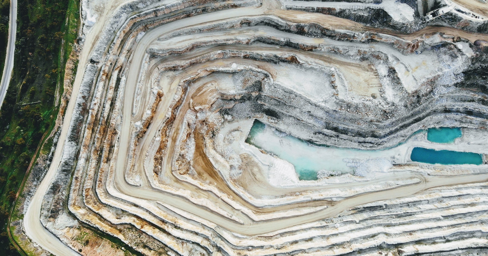
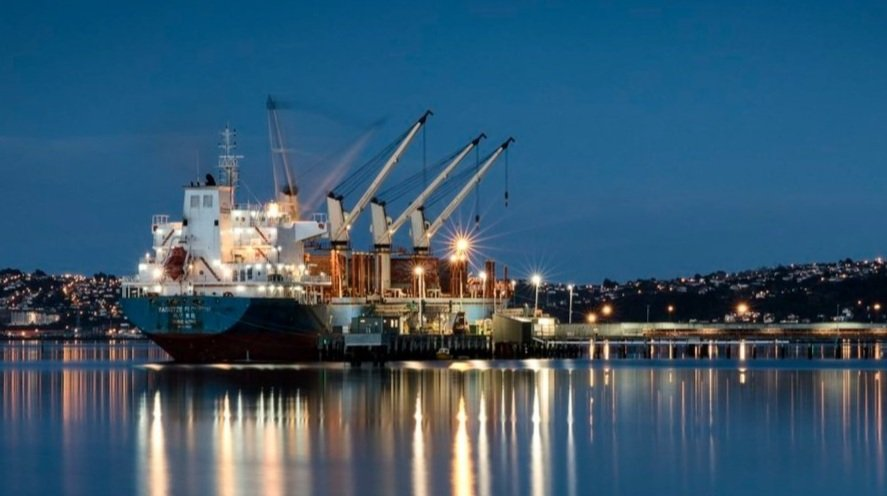

# Weekly Insights Review

**Date:** April 17, 2022  
**Publisher:** Breakwave Advisors | **Category:** Market Insights  
**Original URL:** [https://www.breakwaveadvisors.com/insights/2022/4/16/2yiafdue6w1q1pxwet1g6kh3c8kqwj](https://www.breakwaveadvisors.com/insights/2022/4/16/2yiafdue6w1q1pxwet1g6kh3c8kqwj)  

---

## Welcome to Our Weekly Insights Review

## Read Here Everything You Need to Know

> **Figure 1: Thursday**  
> **Interactive Data & Source:** [Breakwave Advisors Market Insights](https://www.breakwaveadvisors.com/insights/2022/4/14/shipping-decarbonization-weekly-insights) | [Local Asset](file:///C:/Users/Dell/Github/Shipping/corpus/03-breakwave/insights/2022/assets/2022-04-17_2yiafdue6w1q1pxwet1g6kh3c8kqwj_img_thursday_285ee9509adf.jpg)

## Shipping Decarbonization Weekly Insights

## Latest Trends on Fuel Transition, Shipyard Actions, Government, Ports, Financing and Industry Players

The green corridors’ concept is now emerged with further dynamism with Singapore, one of the world’s most important transshipment hubs, announcing its decision to sign up to the Clydebank Declaration, a shipping green corridor movement first announced during COP 26 in Glasgow last November.

> **Figure 2: Monday**  
> **Interactive Data & Source:** [Breakwave Advisors Market Insights](https://www.breakwaveadvisors.com/insights/2022/4/11/large-number-of-coal-mine-deaths-in-china-recently) | [Local Asset](file:///C:/Users/Dell/Github/Shipping/corpus/03-breakwave/insights/2022/assets/2022-04-17_2yiafdue6w1q1pxwet1g6kh3c8kqwj_img_monday_73346fe1525b.jpg)

## Large Number of Coal Mine Deaths in China Recently

## Coal Production Growth in China Continues to Fare Much Better

As we discussed in a special note sent to our clients last month, what has been going somewhat quietly under the radar recently has been that a large number of accidents and deaths have occurred at Chinese coal mines in recent weeks. This has been coinciding with the government's push to significantly increase domestic coal production.

[Read More](https://www.breakwaveadvisors.com/insights/2022/4/11/large-number-of-coal-mine-deaths-in-china-recently)

## Signal Dry Bulk Weekly Report

### Snapshot of Spot Freight Rates, Supply-Demand Trends, Port Congestions

Dry bulk freight rates have sustained a weaker momentum for the first half of April, while the demand ton-days growth continues to decrease, but is expected to recover once Covid-19 cases in China start to calm down.

[Read More](https://www.breakwaveadvisors.com/insights/2022/4/13/signal-dry-bulk-weekly-report)

> **Figure 3: Wednesday**  
> **Interactive Data & Source:** [Breakwave Advisors Market Insights](https://www.breakwaveadvisors.com/insights/2022/4/15/seaborne-coal-due-for-a-shakeup) | [Local Asset](file:///C:/Users/Dell/Github/Shipping/corpus/03-breakwave/insights/2022/assets/2022-04-17_2yiafdue6w1q1pxwet1g6kh3c8kqwj_img_wednesday_aa32c504993b.jpg)

## Seaborne Coal Due for a Shakeup

## European Buyers Have Another Four Months to Find Alternative Supplies

> **Figure 4: Friday**  
> **Interactive Data & Source:** [Breakwave Advisors Market Insights](https://www.breakwaveadvisors.com/insights/2022/4/15/seaborne-coal-due-for-a-shakeup) | [Local Asset](file:///C:/Users/Dell/Github/Shipping/corpus/03-breakwave/insights/2022/assets/2022-04-17_2yiafdue6w1q1pxwet1g6kh3c8kqwj_img_friday_699105a0dbd6.jpg)

The European Union formally adopted the fifth package of sanctions against Russian interests on Friday last week. In contrast to previous measures, the bloc will target Russia’s lucrative energy sector, with thermal coal first in line.

[Read More](https://www.breakwaveadvisors.com/insights/2022/4/15/seaborne-coal-due-for-a-shakeup)

## Dry Bulk Fleet Continues to Grow While Chinese Imports Are in Contraction

> **Figure 5: Friday2**  
> **Interactive Data & Source:** [Breakwave Advisors Market Insights](https://www.breakwaveadvisors.com/insights/2022/4/15/dry-bulk-fleet-continues-to-grow-while-chinese-imports-are-in-contraction) | [Local Asset](file:///C:/Users/Dell/Github/Shipping/corpus/03-breakwave/insights/2022/assets/2022-04-17_2yiafdue6w1q1pxwet1g6kh3c8kqwj_img_friday2_868cda4f86d5.jpg)

## The Fact Remains That Global Iron Ore, Coal, and Grain Trade Volume Could Actually Contract on a Year-on-Year Basis This Year

The dry bulk fleet continues to grow while Chinese iron ore, coal, and soybean imports are in contraction. As has been widely reported, China imported 87.3 million tons of iron ore in March.

[Read More](https://www.breakwaveadvisors.com/insights/2022/4/15/dry-bulk-fleet-continues-to-grow-while-chinese-imports-are-in-contraction)

## Q1 2022 Tonne-Mile Review

## Tables Set to Turn in Q2 for Crude and Clean Tankers

As we move into the second quarter of this year, we analyse the effects of recent developments on the tonne-mile demand of crude and clean tanker fleets. Individual crude tanker classes are indicating a tonne-mile trend reversal, as well as clean LR tankers, while MRs have shown signs of continued strength in the months ahead.

[Read More](https://www.breakwaveadvisors.com/insights/2022/4/16/q1-2022-tonne-mile-review)

> **Figure 6: Saturday**  
> [Local Asset](file:///C:/Users/Dell/Github/Shipping/corpus/03-breakwave/insights/2022/assets/2022-04-17_2yiafdue6w1q1pxwet1g6kh3c8kqwj_img_saturday_dbf1277833a9.jpg)
