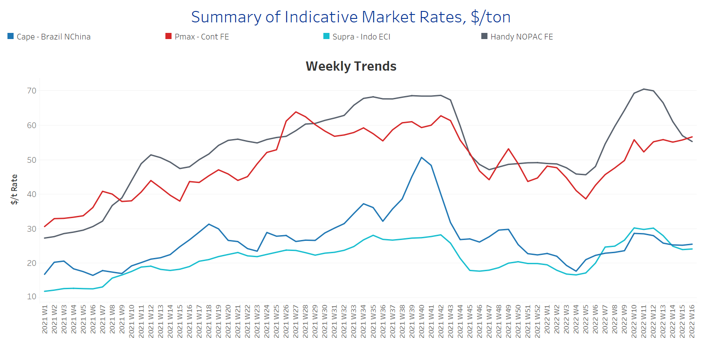
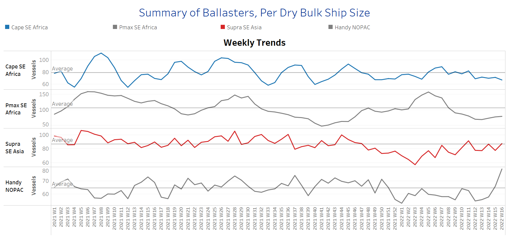
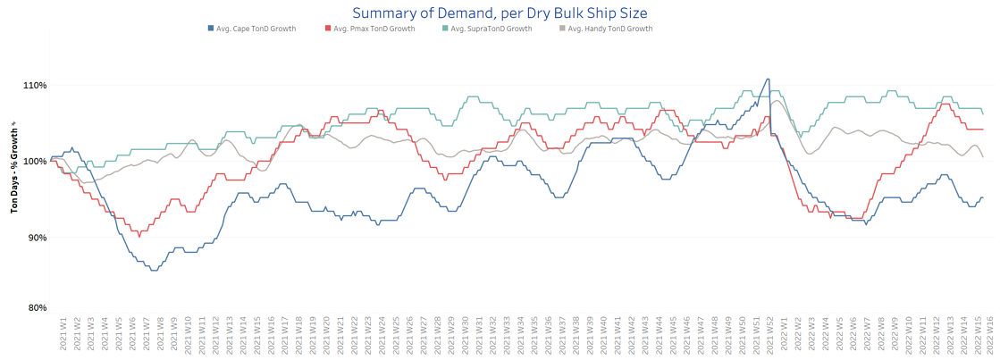
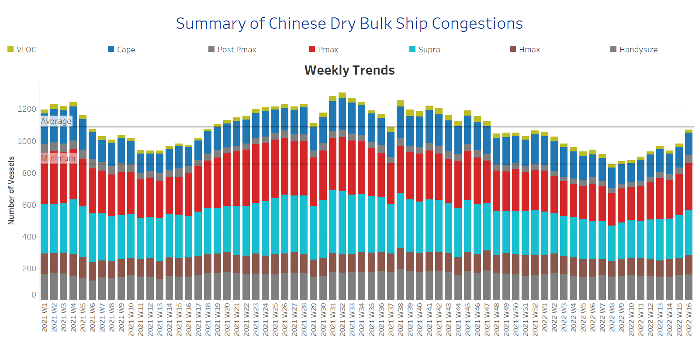

# Signal Dry Bulk Weekly Report

**Date:** April 20, 2022  
**Publisher:** Breakwave Advisors | **Category:** Market Insights  
**Original URL:** [https://www.breakwaveadvisors.com/insights/2022/4/20/signal-dry-bulk-weekly-report](https://www.breakwaveadvisors.com/insights/2022/4/20/signal-dry-bulk-weekly-report)  

---

The sentiment of freight rates came with an air of upward direction apart from the Handysize segment, where we also see a steady increase in the number of ballasters over the last three weeks. The number of ship congestions in China posted a firmer increase for this week with the Panamax segment posting a robust rise.

In the iron ore market, prices for iron ore cargoes with a 63.5% iron content for delivery into Tianjin were around $150/t, on higher demand after steelmakers resumed production and transport and logistics were unclogged as part of China’s push for supply chain resilience. China continues with a dynamic zero COVID policy as part of a functioning economy. The latest data showed capacity utilization rates of blast furnaces at 247 steel plants across China rose and are now at the highest level since late-July 2021. Also, China's state planner approved 32 fixed-asset investment projects worth 520 billion yuan this year.

In India, the increased worries about coal supplies urged the central government to take a number of steps to increase the use of imported coal for power generation, including for blending purposes. At a meeting chaired by Union Minister of Power R K Singh this week with officials of the Gujarat government and a few other states and also independent power producers (IPP) with imported coal-based (ICB) plants, the minister has asked all the companies to operate their power plants at full capacity to reduce pressure on domestic coal demand. There was also a suggestion by the Gujarat government to restart or expand operations in power plants that are lying idle or under-utilized, which will be shared with the other procurer states like Punjab, Haryana, Maharashtra, and Rajasthan so that they can follow Gujarat’s methodology.

In the grain market, record-high prices were posted. Chicago wheat futures rose to $11.4 per bushel in mid-April, the highest in over five weeks, amid lingering concerns of supply shortages. Droughts in North America and interrupted exports from Black Sea regions left importers to seek supplies from other areas, while worldwide stocks are in downward momentum. US drought monitors noted that 67% of Kansas and 85% of Oklahoma farms had little to no rain in the last 30 days, hampering winter wheat growth. Meanwhile, the FAO expects Ukrainian wheat production to significantly fall in 2022, with at least 20% of winter plantings not being harvested due to direct destruction, constrained access, or lack of resources to harvest the crop. Also, a declining economy and shortages of agricultural inputs are expected to negatively impact Russia’s output.

## Section 1 - Freight -Market Rates ($/T) - Weaker

‘The Big Picture’ - Capesize and Panamax Bulkers and Smaller Ship Sizes

> **Figure 1: Market Chart 1**  
> **Interactive Data & Source:** [Signal Ocean Platform](https://www.thesignalgroup.com/signal-ocean-platform) | [Local Asset](file:///C:/Users/Dell/Github/Shipping/corpus/03-breakwave/insights/2022/assets/2022-04-20_signal-dry-bulk-weekly-report_img_unnamed28829_f6af335ca90d.png)

A firmer sentiment of freight rates emerged for the third week of April, however, the Handysize segment sustained the sharp decrease of the previous three weeks.

- **Capesize**Brazil-to-North China freight rates gained further ground and increased to $25.5/t, $7.5/t above the lows of Week 10 of this year ($18/t).
- **Panamax**Continent-to-Far East freight surpassed the barrier of $56/t, and it is the second-highest point for this year since Week 10. The bottom low remains at the end of Week 4 ($39/t).
- **Supramax**Indo-to-ECI freight rates seemed to hold levels around $24/t, following a free-fall over the last few days. The last high remains the Week 12 ~ $30/t.
- **Handysize**NOPAC-to-Far East freight rates continued their accelerated decrease since the ending of Week 11. Rates decreased to around $55/t, which is almost $15/t down from the peak of Week 11.

## Section 2 - Supply - Ballasters View

## Number of Vessels -Increasing

> **Figure 2: Supply Trend Lines for Key Load Areas**  
> **Interactive Data & Source:** [Signal Ocean Platform](https://www.thesignalgroup.com/signal-ocean-platform) | [Local Asset](file:///C:/Users/Dell/Github/Shipping/corpus/03-breakwave/insights/2022/assets/2022-04-20_signal-dry-bulk-weekly-report_img_unnamed28929_7579602c2087.png)

The number of ballasters signals an increasing trend for all vessel size categories, but the levels are still below the one-year average for Capesize, Panamax, and Supramax segments. The Handysize is still in a sharp increasing trend with the third week of April showing an even higher volume than the weak figure of Week 12.

- **Capesize**SE Africa: The number of vessels sailing in ballast still holds a pace of around 70 vessels, since the ending of Week 12 with one or two vessels more or less week on week.
- **Panamax**SE Africa: The number of vessels sailing in ballast is now around 82 vessels, 5 vessels more than last week, 48% down from the accelerated figure during Week 5.
- **Supramax**SE Asia: The number of vessels sailing in ballast increased to 84 vessels, 6 vessels more than last week, while it seems that the trend is reversing upward over the last few days.
- **Handysize**NOPAC: The number of vessels sailing in ballast increased to 77 vessels, 10 vessels more than last week and 20% above the one-year average.

## Section 3 - Demand - In Ton Days

## Decreasing

> **Figure 3: Decreasing**  
> **Interactive Data & Source:** [Signal Ocean Platform](https://www.thesignalgroup.com/signal-ocean-platform) | [Local Asset](file:///C:/Users/Dell/Github/Shipping/corpus/03-breakwave/insights/2022/assets/2022-04-20_signal-dry-bulk-weekly-report_img_unnamed281029_e6b9d94f0d05.png)

The overall trend of demand ton-days keeps decreasing, however, we are gradually seeing signs of an upward correction in the Capesize and Panamax segment compared to the sharp downward direction one week ago.

- **Capesize**demand ton-days: There is a soft upward trend compared to the lows of two weeks ago.
- **Panamax**demand ton-days: We see signs of a steady momentum after almost three weeks of constant decrease.
- **Supramax**demand ton-days: There is also a sustained momentum of a downward trend with insignificant spikes or lows over the last weeks.
- **Handysize**demand ton-days: Ton days growth holds the slower growth with no signs of a rebound since the ending of Week 10.

## Section 4 - Chinese Port Congestions -

## Number of Vessels - Increasing

> **Figure 4: Dry Bulk Ships Congested at Chinese Ports**  
> **Interactive Data & Source:** [Signal Ocean Platform](https://www.thesignalgroup.com/signal-ocean-platform) | [Local Asset](file:///C:/Users/Dell/Github/Shipping/corpus/03-breakwave/insights/2022/assets/2022-04-20_signal-dry-bulk-weekly-report_img_unnamed281129_127257271fc7.png)

Dry bulk ships in congestion continue a sharp increase for two consecutive weeks, stemming mainly from the Handymax and Panamax segments for this week versus to Handysize and Supramax segments one week ago.

- **Capesize:**The number of ships in congestion increased to 140 vessels, 9 vessels more than the previous week.
- **Panamax:**There is a significant increase to more than 290 ships in congestion, a 13% increase since the previous week's ending.
- **Supramax:**The number of ships in congestion kept the robust levels of the previous week's around 278 vessels, a 10% increase since the ending of Week 14.
- **Handysize**: The number of ships in congestion continued at almost the same levels as the previous week, with 159 vessels, a 7.4% increase since the ending of Week 13.

Data Source:[Signal Ocean Platform](https://www.thesignalgroup.com/signal-ocean-platform)

---

**Tags:** Shipping, Dry Bulk, Freight, Rates  
