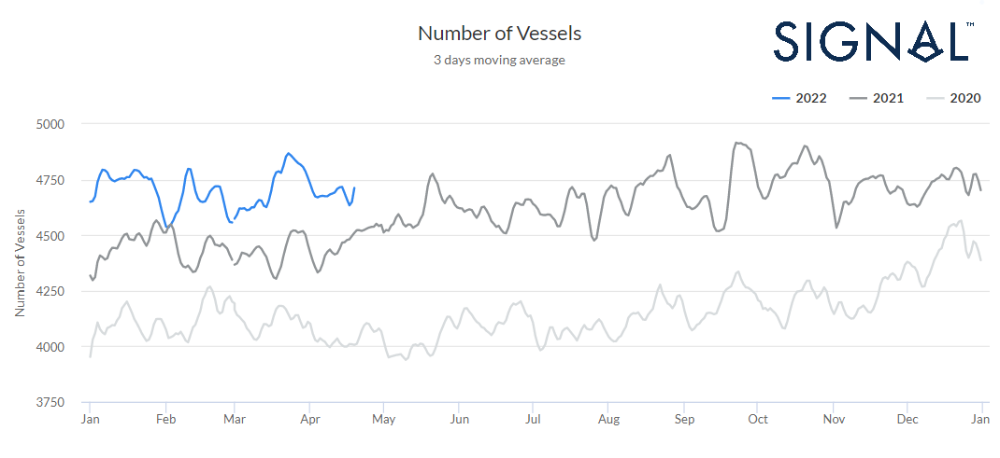
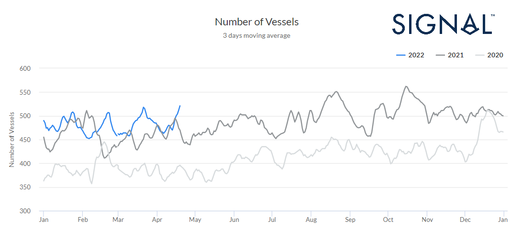
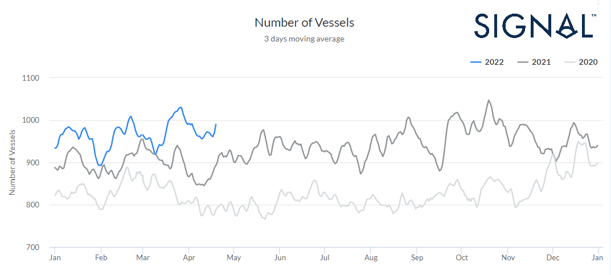
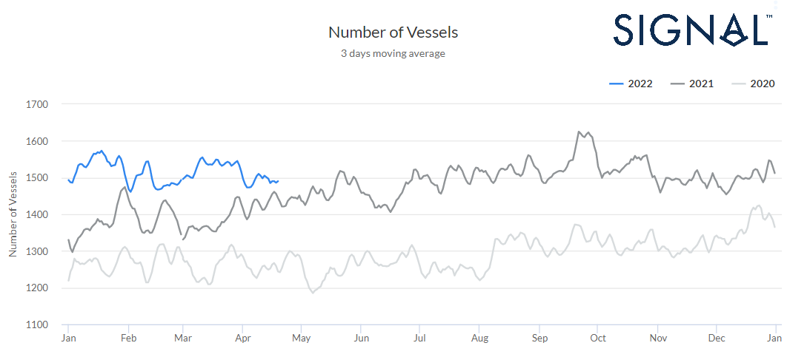
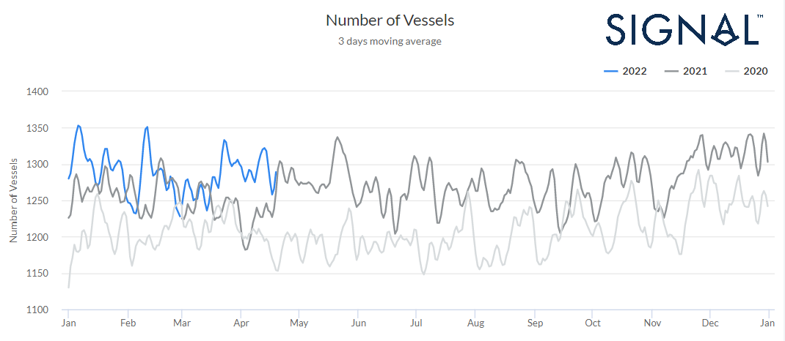
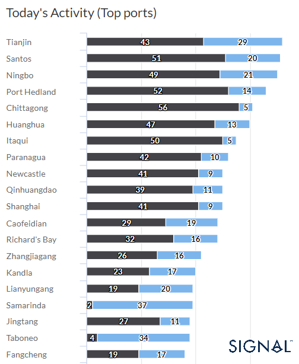
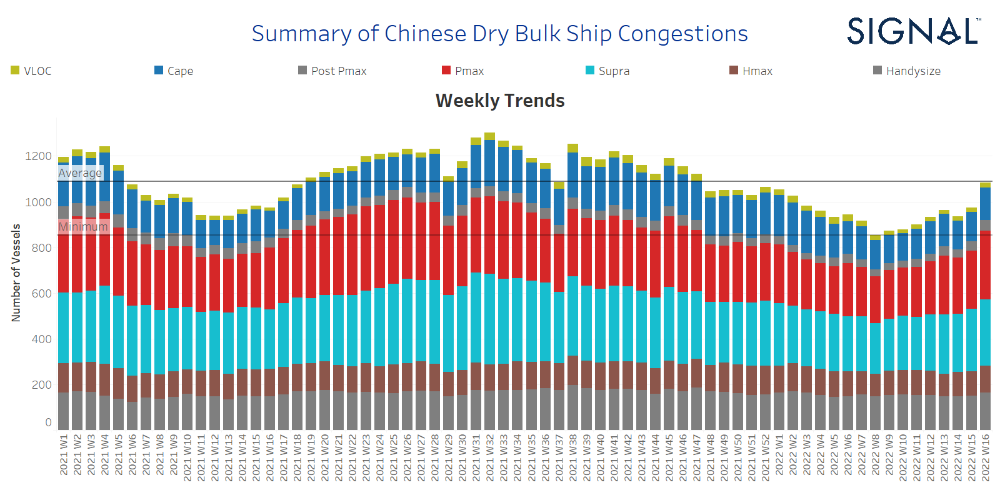
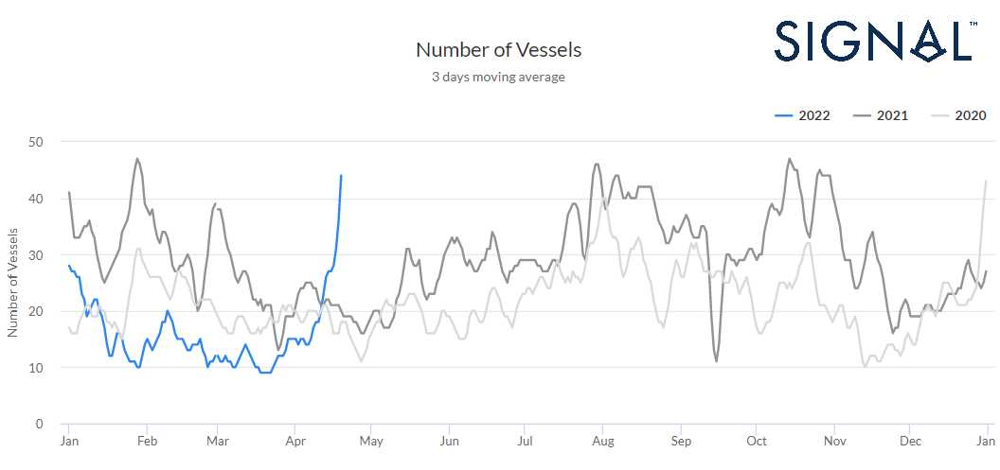

# Port Congestion - A Q1 review of the number of Dry Bulk Vessels

**Date:** April 22, 2022  
**Publisher:** Breakwave Advisors | **Category:** Market Insights  
**Original URL:** [https://www.breakwaveadvisors.com/insights/2022/4/22/port-congestion-a-q1-review-of-the-number-of-dry-bulk-vessels](https://www.breakwaveadvisors.com/insights/2022/4/22/port-congestion-a-q1-review-of-the-number-of-dry-bulk-vessels)  

---

The first quarter of the year comes with an overall upward trend in the number of vessels in waiting and operating status at worldwide ports. Although the last year seemed to be the year of record-high levels, we have seen even stronger figures each month in 2022. In the below screenshot from the[**Signal Ocean Platform**](https://app.signalocean.com/dry/reports/portcongestion?__hstc=30251552.dd2a8d0eef82ce377efe2824186c69c7.1633430369226.1650546865768.1650612659648.10&__hssc=30251552.1.1650612659648&__hsfp=4044988713), we view the number of vessels congested at worldwide ports and it is clear that even April comes with a higher trend than the same month last year.

> **Figure 1: Ch1**  
> **Interactive Data & Source:** [Theguardian](https://www.theguardian.com/world/2022/apr/15/china-zero-covid-policy-global-supply-chain-huawei-executive) | [Local Asset](file:///C:/Users/Dell/Github/Shipping/corpus/03-breakwave/insights/2022/assets/2022-04-22_port-congestion-a-q1-review-of-the-number-of-dry-bulk-vessels_img_ch1_c95e649abe99.png)

Image 1 | Source: The Signal Ocean Platform, Port Congestion, Worldwide Ports, 3 days moving average, Years 2022-2021-2020

For the first quarter of this year, the average number of vessels in waiting and operating status at worldwide ports fetched almost 4700 vessels, 150 vessels more than the average figure for the first three months of the last year. The highest level of this year was on March 23 with 4867 vessels, while last year we saw figures nearing 5000 vessels during October. As the escalating levels of the current year continue it is not an unlikely scenario that the number of vessels surpasses the record levels of 2021.

Panamax, Supramax, and Handysize appear with remarkable levels compared to the Capesize, where the levels are of lower magnitude but still higher than last year. In the below screenshots, we can view the evolution of port congestion per main vessel class category and the volume of magnitude for the third week of April compared to the previous months.

## Capesize - Panamax - Supramax - Handysize | Port Congestion, Number of Vessels

### Capesize ~ 500 Vessels

> **Figure 2: Ch2**  
> **Interactive Data & Source:** [Theguardian](https://www.theguardian.com/world/2022/apr/15/china-zero-covid-policy-global-supply-chain-huawei-executive) | [Local Asset](file:///C:/Users/Dell/Github/Shipping/corpus/03-breakwave/insights/2022/assets/2022-04-22_port-congestion-a-q1-review-of-the-number-of-dry-bulk-vessels_img_ch2_9dff67e5b977.png)

Image 2 Capesize | Source: The Signal Ocean Platform Port Congestion, Worldwide Ports, 3 days moving average, Years 2022-2021-2020

### Panamax ~ 1000 Vessels

> **Figure 3: Ch3**  
> **Interactive Data & Source:** [Theguardian](https://www.theguardian.com/world/2022/apr/15/china-zero-covid-policy-global-supply-chain-huawei-executive) | [Local Asset](file:///C:/Users/Dell/Github/Shipping/corpus/03-breakwave/insights/2022/assets/2022-04-22_port-congestion-a-q1-review-of-the-number-of-dry-bulk-vessels_img_ch3_3389cad9632d.png)

Image 3 Panamax | Source: The Signal Ocean Platform Port Congestion, Worldwide Ports, 3 days moving average, Years 2022-2021-2020

### Supramax ~ 1500 Vessels

> **Figure 4: Ch4**  
> **Interactive Data & Source:** [Theguardian](https://www.theguardian.com/world/2022/apr/15/china-zero-covid-policy-global-supply-chain-huawei-executive) | [Local Asset](file:///C:/Users/Dell/Github/Shipping/corpus/03-breakwave/insights/2022/assets/2022-04-22_port-congestion-a-q1-review-of-the-number-of-dry-bulk-vessels_img_ch4_bff439816a66.png)

Image 4 Supramax | Source: The Signal Ocean Platform Port Congestion, Worldwide Ports, 3 days moving average, Years 2022-2021-2020

### Handysize ~ 1300 Vessels

> **Figure 5: Ch5**  
> **Interactive Data & Source:** [Theguardian](https://www.theguardian.com/world/2022/apr/15/china-zero-covid-policy-global-supply-chain-huawei-executive) | [Local Asset](file:///C:/Users/Dell/Github/Shipping/corpus/03-breakwave/insights/2022/assets/2022-04-22_port-congestion-a-q1-review-of-the-number-of-dry-bulk-vessels_img_ch5_a16cf7416881.png)

Image 5 Handysize | Source: The Signal Ocean Platform Port Congestion, Worldwide Ports, 3 days moving average, Years 2022-2021-2020

‍

It is interesting to examine the breakdown of volume per port and distinguish today’s top ports' activity (April 20), where we will see that Chinese ports come in the first ranking along with Brazil and Australia. Tianjin, Santos, Ningbo, and Port Hedland appear to be the hotspots for vessel congestion. Overall, in the ranking position, we clearly see that Chinese ports dominate in the port congestion issue, where the[**zero-COVID**](https://www.theguardian.com/world/2022/apr/15/china-zero-covid-policy-global-supply-chain-huawei-executive)policy has created severe port supply disruptions for the consumed and raw material commodities.

> **Figure 6: Ch6**  
> **Interactive Data & Source:** [Piie](https://www.piie.com/blogs/realtime-economic-issues-watch/zero-covid-shanghai-comes-high-social-and-economic-costs) | [Local Asset](file:///C:/Users/Dell/Github/Shipping/corpus/03-breakwave/insights/2022/assets/2022-04-22_port-congestion-a-q1-review-of-the-number-of-dry-bulk-vessels_img_ch6_e8016a3450c8.png)

Image 6 |Source: The Signal Ocean Platform. Today’s Activity, Top Ports, Waiting and Operating Status

## Summary of Chinese Dry Bulk Ship Congestions - Increasing

With an overall eye on the latest status of Chinese dry bulk ship congestions, we see a sharp increasing trend for the last two consecutive weeks of April as the Chinese economy continues with zero-COVID measures while the rest of the world has decided to live with coronavirus.

> **Figure 7: Ch7**  
> **Interactive Data & Source:** [Piie](https://www.piie.com/blogs/realtime-economic-issues-watch/zero-covid-shanghai-comes-high-social-and-economic-costs) | [Local Asset](file:///C:/Users/Dell/Github/Shipping/corpus/03-breakwave/insights/2022/assets/2022-04-22_port-congestion-a-q1-review-of-the-number-of-dry-bulk-vessels_img_ch7_ba6565ad7475.png)

Graph 1 | Source: The Signal Ocean Data, Summary of Chinese Dry Bulk Ship Congestions, per Vessel Class, Years 2021-2022

The situation is extremely tight in[**Shanghai**](https://www.piie.com/blogs/realtime-economic-issues-watch/zero-covid-shanghai-comes-high-social-and-economic-costs), where there has been a complete lockdown for half a month at high social and economic costs. We can see below (image 7) the increasing evolution in the port congestion in Shanghai, with a significant spike in the number of vessels during the days of April and far above the yearly levels of 2020 and 2021.

> **Figure 8: Ch8**  
> **Interactive Data & Source:** [Signal Ocean Platform](https://www.thesignalgroup.com/signal-ocean-platform) | [Local Asset](file:///C:/Users/Dell/Github/Shipping/corpus/03-breakwave/insights/2022/assets/2022-04-22_port-congestion-a-q1-review-of-the-number-of-dry-bulk-vessels_img_ch8_0a90353879ca.png)

Image 7 | Source: The Signal Ocean Platform, Port Congestion, Shanghai, 3 days moving average, Years 2022-2021-2020

The sharp increase in the overall number of dry bulk ships congested at Chinese ports during the third week of April is stemming mainly from the Panamax segment versus to Handysize and Supramax segments one week ago. In the Capesize segment, the number of ships in congestion increased to 140 vessels, 9 vessels more than the previous week, while in the Panamax, there is a significant increase to more than 290 ships in congestion, a 13% increase since the previous week's ending. In the Supramax segment, the number of ships in congestion kept the robust levels of the previous week's around 278 vessels, a 10% increase since the ending of Week 14. Lastly, for the Handysize, the number of ships in congestion continued at almost the same levels as the previous week, with 159 vessels, a 7.4% increase since the ending of Week 13.

### Conclusion‍

Looking at the next days of April, the strict policy of China’s zero-COVID is likely to prolong the escalated levels of vessels congestion already recorded in the dry bulk segment. It seems that the second quarter of the year may bring new highs that we have not seen even 12 months ago, as the Chinese zero-COVID policy along with the current Russia-Ukraine geopolitical uncertainties stimulates an upward swing in the freight rates supported by the port supply disruptions and logistics issues.

Data Source:[Signal Ocean Platform](https://www.thesignalgroup.com/signal-ocean-platform)
