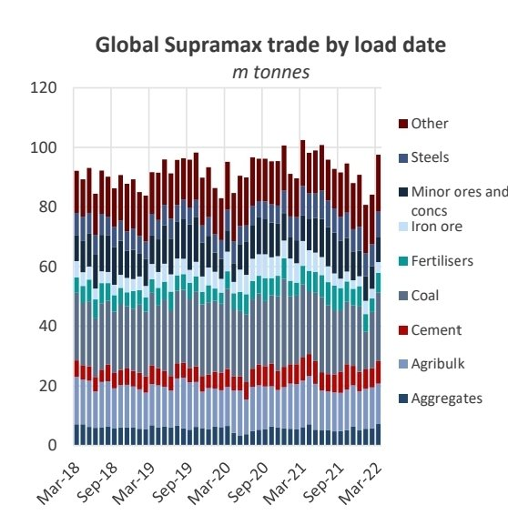
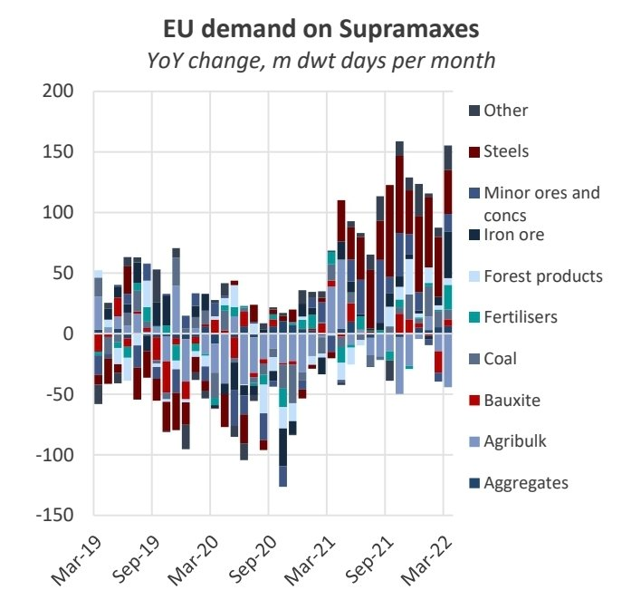
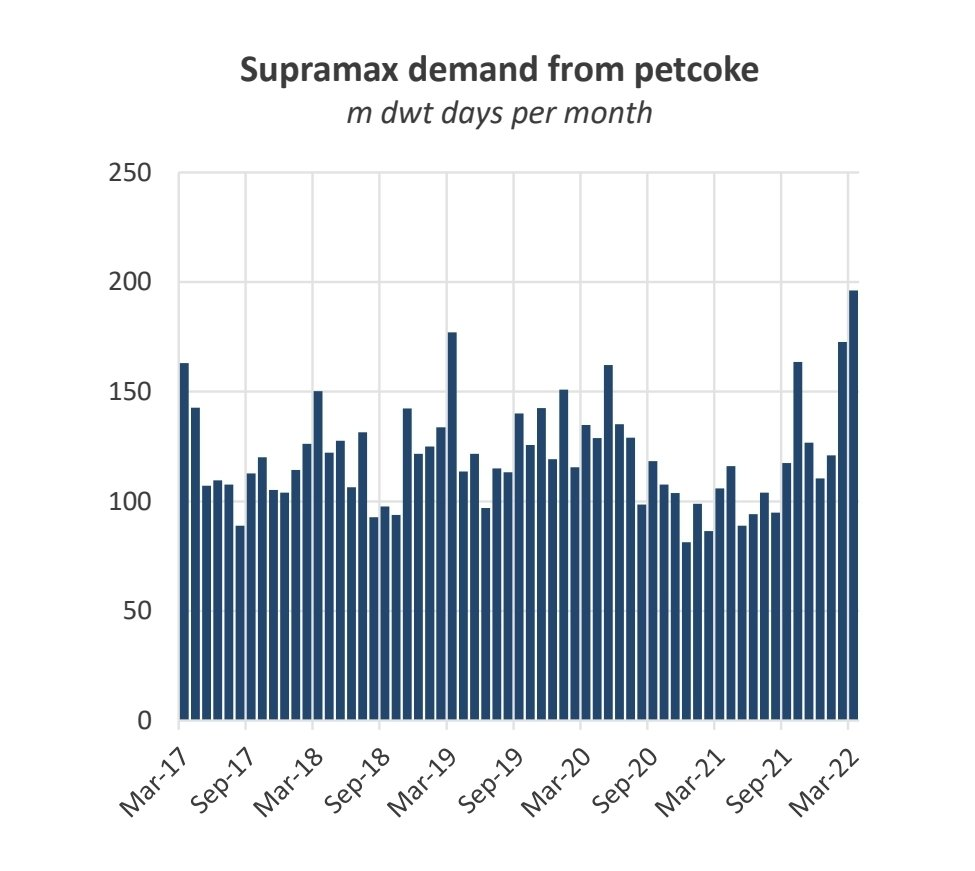

# The Big Picture: Supramax market

**Date:** April 23, 2022  
**Publisher:** Breakwave Advisors | **Category:** Market Insights  
**Original URL:** [https://www.breakwaveadvisors.com/insights/2022/4/22/the-big-picture-supramax-market](https://www.breakwaveadvisors.com/insights/2022/4/22/the-big-picture-supramax-market)  

---

By[Mark Nugent](https://www.linkedin.com/in/mark-nugent-3724a3192/)

### Holding Steady

The Supramaxes now receive a premium over all other sectors as several trades for these vessels see fresh demand. We look at where the new demand is coming from.

### Shipments Bounce Back in March

The Baltic Supramax 58 average today settled at $29,105/day, marking a 24.6% increase YoY, but a 9.5% decline MoM following a broad decline in dry bulk rates from the end of March. Total liftings on Supramaxes in March totalled 98m tonnes, declining by 4.4% YoY, although the highest level since June 2021. However, while trade has not performed particularly strongly, bulk carrier demand from Supramaxes increased by 6.4% YoY.

> **Figure 1: Screenshot 20220422 113225 Word**  
> [Local Asset](file:///C:/Users/Dell/Github/Shipping/corpus/03-breakwave/insights/2022/assets/2022-04-23_the-big-picture-supramax-market_img_screenshot-20220422-113225-word_a2f8e2854de5.jpg)

Driving employment in the east has been the resurgence in Indonesian coal trade. Supramaxes lifted 13.8m tonnes of coal in Indonesia in March, rising by 13.0% YoY and the highest since December 2020. Of these volumes, Indian imports increased by 19.0% to 3.1m tonnes, while shipments discharged in Bangladesh more than doubled YoY to 1.3m tonnes. Chinese imports of Indonesian coal on Supras declined by 22.5% YoY to 4.9m tonnes. The changes in trade flows above resulted in a net loss of 174k tonnes of coal. As a result, the longer voyages to both WC India and Bangladesh compared to China (bss Qingdao) have provided support to rates in this region.

Demand for Supramaxes from aggregates, which primarily consists of building materials such as sand, gravel and stone, increased by 13% YoY in March. This was buoyed by a surge in shipments from the UAE to Bangladesh, which increased by 65.5% YoY to 1.3m tonnes. Many of these shipments were typically loaded in Oman and India which would result in briefer voyages.

### European Supramax Trade Robust

In March, dry bulk shipments imported into Europe on Supramaxes totalled 7.3m tonnes, increasing by 13.8% YoY. Average voyage lengths on Supramax voyages into Europe, increased by over 6 days in March YoY, in part due to a speed reduction owing to high bunker prices. As a result demand, measured in dwt days, increased by 30.9% YoY in March.

> **Figure 2: Screenshot 20220422 113249 Word**  
> [Local Asset](file:///C:/Users/Dell/Github/Shipping/corpus/03-breakwave/insights/2022/assets/2022-04-23_the-big-picture-supramax-market_img_screenshot-20220422-113249-word_d27fc96d231e.jpg)

Imports of aggregates increased to 776k tonnes, doubling YoY and the highest level on record. Although these voyages are not considerably demand-intensive, the extra shipments have been effective in keeping vessels employed in the Continent/Mediterranean. Of these volumes, 62.3% loaded in Norway and the remaining 37.7% from Turkey.

Meanwhile, European fertiliser imports on Supras more than doubled in March and are already higher so far in April YoY. European buyers have secured several cargoes from Canada following the embargo of Russian and Belarusian supply, primarily to the benefit of the Supramaxes. Despite European grain shipments staying flat YoY at 5.1m tonnes, the increase in volumes from Brazil has benefitted the Panamaxes at the expense of both the Supras and Handies.

### Tight Tonnage Supply in USG

Rates out of the US Gulf have emerged as the strongest performer among the Baltic-assessed Supramax routes in the past week. Largely down to a lack of tonnage availability in the region, we count a total of 28 Supramax vessels ballasting towards the US that also discharged in April. While US grains do not seasonally ship until the back half of each year, shipments out of the USG increased by 6.7% YoY totalling 6.8m tonnes in March. The main driver of the increase has been a 42.9% YoY increase in petcoke shipments, totalling 2m tonnes. In April, liftings on the Supras are already at 4.2m tonnes, 77.3% of total shipments in April last year. Due to cleaning requirements after lifting petcoke cargoes, some vessels have opted to head to South America where the cargoes are cleaner despite the lower freight rate, further sustaining a more constant flow of tonnage south rather than into the USG.

### Petcoke Providing New Demand

Supramax demand generated from petroleum coke, otherwise known as petcoke, hit new highs in March, rising by 85.2% YoY. Shipments of petcoke on Supramaxes totalled 3.1m tonnes in March, the highest on record, increasing by 57.7% YoY. Produced during the oil refining process, high-grade petcoke, as with coking coal, is largely used in steel and aluminium production as the main heating element. On the steel side, it is predominantly used in electric-arc furnaces. On the other hand, lower-grade product can be used for electricity generation and cement production. Therefore, this can be used as a replacement for coal across both of its primary uses, making it an ideal substitute for end-users during a period in which coal markets are very tight, which has been exacerbated by the war in Ukraine.

In terms of destination, this has been more of a mixed bag. The largest increase has been shipments into India, totalling 639k tonnes, more than doubling YoY, loaded largely in Saudi Arabia and the US. While petcoke typically provides a discount to coal, demand has driven prices to near-similar levels in 2022 as buyers look for alternative fuel sources. As a result, we expect these shipments to continue strongly on the basis primary energy sources, namely coal, remain in short supply.

> **Figure 3: Screenshot 20220422 113314 Word**  
> [Local Asset](file:///C:/Users/Dell/Github/Shipping/corpus/03-breakwave/insights/2022/assets/2022-04-23_the-big-picture-supramax-market_img_screenshot-20220422-113314-word_d55f1bbfff6a.jpg)

### India Congestion

Supramax congestion in India has risen 87.5% WoW to 797k dwt, currently more than double the 5-year average. This is likely as a result of growing interest in Indian grains, which the country has pledged to ship more of following the Ukraine war. Shipments have continued to load strongly at Indian ports, with international prices providing an attractive premium to those domestically.
