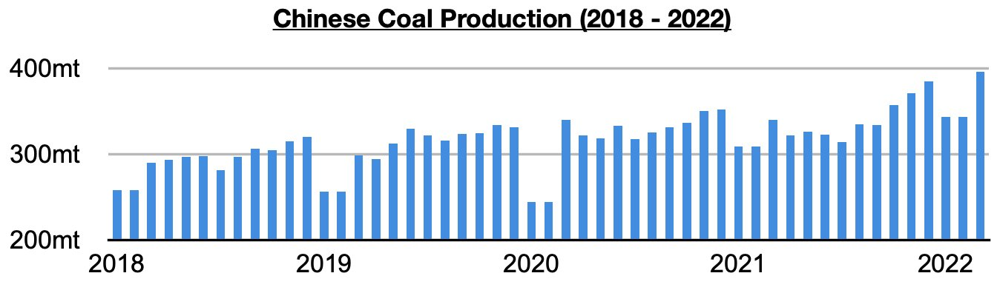
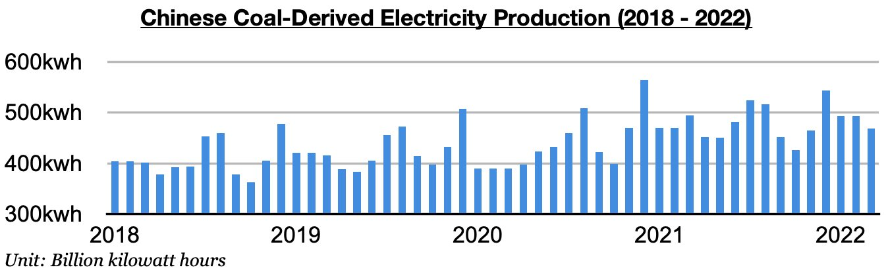
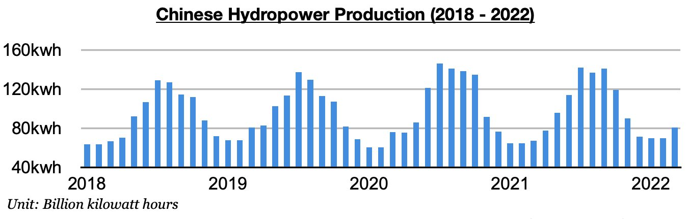
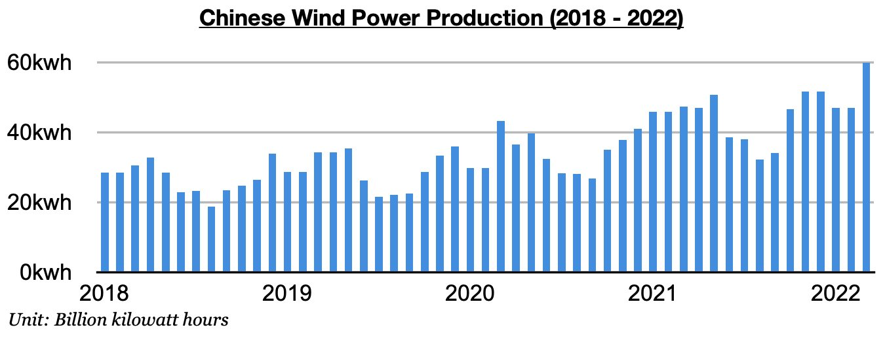
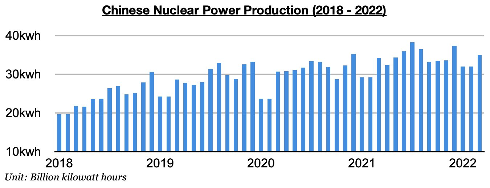
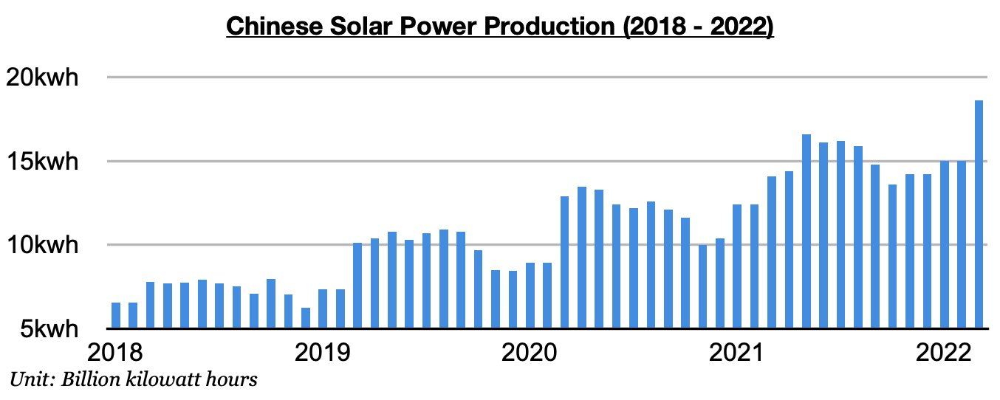

# China's Coal Production Growth and Renewable Energy Generation Growth Remain Strong

**Date:** April 29, 2022  
**Publisher:** Breakwave Advisors | **Category:** Market Insights  
**Original URL:** [https://www.breakwaveadvisors.com/insights/2022/4/28/chinas-coal-production-growth-and-renewable-energy-generation-growth-remain-strong](https://www.breakwaveadvisors.com/insights/2022/4/28/chinas-coal-production-growth-and-renewable-energy-generation-growth-remain-strong)  

---

*By*[*Jeffrey Landsberg*](https://www.linkedin.com/in/jeffrey-landsberg-70ab957/)

China’s coal production set another all-time high in March coming in at 395.8 million tons. This is 52.5 million tons (15%) more than was produced in February and is up year-on-year by 55.8 million tons (16%). Overall, we continue to stress that it is concerning for China's coal import prospects that domestic production has remained so strong. As we stressed in Commodore's recent Weekly China Reports, January and February saw an average of “only” 344.3 million tons of coal mined, but that of course was still a very robust amount. Prior to this year, the last time that China produced 344.3 million tons or more of coal during any month in the first three quarters of any year was all the way back in 2012.

> **Figure 1: Chart 1 (28)**  
> [Local Asset](file:///C:/Users/Dell/Github/Shipping/corpus/03-breakwave/insights/2022/assets/2022-04-29_chinas-coal-production-growth-and-renewable-energy-generation-growth-remain-stro_img_chart1282829_024c980ebba4.jpg)

Also remaining concerning for China’s coal import prospects is that domestic coal production growth continues to fare much better than coal-derived electricity generation growth. China's coal-derived electricity generation output totaled 468.8 billion kilowatt hours in March, which is 24.2 billion kilowatt hours (-5%) less than was produced in February and down year-on-year by 26.5 billion kilowatt hours (-5%).

> **Figure 2: Chart 2 (25)**  
> [Local Asset](file:///C:/Users/Dell/Github/Shipping/corpus/03-breakwave/insights/2022/assets/2022-04-29_chinas-coal-production-growth-and-renewable-energy-generation-growth-remain-stro_img_chart2282529_d63d89133780.jpg)

Also of note is that the production of hydropower and other renewable sources of electricity have again all experienced year-on-year growth. Hydropower output totaled 80.5 billion kilowatt hours in March, which is up from February by 10.5 billion kilowatt hours (15%) and up year-on-year by 13.5 billion kilowatt hours (20%). The 20% year-on-year growth has marked the largest year-on-year growth seen since October 2020.

> **Figure 3: Chart 3 (20)**  
> [Local Asset](file:///C:/Users/Dell/Github/Shipping/corpus/03-breakwave/insights/2022/assets/2022-04-29_chinas-coal-production-growth-and-renewable-energy-generation-growth-remain-stro_img_chart3282029_b4e1d5c66fea.jpg)

Wind power production totaled 67.3 billion kilowatt hours, which is up by 20.3 billion kilowatt hours (43%) from February and up year-on-year by 20 billion kilowatt hours (42%).

> **Figure 4: Chart 4 (12)**  
> [Local Asset](file:///C:/Users/Dell/Github/Shipping/corpus/03-breakwave/insights/2022/assets/2022-04-29_chinas-coal-production-growth-and-renewable-energy-generation-growth-remain-stro_img_chart4281229_c2dca5b6d816.jpg)

Nuclear power production totaled 35 billion kilowatt hours, which is up from February by 3 billion kilowatt hours (9%) and up year-on-year by 800 million kilowatt hours (2%).

> **Figure 5: Chart 5 (4)**  
> [Local Asset](file:///C:/Users/Dell/Github/Shipping/corpus/03-breakwave/insights/2022/assets/2022-04-29_chinas-coal-production-growth-and-renewable-energy-generation-growth-remain-stro_img_chart528429_931a675ffba1.jpg)

Solar power production totaled 18.6 billion kilowatt hours, which is up from February by 3.6 billion kilowatt hours (24%) and up year-on-year by 4.5 billion kilowatt hours (32%). The last time that any renewable other than hydropower production contracted on a year-on-year basis was nuclear back in November 2020.

> **Figure 6: Chart 6**  
> [Local Asset](file:///C:/Users/Dell/Github/Shipping/corpus/03-breakwave/insights/2022/assets/2022-04-29_chinas-coal-production-growth-and-renewable-energy-generation-growth-remain-stro_img_chart6_ed4ec8cacb87.jpg)
