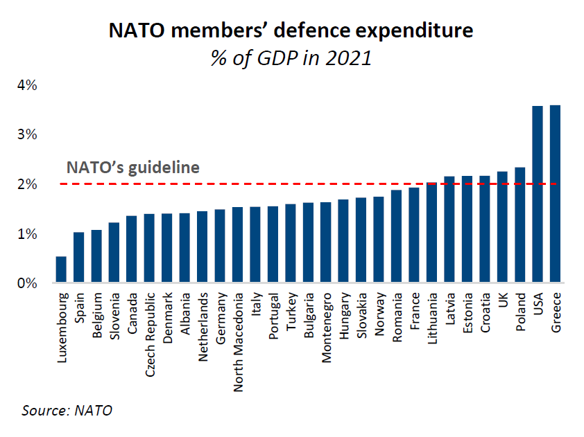
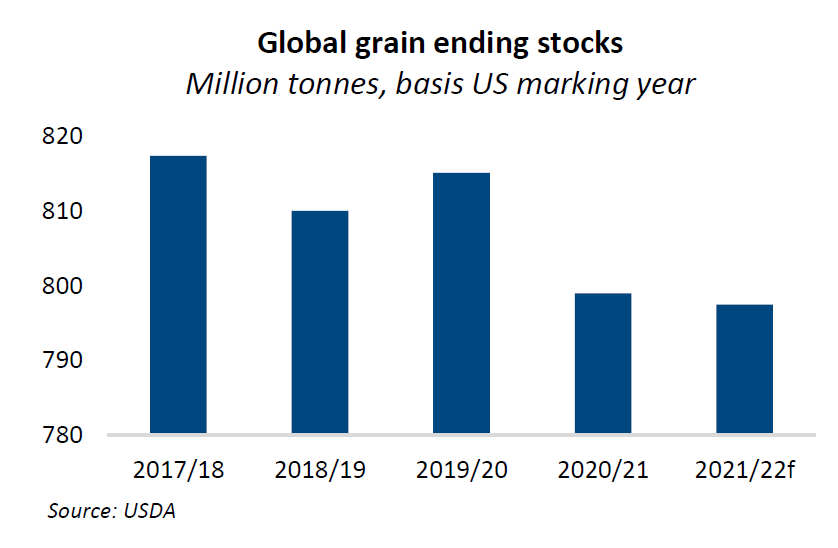
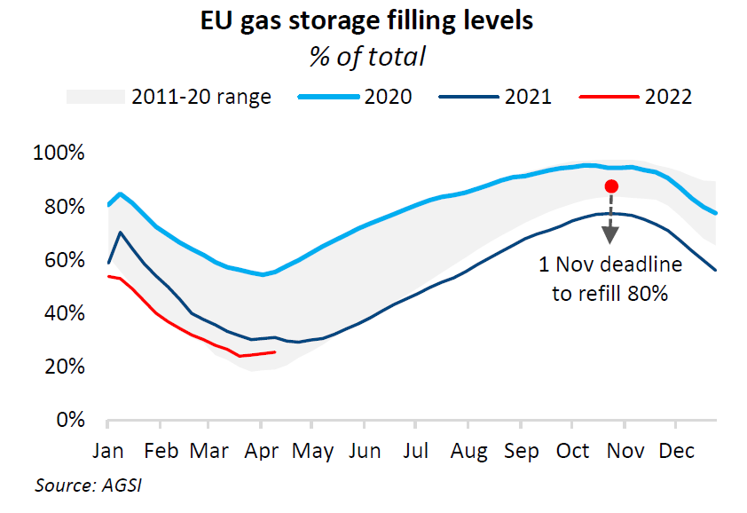
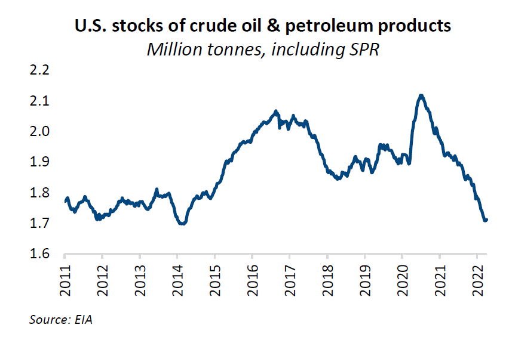
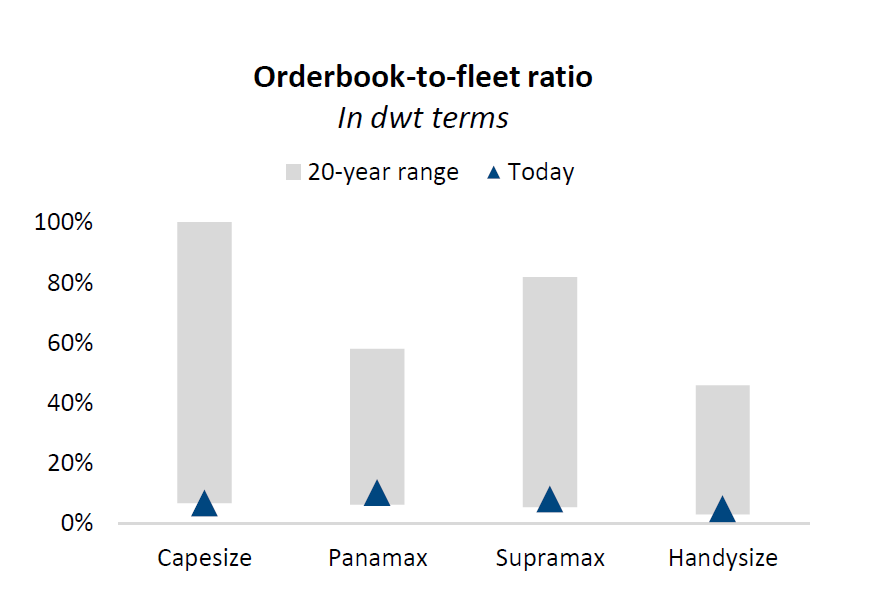
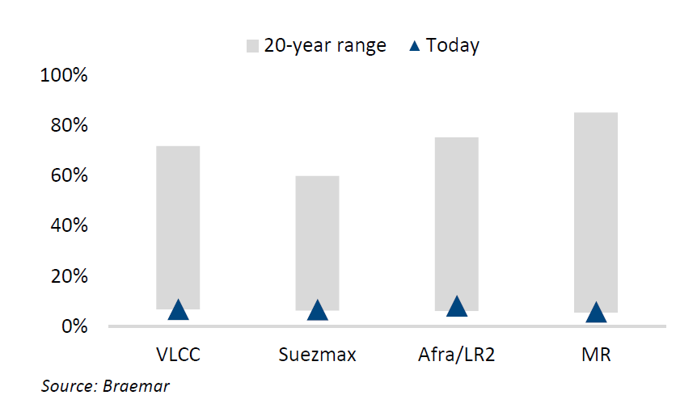

# The Bigger Picture: Shipping in the next decade

**Date:** April 30, 2022  
**Publisher:** Breakwave Advisors | **Category:** Market Insights  
**Original URL:** [https://www.breakwaveadvisors.com/insights/2022/4/29/the-bigger-picture-shipping-in-the-next-decade](https://www.breakwaveadvisors.com/insights/2022/4/29/the-bigger-picture-shipping-in-the-next-decade)  

---

*By*[*Alexandra Alatari*](https://www.linkedin.com/in/alexalatari/)

Are we heading towards a recession? Has globalisation peaked? Is the US dollar’s status as a reserve currency under threat? How much will interest rates have to rise before inflation is tamed? In this report, we address some of the most discussed macroeconomic themes and gauge their impact on the shipping industry.

## A Brave New World

Wars and other major geopolitical events typically act as catalysts for fundamental shifts in monetary world order. A new framework has been proposed recently: Bretton Woods III. Simply put, it is a hybrid of Bretton Woods I and II, where gold plays a bigger role in our future monetary system, but so do other commodities. The US dollar remains the top reserve currency, but loses part of its shine to the renminbi.

The rationale behind it is rather straightforward. In a world of soaring inflation, where currencies run a great risk of depreciation if targeted by sanctions, why hold on to fx reserves? Alternatively, you could turn to gold. But its lack of liquidity limits gold’s upside. Or you can reduce your fx reserves and stockpile on commodities instead.

Which commodities? Practically all of them. Let’s have a look at which macroeconomic developments will shape commodity demand over the next decade.

## Rethinking Supply Chains

Supply chains have been stretched to the limit for over two years. The pandemic coupled with the war will inevitably alter their long-standing structure.

Firstly, countries will begin to establish back-up suppliers. Overreliance on one single producer can prove fatal. Just think of the strain Europe is facing trying to end its dependence on Russian fossil fuels. What happens if China invades Taiwan, which accounts for over half of global semiconductor output? Events in Ukraine make it extremely risky to ignore such what-if scenarios.

However, change does not necessarily imply reshoring all production nor does it spell the end of globalisation. The less costly option is to diversify suppliers. The US Treasury Secretary recently hinted at it coining a new term, “friend-shoring”.

It also means moving away from just-in-time supply chains. For all their efficiency, they can also cause rapid, global domino effects. Ports piling up with containers, overwhelmed trucking companies and huge backlogs of orders at factories are direct results of the collapse of just-in-time logistics.

This will mark a transition to just-in-case logistics as discussed above. But production and transportation of raw commodities and finished goods will become less efficient as more companies increasingly rely on less streamlined networks. Such a shift requires the upgrade or development of new production lines, building more ports and storage facilities. Meanwhile, inefficiencies emerge leading to longer delivery times.

## Increased Military Spending

In the wake of the conflict in Ukraine, many countries have pledged to boost their military budgets.

This will effectively generate greater steel demand to build weapons while further reducing yard availability. Evidence of this has already surfaced at certain Chinese yards where the state is said to have placed numerous navy ship orders.

Don’t increased military budgets equal lower economic growth? Not by definition. The academic argument of guns vs butter may apply to poorer countries. However, in the developed world even a modest 10% increase in government-financed R&D can push R&D in the private sector another 5% higher and boost employment. The rearmament race is being led by developed countries, namely the U.S., Germany & other NATO members recommitting to hit NATO guidelines in the coming years. If arming up succeeds in creating more jobs, it should keep unemployment rates under control. A strong labour market has taken centre stage in the argument against an impending recession in 2023.

## Commodity Stockpiling

The world is currently short of nearly all commodities. Replenishing inventories is a challenging undertaking, one that cannot happen overnight due to logistical bottlenecks and spiralling prices.

> **Figure 1: Market Chart 1**  
> [Local Asset](file:///C:/Users/Dell/Github/Shipping/corpus/03-breakwave/insights/2022/assets/2022-04-30_the-bigger-picture-shipping-in-the-next-decade_img_image028229_badf0b28f0ce.png)

Nevertheless, restocking has to happen. A decade ago, the world was all about efficiency. Nowadays, the new buzz word is resilience, which can be roughly translated into holding abundant inventories.

> **Figure 2: Market Chart 2**  
> [Local Asset](file:///C:/Users/Dell/Github/Shipping/corpus/03-breakwave/insights/2022/assets/2022-04-30_the-bigger-picture-shipping-in-the-next-decade_img_image128229_e858659caa7b.png)

> **Figure 3: Market Chart 3**  
> [Local Asset](file:///C:/Users/Dell/Github/Shipping/corpus/03-breakwave/insights/2022/assets/2022-04-30_the-bigger-picture-shipping-in-the-next-decade_img_image228229_e40998b1d453.png)

> **Figure 4: Market Chart 4**  
> [Local Asset](file:///C:/Users/Dell/Github/Shipping/corpus/03-breakwave/insights/2022/assets/2022-04-30_the-bigger-picture-shipping-in-the-next-decade_img_image328329_5c65241b9989.png)

The current crisis is a commodity crisis. That is why central banks’ tools cannot be particularly effective. Especially when it is their own countries imposing sanctions.

The solution may lie in China. The PBoC is not deterred by sanctions and has incentives to reduce its massive US dollar reserves. As discussed in the first part of this report, China could turn to gold. However, there are plenty of cheap available commodities that most countries refuse to touch. Why not stock up?

Trade dislocations of such an extent naturally boost shipping demand. Even more so since there is no inland way of transporting coal, grains or oil from the Baltic and the Black Sea to the Pacific Coast.

China has largely refrained from an extensive buying spree so far, unlike India. Renewed lockdowns have weighed heavily on consumption and activity, while Beijing attempts to maintain a seemingly neutral stance in international diplomacy over Ukraine. But soon or later, China is likely to ramp up purchases of steeply discounted Russian commodities. In that case, more ships will be needed.

## More Ships Are Needed

The dry bulk market is already tight. Only 7.8% of the fleet is currently on order, hovering near 20-year lows. The tanker has been struggling with tonnage oversupply in the past few years, but things may be about to change if tonne-mile demand gets a boost. Bear in mind that the current crude tanker orderbook does not meet fleet replacement needs. Meanwhile, the number of product tankers to be delivered in the coming years is roughly at par with the overaged units facing more immediate scrapping pressure.

The newbuilding market cannot come to the rescue. Yards’ forward cover extends well into 2025. They are not seeking to expand their capacity while soaring costs (from steel to labour and electricity) sustain prices near 2006-09 average levels. Add higher interest rates to the mix and a substantial influx of newbuilt tonnage moves further away.

> **Figure 5: Market Chart 5**  
> [Local Asset](file:///C:/Users/Dell/Github/Shipping/corpus/03-breakwave/insights/2022/assets/2022-04-30_the-bigger-picture-shipping-in-the-next-decade_img_image428229_2d55f6e21e08.png)

> **Figure 6: Market Chart 6**  
> [Local Asset](file:///C:/Users/Dell/Github/Shipping/corpus/03-breakwave/insights/2022/assets/2022-04-30_the-bigger-picture-shipping-in-the-next-decade_img_image5_c7794977afb2.png)

If commodity and in turn shipping demand proves to be as firm as we laid out above in the coming years, then second-hand ship values should remain elevated despite any short-lived fluctuations.

On top of strong demand & tight supply fundamentals, the upcoming IMO regulations coupled with increased bunkering costs are likely to render slow-steaming the main industry practice. Reduced sailing speeds at a time when more tonnage capacity will be required should be well-supportive of the freight market and second-hand values as a result.

## The Inflation Monster

Following the pandemic, inflation surged to 40-year highs as quantitative easing dragged demand disproportionately higher compared to supply. Central banks cannot adjust the supply side of the equation. As such, they resort to policy tightening to bring demand down by hiking interest rates.

We are not going to debate whether this is the correct course of action. Neither are we going to argue over the predictive power of an inverted yield curve and whether it signals caution or recession. Instead, we would rather highlight that nowadays shipping might be more resilient to higher interest rates as opposed to previous economic downturns.

## Government-Driven Demand

This time, it is not the private sector driving borrowing and spending demand. Supply chains are in dire need of restructuring, but the private sector will take a back seat.

Instead, governments will be the major driver of credit demand going forward. And this kind of demand is not as sensitive to interest rate hikes. Firstly, as ensuring food and energy security, replenishing depleted inventories, developing net-zero transition projects and arming up all have to materialise. But also because central banks are able to step in as and when needed in order to facilitate their governments.

The shipping sector is no longer overleveraged

What is also different this time around is that shipping is not an overleveraged industry anymore. Its positive outlook, for certain segments more than others, has transformed shipping as a whole to a sector where sustainable investment opportunities can present themselves. Banks have taken notice and become more active after having downsized their books since 2010.

Plus many owners sit on a bunch of liquidity following several lucrative quarters for the dry bulk and containership markets. Even tanker owners with well-diversified fleets have managed to fare well despite two years of dismal tanker earnings.

This means shipowners can generally afford to invest more equity. With banks back in the game offering more competitive LTV ratios than leasing companies, more diverse financing options could come up. Serious cash balance discipline is required. However, it is possible to operate successfully in spite of inflated costs.

## Conclusion

While it is still early days, we are looking at structural, high-level developments that require a long period of time to unravel.

When they do, we are likely to embark on a very commodity-intensive decade. Strong shipping demand coinciding with longer distances being travelled at reduced speeds and limited yard capacity might prove we are indeed short of ships.

While we are seemingly moving towards a higher CAPEX and OPEX environment, the floor for both freight rates and asset values will also be raised.
