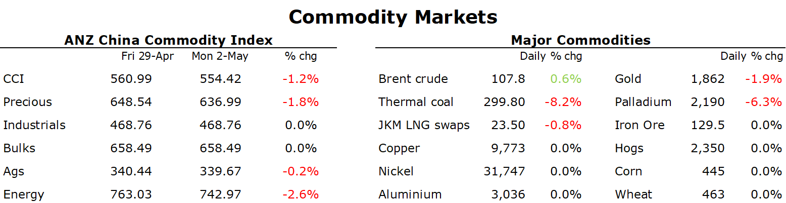

# Crude gains as Europe consider sanctioning Russia oil

**Date:** May 03, 2022  
**Publisher:** Breakwave Advisors | **Category:** Market Insights  
**Original URL:** [https://www.breakwaveadvisors.com/insights/2022/5/3/crude-gains-as-europe-consider-sanctioning-russia-oil](https://www.breakwaveadvisors.com/insights/2022/5/3/crude-gains-as-europe-consider-sanctioning-russia-oil)  

---

*By*[*Daniel Hynes*](https://www.linkedin.com/in/dahynes/)

Weak economic data in China weighed on sentiment early in the session. Thin liquidity was an issue with most markets closed for holidays.

> **Figure 1: 1651532693743**  
> **Interactive Data & Source:** [Linkedin](https://www.linkedin.com/newsletters/commodities-wrap-6692196755876012032/?fbclid=IwAR3kiXJqZdxmp9ZcRwBNI7FsBySI-XSC0pfPur1qzjt7OZp7PTE59Tsl1QI) | [Local Asset](file:///C:/Users/Dell/Github/Shipping/corpus/03-breakwave/insights/2022/assets/2022-05-03_crude-gains-as-europe-consider-sanctioning-russia-oil_img_1651532693743_b27087e02ee2.png)

**Crude oil**fell in Asian trading after data showed the full impact of lockdowns in China. Manufacturing activity has suffered, with the monthly Purchasing Managers Index falling to 47.4 in April from 49.5 in March. Fears of more demand weakness rose, as Beijing ordered the closure of gyms and cinemas over the Labour Day weekend. However, oil rallied late in the session as signs of tightness in oil product markets emerged. The growing reliance on US exports lifted diesel futures, with yesterday’s gain hitting 5%. The diesel crack (the premium over crude futures) surged yesterday to reach USD73.50/bbl, a level not seen since 1986. Record exports from the US Gulf are eating into supplies, with at least 2mb/d of gasoline, diesel and jet fuel flowing out of the refining hub in April according to Vortexa. The prospect of European sanctions on Russian oil also offered support. Germany said it’s looking to end its reliance on Russia by the end of the year. To date, its share of Russian oil has already fallen to 12% from 35% before the Ukraine war. Poland said it will also support a ban on Russian oil.

**European natural gas**fell as warm weather raised the prospect of weaker demand in the spot market. Dutch front-month futures fell as much as 6.5% on Monday after forecasts of widespread above-seasonal temperatures across Europe next week. A pick-up in LNG imports weighed on sentiment, but the market remains wary as discussions on a ban on Russian natural gas heat up. The European Union is expected to provide guidance on what companies can and can’t do under its sanctions to address Moscow’s demands that payments are made in rubles. The EU’s energy commissioner, Kadri Simpson, called the decision an unprecedented breach of existing contracts. For the moment, the EU appears to be short of full unity on banning payment in rubles. However, more and more countries are coming out to support such a move.**North Asia spot LNG**also edged lower, with weaker demand in China weighing on sentiment. Chinese buyers have largely been absent from the spot market amid the lockdowns in major cities across the country.

**Industrial metals**were unchanged, with China and London market closed for the May Day holiday. The market finished last week under pressure amid the growing impact of China’s COVID-19 rules on economic activity. The weaker-than-expected manufacturing PMI is unlikely to change this, once markets reopen. Announcements by Beijing that it would boost infrastructure spending to support the economy are losing their lustre as the disease spreads across the country. The shifting geopolitical sands could play some part in increased investment in key markets. The Biden administration announced it will spend more than USD3bn to support the domestic manufacturing of advance batteries used in electric vehicles and energy storage. The grants are intended to reduce its reliance on competitors, such as China. This is likely to benefit metals such as lithium, cobalt and nickel.

A stronger USD and higher Treasury yields weighed on**gold**, with the precious metal falling nearly 2% in Monday’s session. This comes ahead of the FOMC meeting, where it’s expected the Fed will aggressively tighten is monetary policy. The market is pricing in nearly 75bp rise in rates in June. However, the rally in the USD is providing the biggest headwind for the gold price. The US Dollar Index has rallied from 98 to 103 in April amid the prospect of higher interest rates. This has offset gains in safe haven demand amid the Ukraine war and broad weakness in the economic backdrop.

Data source:[Commodities Wrap](https://www.linkedin.com/newsletters/commodities-wrap-6692196755876012032/?fbclid=IwAR3kiXJqZdxmp9ZcRwBNI7FsBySI-XSC0pfPur1qzjt7OZp7PTE59Tsl1QI)

---

**Tags:** Crude Oil, Commodities, Market  
