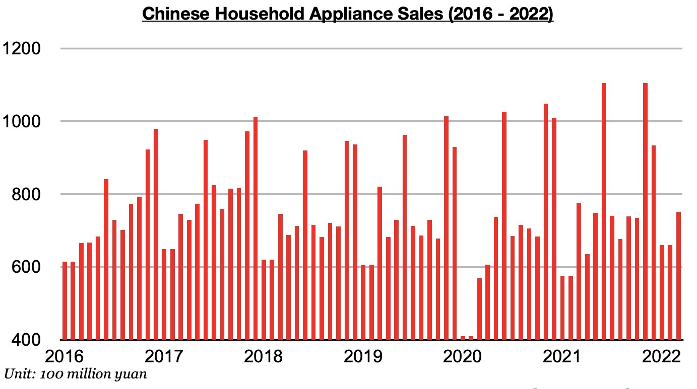
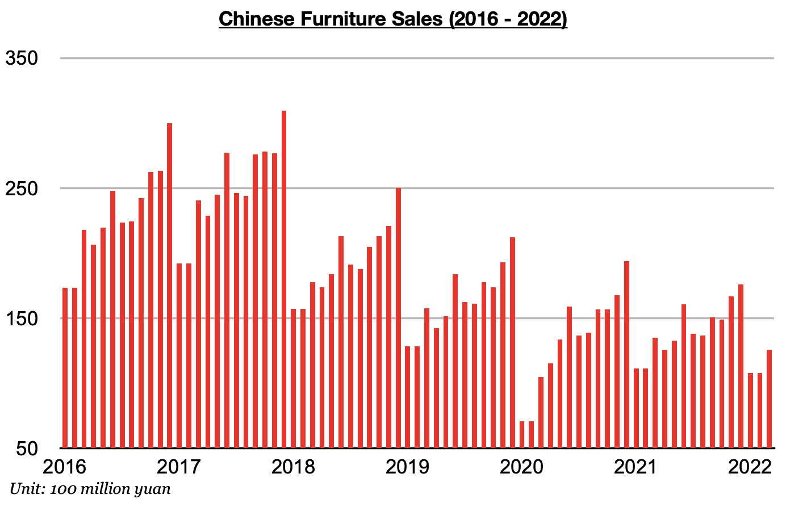
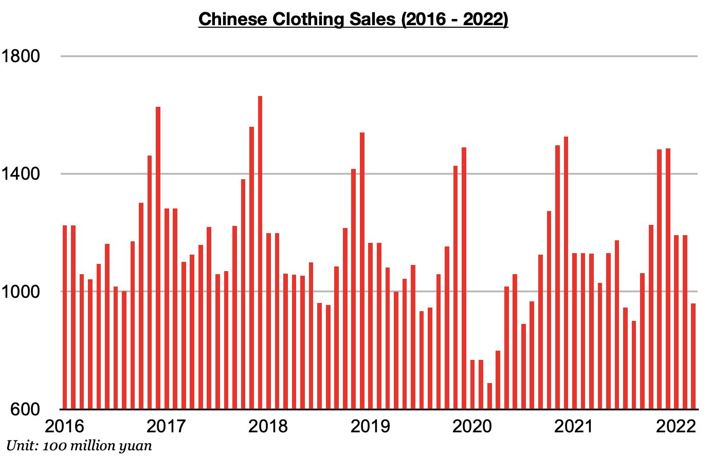

# Renewed Weakness in Chinese Consumer Spending

**Date:** May 03, 2022  
**Publisher:** Breakwave Advisors | **Category:** Market Insights  
**Original URL:** [https://www.breakwaveadvisors.com/insights/2022/5/3/renewed-weakness-in-chinese-consumer-spending](https://www.breakwaveadvisors.com/insights/2022/5/3/renewed-weakness-in-chinese-consumer-spending)  

---

*By*[*Jeffrey Landsberg*](https://www.linkedin.com/in/jeffrey-landsberg-70ab957/)

The ongoing surge of new daily coronavirus cases in China, which began last month, has been leading to renewed weakness in the nation's consumer spending. March saw consumer spending fall on a year-on-year basis by 3.5%, which has marked the first year-on-year contraction seen since July 2020. Another contraction will very likely be reported once April data is released later next month. As we discussed in some of Commodore's recent China coverage, an examination of the March data shows that domestic appliance sales, clothing sales, and furniture all contracted on a year-on-year basis last month. Appliance sales (which includes consumer electronics) totaled 75.2 billion yuan in March, which has marked a year-on-year contraction of 3%. Appliance sales had previously increased on a year-on-year basis during fifteen of the prior seventeen months. Also remaining notable is that appliance sales last year came in at an all-time high during both June and November.

> **Figure 1: Chart 1 (29)**  
> [Local Asset](file:///C:/Users/Dell/Github/Shipping/corpus/03-breakwave/insights/2022/assets/2022-05-03_renewed-weakness-in-chinese-consumer-spending_img_chart1282929_07b22f5f2731.jpg)

Furniture sales in March totaled 12.6 billion yuan, which has marked a year-on-year contraction of 7%. Furniture sales have now contracted on a year-on-year basis for eight consecutive months. The 7% contraction has marked the second largest contraction seen during this period (the largest was a 9% contraction in December).

> **Figure 2: Chart 2 (26)**  
> [Local Asset](file:///C:/Users/Dell/Github/Shipping/corpus/03-breakwave/insights/2022/assets/2022-05-03_renewed-weakness-in-chinese-consumer-spending_img_chart2282629_1a5c22eb2f70.jpg)

Clothing sales (which includes garments, footwear, hats, and knitwear) in March totaled 96 billion yuan, which has marked a year-on-year increase of 15%. Appliance sales have now contracted on a year-on-year basis during six of the last eight months (but sales did increase on a year-on-year basis in January/February by 5%).

> **Figure 3: Chart 3 (21)**  
> [Local Asset](file:///C:/Users/Dell/Github/Shipping/corpus/03-breakwave/insights/2022/assets/2022-05-03_renewed-weakness-in-chinese-consumer-spending_img_chart3282129_215f8a77397f.jpg)

---

**Tags:** China, Economy, Sales  
