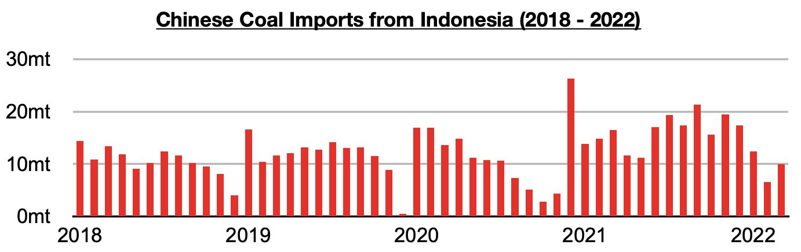
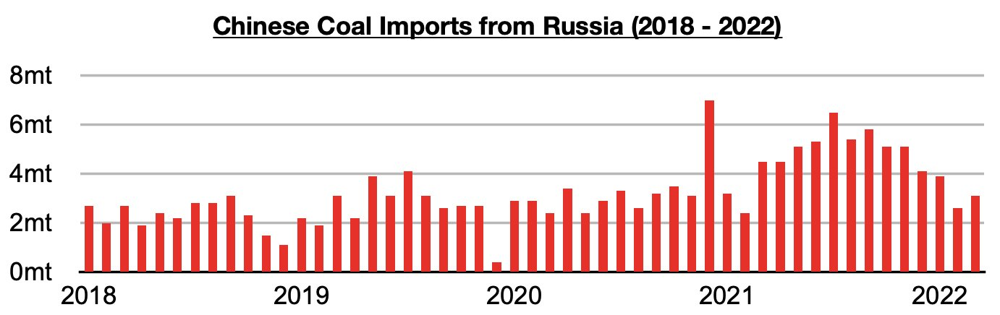
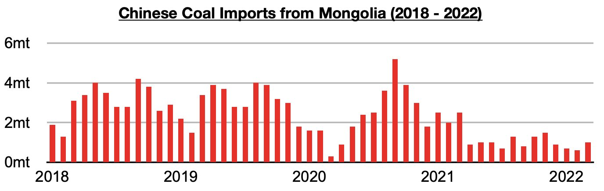
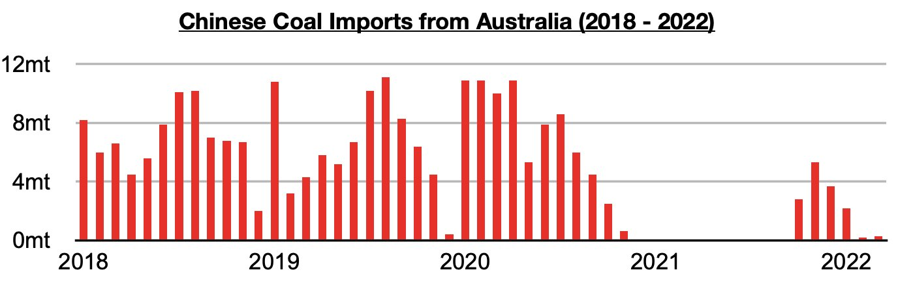

# Indonesia and Russia Remain China's Primary Source of Coal Imports

**Date:** May 05, 2022  
**Publisher:** Breakwave Advisors | **Category:** Market Insights  
**Original URL:** [https://www.breakwaveadvisors.com/insights/2022/5/5/indonesia-and-russia-remain-chinas-primary-source-of-coal-imports](https://www.breakwaveadvisors.com/insights/2022/5/5/indonesia-and-russia-remain-chinas-primary-source-of-coal-imports)  

---

*By*[*Jeffrey Landsberg*](https://www.linkedin.com/in/jeffrey-landsberg-70ab957/)

As we discussed in Commodore's most recent Weekly China Report, March coal import data by origin was recently released. Imports from Indonesia have remained China's primary source of imports and imports from Russia have remained the second largest source of imports. Significant to us is that Russia remains China's second largest source of coal imports, and we believe last week's coal import tariff cut has been done with Russian imports in mind. Thermal coal imports from Russia previously had a 6% tariff. Indonesia, China's largest source of coal imports, already had a tariff rate of zero.

Imports from Indonesia totaled 10 million tons in March, which is up from February by 3.4 million tons (52%) but down year-on-year by 6.5 million tons (-39%).

> **Figure 1: Chart 1 (30)**  
> [Local Asset](file:///C:/Users/Dell/Github/Shipping/corpus/03-breakwave/insights/2022/assets/2022-05-05_indonesia-and-russia-remain-chinas-primary-source-of-coal-imports_img_chart1283029_157f006ebc7f.jpg)

Imports from Russia totaled 3.1 million tons, which is up from February by 500,000 tons (19%) but down year-on-year by 1.4 million tons (-31%).

> **Figure 2: Chart 2 (27)**  
> [Local Asset](file:///C:/Users/Dell/Github/Shipping/corpus/03-breakwave/insights/2022/assets/2022-05-05_indonesia-and-russia-remain-chinas-primary-source-of-coal-imports_img_chart2282729_0b961d006bda.jpg)

Imports from Mongolia totaled 1 million tons, which is up from February by 400,000 tons (67%) but down year-on-year by 1.5 million tons (-60%). Imports from Mongolia have long remained under pressure from the Chinese government due to Mongolian coronavirus cases.

> **Figure 3: Chart 3 (22)**  
> [Local Asset](file:///C:/Users/Dell/Github/Shipping/corpus/03-breakwave/insights/2022/assets/2022-05-05_indonesia-and-russia-remain-chinas-primary-source-of-coal-imports_img_chart3282229_d729198ad8c1.jpg)

Imports from Australia totaled 300,000 tons. This is up from February by 100,000 tons (50%) and up year-on-year by 300,000 tons. China has now imported Australian coal for six straight months (but the last two months have seen only a relatively small amount of volume). Prior to October, the last time that China reported any coal imports from Australia was back in November 2020. China has still not actually reported an official end to its ban on Australian coal imports.

> **Figure 4: Chart 4 (13)**  
> [Local Asset](file:///C:/Users/Dell/Github/Shipping/corpus/03-breakwave/insights/2022/assets/2022-05-05_indonesia-and-russia-remain-chinas-primary-source-of-coal-imports_img_chart4281329_e3f6bd978713.jpg)

China in March also imported a small amount of coal from the United States, Canada, and the Philippines.

---

**Tags:** Coal, Imports, China, Indonesia, Russia  
