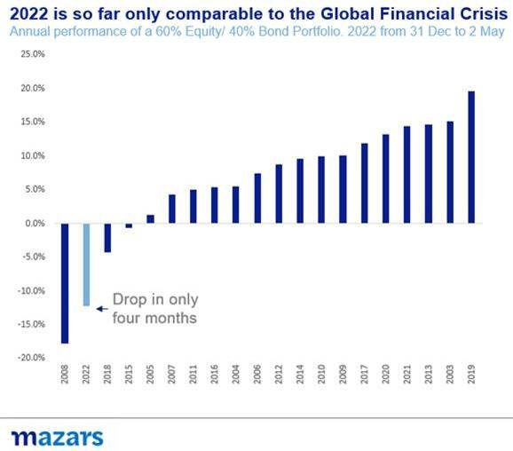
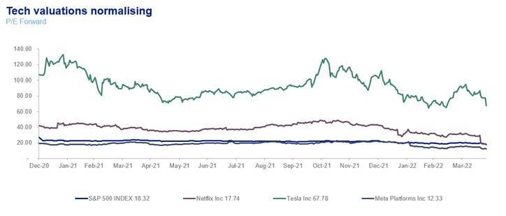
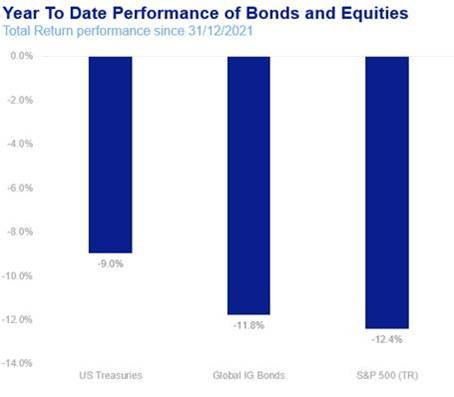

# Weekly Comment: The GDR (Great Dose of Reality) crisis

**Date:** May 05, 2022  
**Publisher:** Breakwave Advisors | **Category:** Market Insights  
**Original URL:** [https://www.breakwaveadvisors.com/insights/2022/5/4/weekly-comment-the-gdr-great-dose-of-reality-crisis](https://www.breakwaveadvisors.com/insights/2022/5/4/weekly-comment-the-gdr-great-dose-of-reality-crisis)  

---

*By*[*George Lagarias*](https://www.linkedin.com/in/george-lagarias-mba-3baa769/)

In 1865 Rudolf Clausius, a German Physicist and Mathematician said that*“The entropy (disorder) of the universe tends to a maximum”*, in his famous Second Law of Thermodynamics. Humans have always known that good times only last for so long, before disorder sets in. Correctly, then, the more things are great, the more we fear that they will not continue to be so. Two centuries before Clausius, Shakespeare encapsulated the feeling in Richard III*“I fear our happiness is at the height”*. Twenty centuries before that, the Greek Philosopher Heraclitus exclaimed that*“everything is in flux”*.

In other words, nothing good, or bad, lasts forever. Not even long enough.

The old adage says that*“markets can remain irrational, longer than you can stay solvent”*. It is a reminder to value investors everywhere, that betting on the market coming to its senses requires both vast amounts of patience and liquidity. In a world fuelled by the Fed’s willingness to suppress risks everywhere to foster growth, where narratives were compartmentalised in media bubbles, it was not too difficult for irrational exuberance to perpetuate itself longer than anyone thought possible. In fact, in the past few years, while we often acknowledged that risks were high, we advised portfolio clients ‘going with it’ is probably a better strategy than fighting capitalism. At the same time, we warned that the one thing which could end the post-2008 illusion was persisting inflation, which would knock the Fed off its growth-support course and put it into a hawkish mode. As of the beginning of 2022 inflation unravelled a 14-year policy by the Fed, and with it, by and large, the ‘going with it’ investment strategy.

So, a list of things 2022 has, so far, painfully reminded us of

- Even central banks have limits to how much they can support growth and risk assets
- No country can grow in perpetuity and without volatility (not even China)
- Inflation may go away for a very long time, but it is never truly extinct
- Hope is an investment prerequisite, not an investment strategy (tech stocks normalising)
- *“Only the dead have seen the end of war”*(Plato)

Since the beginning of the year, equity and bond markets have been in disarray. For asset allocators, it marks by far the worst beginning of the year in this century. Performance is ¾ of the way to catching 2008, in just for months.

> **Figure 1: Fed Put Is**  
> *The Fed Put is, for all intents and purposes, dead, or at least deeply buried into the ground.Portfolio managers should no longer wait for signs from the central bankbefore proceeding with an investment. The most prominent victim is the tech bubble. Unsustainably valued car makers, to content creators, exotic cryptocurrencies and other blockchain-related products are now being introduced to gravity.*  
> **Interactive Data & Source:** [Bnnbloomberg](https://www.bnnbloomberg.ca/mercedes-ev-breaks-1-000-kilometer-range-barrier-to-outdo-tesla-1.1752118) | [Local Asset](file:///C:/Users/Dell/Github/Shipping/corpus/03-breakwave/insights/2022/assets/2022-05-05_weekly-comment-the-gdr-great-dose-of-reality-crisis_img_image004_3b6a78492b3e.jpg)

We are in a market dominated by risks and in desperate search of a guiding theme that will replace the Fed Put. This will not be easy. In the last fourteen years, markets have been guided by a single, government-sponsored theme. Even before the Global Financial Crisis, Alan Greenspan happily assumed the mantle of ‘the market-friendly’ Fed. Reversion back to a pre-Fed Put market will take time. Failure to find a new guiding doctrine could see further and significant devaluation of risk assets.

The sooner markets acknowledge these three truths, the sooner they will be able to once again profitably convert risk into opportunities

> **Figure 2: The Fed Put Is, for All Intents and Purposes, Dead**  
> **Interactive Data & Source:** [Bnnbloomberg](https://www.bnnbloomberg.ca/mercedes-ev-breaks-1-000-kilometer-range-barrier-to-outdo-tesla-1.1752118) | [Local Asset](file:///C:/Users/Dell/Github/Shipping/corpus/03-breakwave/insights/2022/assets/2022-05-05_weekly-comment-the-gdr-great-dose-of-reality-crisis_img_image005_987f85c7cba2.jpg)

Quantitative tightening should separate those with true wings from those who just flap their hands in the background hoping for investment.

- **China is no longer the world’s cheap manufacturer**. It doesn’t want to be. The repercussions of the ‘Great Rebalancing’ are already significant for Value Chains, long-term inflation and earnings at a global level.
- **The post-WWII order is officially dead**. This will be hard to swallow since this is the world all of us grew up in. But like the Pax Britannica or even the Pax Romana, the Pax Americana has reached its natural end. This doesn’t necessarily mean a sea change, not at least within the 10-30year life of a portfolio. The US will probably remain the strongest country in the world and a, largely, dependable ally to the West. The Dollar will also probably remain the world’s safe haven. Why? Because nuclear weapons prevent a World-War-type Total War, and with it the abrupt change this brings. The world will probably remain in disarray for some time before a new global order emerges, which will, by and large, be a variation of the previous one.

## How About the Short Term?

In theory, and philosophy, these are good principles for the ten-year portfolio. But what about tactical asset allocation? To be sure, the bulk of returns comes from the long-term decisions. But all clients paying an annual management fee want to know that the captain at the helm can also tactically produce results.

What we can’t do, is be tactically based on long term asset allocation principles. Since the beginning of the year, returns have been positively correlated on the downside.

> **Figure 3: Market Chart 3**  
> **Interactive Data & Source:** [Bnnbloomberg](https://www.bnnbloomberg.ca/mercedes-ev-breaks-1-000-kilometer-range-barrier-to-outdo-tesla-1.1752118) | [Local Asset](file:///C:/Users/Dell/Github/Shipping/corpus/03-breakwave/insights/2022/assets/2022-05-05_weekly-comment-the-gdr-great-dose-of-reality-crisis_img_image006_67c0b489b42c.jpg)

It is also evident that they can’t think in terms of long term themes over the short term. In a world so much in flux, in the space of the next 12-24 months, everything and anything is possible. The Fed could change tack. China could withdraw support from Russia. Moscow and Kiev might come to an accord. What today looks impossible is more probable when things change so quickly.

Instead, tactical wins might come from more mundane observations.

The first tactical win comes from avoiding obvious icebergs. While risks are more apparent now, icebergs managed to hide themselves well during a time of extreme liquidity.

The second tactical win may come from identifying value. After fourteen years of focusing on the Fed, portfolio managers will now have to answer bottom-up questions again. At this point, both bond and equity valuations are low. Successful managers will be the ones who will correctly identify where longer-term opportunities lie. Are bonds attractive at 3%? Are Netflix, Facebook and Google valued at S&P 500 average now mature companies, or can they still produce super growth? Will Elon Musk be able to go to Mars, become the arbiter of global free speech and still successfully run Tesla? Or will Tesla be undone by[Mercedes](https://www.bnnbloomberg.ca/mercedes-ev-breaks-1-000-kilometer-range-barrier-to-outdo-tesla-1.1752118)’s 1000km autonomous electric vehicle?

A post-Fed Put market means that policy, hope, memetics and momentum are giving way to good-old-fashioned investment principles. It will take us some time to get there, it will be rough and the mettle of many a portfolio manager will be tested. We are confident that our long term, clear-headed and focused approach towards portfolios which has seen us through many a crisis, will do so through this GDR (Great Dose of Reality) Crisis.
