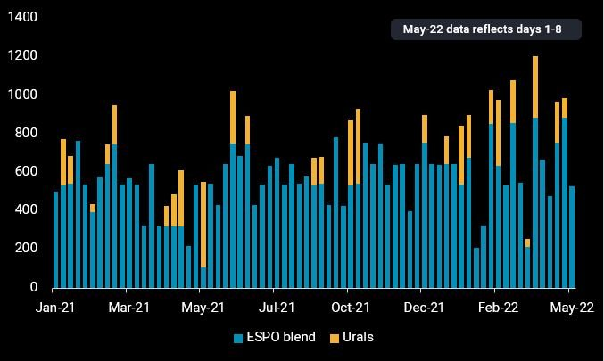
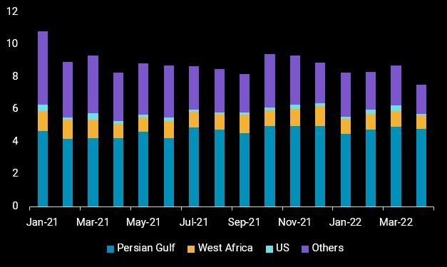

# China’s slowing crude appetite: Winners and losers

**Date:** May 06, 2022  
**Publisher:** Breakwave Advisors | **Category:** Market Insights  
**Original URL:** [https://www.breakwaveadvisors.com/insights/2022/5/6/chinas-slowing-crude-appetite-winners-and-losers](https://www.breakwaveadvisors.com/insights/2022/5/6/chinas-slowing-crude-appetite-winners-and-losers)  

---

*By*[*Serena Huang*](https://www.linkedin.com/in/serena-huang-2466b489/)

**As China battles against its latest Covid outbreak, holding firm to its zero-Covid policy, domestic refiners are forced to dial back on refinery runs as domestic consumption and margins plunge. Crude purchases have slowed in recent weeks and are likely to remain subdued as more refineries enter into seasonal maintenance this quarter. Global crude suppliers are now competing for a smaller pie in China. Who will be the winners and losers in this race?**

## Iran's Crude Exports Hold Firm, Russia Sees Mixed Outlook

With much certainty, Iran’s heavily discounted crude has been and will remain a popular choice among the independent refiners, especially in the current environment of weak domestic refining margins. Chinese imports of Iranian crude averaged 550kbd in Q1, up over 10% from last quarter, and flows are expected to remain firm despite the country’s reduced import appetite.

Prospects for Russia’s crude exports to China are, however, mixed. The withdrawal of credit loans from banks, high freight costs and potential risks of being sanctioned for handling Russian crude may have derailed Chinese refiners’ purchases of Russian crude, at least in the early days of the Russian-Ukraine invasion. But Russia has reportedly been courting the independent refiners in maintaining their crude purchases through offering discounts and alternative payment arrangements, which could be paying off. Our preliminary data shows[Russia’s seaborne ESPO blend exports to China at 530kbd](https://analytics.vortexa.com/?dateRange=2021-01-01T00%3A00%3A00.000Z__2022-05-08T23%3A59%3A59.999Z&filtersEnabled=%5B%22p%22%2C%22o%22%2C%22d%22%2C%22d_r%22%2C%22v%22%2C%22intra%22%2C%22sts_o%22%2C%22c_o%22%2C%22c%22%2C%22sts%22%2C%22w%22%2C%22v_c%22%2C%22v_o%22%5D&frequency=week&from=%5B%220f97cdceba05c3c4d13e264ffbfa7b571d72a22a81175d56beb91227f6c3f40f%22%5D&maxEventFilter=1652054399999&metric=bpd&minEventFilter=1651449600000&page=Flows&products=%5B%2254af755a090118dcf9b0724c9a4e9f14745c26165385ffa7f1445bc768f06f11%22%5D&tabId=8e4647b4-8839-4e7a-b94b-206ec3a3a101&timeSeriesProperty=product_grade&vesselsExcluded=%5B%2222cc938de87940f07e4d751e46e50a9a401eb28eba48df362ccb551f89e350f3%22%5D)in the first week of May, still within the historical range and we deem it likely that this level will be sustained.

The outlook on Russian Urals is more uncertain, comparatively. At first glance, loadings of Urals in April with a firm destination to China totalled 75kbd, down nearly 50% from Q1. But two Urals-laden VLCCs (*Elandra Everest, Elandra Denali*) and three Aframaxes (*NS Champion, Vernadsky Prospect, Glaucus*) that are currently heading East of Suez but are signalling waypoint destinations, could likely be headed for China, lifting total Urals exports to the country to 230kbd if all the cargoes were to discharge there. Based on our observations of previous vessel movements, Urals-laden vessels that are headed for China are often more discrete in their destination declarations, compared to vessels headed for India which typically signal their final destination port in the early days of their voyages.

The European Union’s proposal of banning Russian oil imports by the end of this year, if implemented, is set to drive more Urals exports to China. While China is keen to remain politically neutral and has been discouraging its state-owned refiners from making fresh Russian oil purchases, it would be difficult for the government to ignore Russia’s request for a lifeline if it needs one.

> **Figure 1: Russia Crude Exports to China 1**  
> **Interactive Data & Source:** [Analytics Vortexa](https://analytics.vortexa.com/?dateRange=2021-01-01T00%3A00%3A00.000Z__2022-05-08T23%3A59%3A59.999Z&filtersEnabled=%5B%22p%22%2C%22o%22%2C%22d%22%2C%22d_r%22%2C%22v%22%2C%22intra%22%2C%22sts_o%22%2C%22c_o%22%2C%22v_o%22%2C%22c%22%2C%22w%22%2C%22sts%22%2C%22v_s%22%5D&frequency=week&from=%5B%22b996521be9c996db3560ca234a56286ac38f798d34be229437555fab4f12a6a5%22%5D&metric=bpd&page=Flows&products=%5B%2204c4ea46fc6fccfe8388717f399b40e5e348f9a98c451d99e7366caa998191a7%22%2C%22c8803c073c2980d9849784c16bcd41d7f7b7561d2c8c1799a16166527b120242%22%5D&tabId=ec7f8668-bf37-4879-b01e-bd912376618c&timeSeriesProperty=product_grade&to=%5B%22934c47f36c16a58d68ef5e007e62a23f5f036ee3f3d1f5f85a48c572b90ad8b2%22%5D) | [Local Asset](file:///C:/Users/Dell/Github/Shipping/corpus/03-breakwave/insights/2022/assets/2022-05-06_chinas-slowing-crude-appetite-winners-and-losers_img_russiacrudeexportstochina-1_8529a0b6751d.jpg)

## West African and Us Crudes Lose Market Share As Marginal Barrels

Among the other crude exporters, Mideast Gulf producers have secured term contracts with the Chinese refiners, safeguarding their market share. West Africa and US crudes, the marginal barrels purchased on a spot basis, however, saw their combined loadings to China fall by almost 30% m-o-m in April. Exports of Norway’s Johan Sverdrup grade to China, too, registered an over 60% m-o-m decline last month. Most of these crudes found homes in Europe replacing Urals supplies for many refiners. But the decline in long-haul crude exports to China is bad news for ship owners, which have seen tanker rates tumbling in recent weeks. Both TD15 (West Africa-to-China) and TD22 (US Gulf-to-China) VLCC rates are down nearly 30% this week versus mid-April.

> **Figure 2: Crude Loadings to China**  
> **Interactive Data & Source:** [Analytics Vortexa](https://analytics.vortexa.com/?dateRange=2021-01-01T00%3A00%3A00.000Z__2022-04-30T23%3A59%3A59.999Z&filtersEnabled=%5B%22p%22%2C%22o%22%2C%22d%22%2C%22d_r%22%2C%22v%22%2C%22intra%22%2C%22sts_o%22%2C%22c_o%22%2C%22v_o%22%2C%22c%22%2C%22w%22%2C%22sts%22%2C%22v_s%22%5D&metric=bpd&page=Flows&products=%5B%2254af755a090118dcf9b0724c9a4e9f14745c26165385ffa7f1445bc768f06f11%22%5D&tabId=ec7f8668-bf37-4879-b01e-bd912376618c&timeSeriesProperty=origin_shipping_region&to=%5B%22934c47f36c16a58d68ef5e007e62a23f5f036ee3f3d1f5f85a48c572b90ad8b2%22%5D) | [Local Asset](file:///C:/Users/Dell/Github/Shipping/corpus/03-breakwave/insights/2022/assets/2022-05-06_chinas-slowing-crude-appetite-winners-and-losers_img_crudeloadingstochina_a21d48123c3f.jpg)

## China’s Crude Appetite Recovery Uncertain

China, mired by its current Covid wave, may see a slow recovery in its crude import appetite post its refinery maintenance season if domestic demand remains muted. Refiners may however choose to keep imports stable instead of cutting back further, to restock the inventories that they have drawn significantly last year. The country’s crude inventories have climbed for six consecutive weeks since end March, registering the largest m-o-m increase in April since July 2020 but remain well below the two-year historical average levels.
