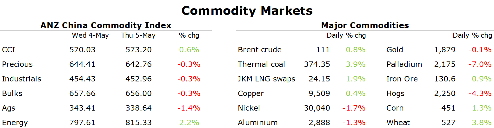

# Crude oil gains as OPEC struggles to raise output

**Date:** May 06, 2022  
**Publisher:** Breakwave Advisors | **Category:** Market Insights  
**Original URL:** [https://www.breakwaveadvisors.com/insights/2022/5/6/crude-oil-gains-as-opec-struggles-to-raise-output](https://www.breakwaveadvisors.com/insights/2022/5/6/crude-oil-gains-as-opec-struggles-to-raise-output)  

---

*By*[*Daniel Hynes*](https://www.linkedin.com/in/dahynes/)

A gloomy economic backdrop weighed on sentiment across markets. But supply side issues in energy markets helped keep them afloat.

> **Figure 1: 1651787917027**  
> [Local Asset](file:///C:/Users/Dell/Github/Shipping/corpus/03-breakwave/insights/2022/assets/2022-05-06_crude-oil-gains-as-opec-struggles-to-raise-output_img_1651787917027_ac1e95f1e3e8.png)

**Crude oil**edged higher as the market fretted about supply. A stronger USD and losses across most other asset classes weighed on sentiment early in the session. However, attention quickly reverted to fundamentals tightening in the short term. The market is concerned that Europe will struggle to replace the 3.2mb/d it imports from Russia, as it looks to impose a ban over the next six months. OPEC seems unable to cover the losses. At its monthly meeting overnight, it ratified a small monthly production increase (400kb/d). The reality is thought that it is struggling to raise output, with Bloomberg data showing production rose by only 10kb/d in April. Kuwaiti oil minister, Mohammed Alfares, said the group remained concerned about weaker demand in China and the prospects of weaker economic growth due to rising interest rates. It also sees no shortage stemming from the Russia-Ukraine war, and raised its forecast of a surplus by 600kb/d to 1.9mb/d. The market was also surprised by the announcement that the US Energy Department would start purchasing oil to refill the nation’s strategic reserve. This is likely to exacerbate the tightness in the oil market.

The prospect of sanctions on Russia’s energy products weighed on the**European natural gas**market. With the EU expected to announce sanctions on Russian oil in coming days, attention is shifting to whether it will include natural gas in the future. For the moment, supplies of Russian gas via Ukraine remain steady, while Poland is receiving gas in reverse mode from Germany following Russia’s move to cut supplies. Sentiment was boosted by lower renewables generation. Germany’s wind power slumped, while output is forecast to remain restricted for the rest of the weak. This helped pushed Dutch front-month futures up 2.6% to EUR106.51/MWh.**North Asia LNG**futures gained as India’s buyers returned to the spot market. Sweltering heat and blackouts have caused utilities to turn to expensive LNG to boost power generation. The tightness is being exacerbated by a shortage of**coal**in the market following Europe’s ban on Russian supplies. Newcastle coal futures rallied 3.9% to hit USD374/t as consumers scrambled to secure any available cargo.

**European carbon emissions**touched a 10-week high of EUE91/t amid gains in the energy markets. Technical buying was a feature in the market, after it broke through a key resistance level. However, prices retreated into the close as the weak economic backdrop weighed on sentiment.

**Base metals**also struggled amid the economic gloom. A stronger USD weighed on investor appetite. Copper ended the session unchanged, while nickel and aluminium fell more than 1.5%. Attention remains on China, where officials are struggling to contain a wave of COVID-19 by increasing restrictions in Shanghai and Beijing. This comes amid tighter monetary policy from central banks around the world.

**Iron ore**manage to push higher, with investors shrugging off weak economic data to focus on support from the government. China Securities Regulatory Commission will support the financing of real estate companies. This follows the government’s commitment to bolster infrastructure investment.

**Gold**erased gains amid a stronger USD and higher Treasury yields. A selloff in long-end Treasuries saw the benchmark 10y rate rise above 3%.
