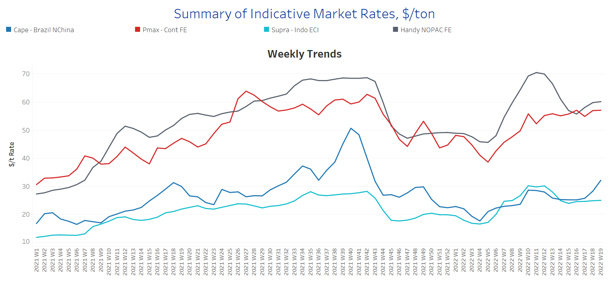
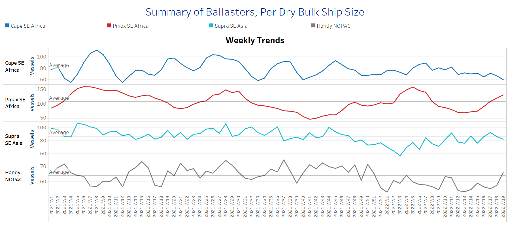
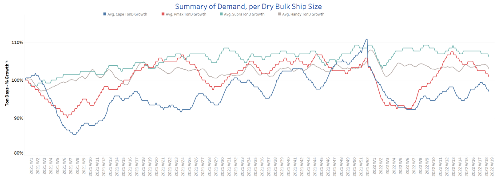
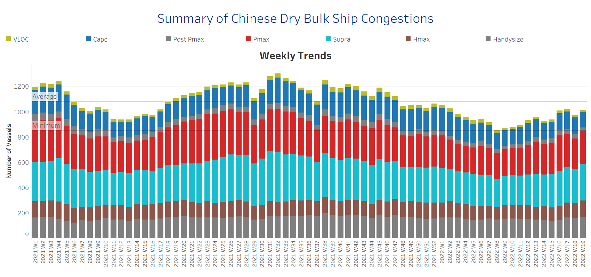

# Signal Dry Bulk Weekly Report

**Date:** May 12, 2022  
**Publisher:** Breakwave Advisors | **Category:** Market Insights  
**Original URL:** [https://www.breakwaveadvisors.com/insights/2022/5/12/signal-dry-bulk-weekly-report](https://www.breakwaveadvisors.com/insights/2022/5/12/signal-dry-bulk-weekly-report)  

---

The freight market sentiment sustained the firmness of the last days with revival seen in the Capesize and Handysize segment, and Panamax recorded a gradual upward trend. There are still concerns about the iron ore outlook as iron ore prices plunged on Monday as COVID-19 restrictions prompted traders to be cautious and fuelled uncertainty over global demand.

Prices for iron ore cargoes with a 63.5% iron content for delivery into Tianjin tumbled to an over two-month low of around $135 /t, while Chinese iron ore imports recorded a decreasing trend. In April, Chinese iron ore imports stood at 86 million tons, down almost 13% over a year earlier, as renewed coronavirus-induced restrictions suppressed demand.

In the coal segment, China's coal imports surged 43% in April from March, driven mainly by concerns of supply disruptions following Russia-Ukraine geopolitical tensions. According to data from the General Administration of Customs, China shipped 23.5 million tons of coal last month, compared to 16.4 million tons in March and 21.7 million tons in April 2021. For the period of January-April, China brought in a total of 75.4 million tons of coal, down 16% from shipments in the same period a year earlier.

In the grain market, Chicago wheat futures were above the $11 per bushel level in May. The surge is ongoing for around three weeks as poor weather conditions and export restrictions heightened supply concerns. In the meantime, the Indian government said it considered restricting wheat exports after severe heat waves hampered production, erasing previous hopes from traders worldwide that a strong crop in India would ease global shortages amid the supply shortage in Ukraine.

## Section 1 - Freight -Market Rates ($/T) - Firmer

‘The Big Picture’ - Capesize and Panamax Bulkers and Smaller Ship Sizes

> **Figure 1: Ch1**  
> **Interactive Data & Source:** [Signal Ocean Platform](https://www.thesignalgroup.com/signal-ocean-platform) | [Local Asset](file:///C:/Users/Dell/Github/Shipping/corpus/03-breakwave/insights/2022/assets/2022-05-12_signal-dry-bulk-weekly-report_img_ch1_47c4a6751190.png)

The revival continues with a significant upturn of freight rates in the Capesize segment, whereas there is a sustained steadiness in the Supramax.

- **Capesize**Brazil-to-North China freight rates increased to $31/t, $5/t more than the ending of Week 17.
- **Panamax**Continent-to-Far East freight recorded a slight increase to $58/t, surpassing the peak of Week 10 (~$56/t).
- **Supramax**Indo-to-ECI freight rates continued flat as seen over the last four weeks at around $25/t.
- **Handysize**NOPAC-to-Far East freight rates fetched this week $60/t for the first time since the ending of Week 14.

## Section 2 - Supply - Ballasters View

## Number of Vessels -Increasing

Supply Trend Lines for Key Load Areas

> **Figure 2: Ch2**  
> **Interactive Data & Source:** [Signal Ocean Platform](https://www.thesignalgroup.com/signal-ocean-platform) | [Local Asset](file:///C:/Users/Dell/Github/Shipping/corpus/03-breakwave/insights/2022/assets/2022-05-12_signal-dry-bulk-weekly-report_img_ch2_8820ccc1f7cf.png)

The number of ballasters increased sharply in the Panamax and Handysize segment for the second week of May, while in the Capesize, levels remain below the one-year average since the ending of Week 9.

- **Capesize**SE Africa: The number of vessels sailing in ballast decreased further to 61 vessels, 10 vessels less than the ending of Week 17 with a 25% decrease from the last peak of Week 11.
- **Panamax**SE Africa: The number of vessels sailing in ballast increased to 126 vessels, an 80% increase from the low of Week 13.
- **Supramax**SE Asia: The number of vessels sailing in ballast is now around 90 vessels, 4 vessels more than the one-year average.
- **Handysize**NOPAC: The number of vessels held the sharp increase of previous days and rose to around 80 vessels, a 50% increase from the low of Week 13.

## Section 3 - Demand - In Ton Days

## Decreasing

> **Figure 3: Ch3**  
> **Interactive Data & Source:** [Signal Ocean Platform](https://www.thesignalgroup.com/signal-ocean-platform) | [Local Asset](file:///C:/Users/Dell/Github/Shipping/corpus/03-breakwave/insights/2022/assets/2022-05-12_signal-dry-bulk-weekly-report_img_ch3_b4c2ee9ad850.png)

The overall trend of demand ton-days sustained the decreasing trend for the last four weeks.

- **Capesize**demand ton-days: The revival seems to hold but with a softer pace than last week.
- **Panamax**demand ton-days: The downward revision remains with a further decrease during the second week of May.
- **Supramax**demand ton-days: There is a slight fall from the previous week, while it seems that the last peak will remain within week 12.
- **Handysize**demand ton-days: There is a sustained decrease week over week, and seems likely to continue through the end of the current month.

## Section 4 - Chinese Port Congestions -

## Number of Vessels - Decreasing

## Dry Bulk Ships Congested at Chinese Ports

> **Figure 4: Ch4**  
> **Interactive Data & Source:** [Signal Ocean Platform](https://www.thesignalgroup.com/signal-ocean-platform) | [Local Asset](file:///C:/Users/Dell/Github/Shipping/corpus/03-breakwave/insights/2022/assets/2022-05-12_signal-dry-bulk-weekly-report_img_ch4_dda6a790dfc2.png)

Dry bulk ships in congestion seemed to have sustained a softer pace in May since the last spike of Week 17.

- **Capesize:**The number of ships in congestion sustained levels of less than 130 over the last two weeks. The second week of May started with 126 vessels compared to 137 vessels during Week17.
- **Panamax:**The number of ships recorded a slight increase to 248 vessels, however, the current figure is significantly lower than the highs of Week 17~264 vessels.
- **Supramax:**The number of ships in congestion increased to 284, 12 vessels more than the previous week.
- **Handysize**: The number of ships in congestion increased to 166, a 20% increase from the low of Week 13.

Data Source:[Signal Ocean Platform](https://www.thesignalgroup.com/signal-ocean-platform)

---

**Tags:** Dry Bulk, Shipping, Freight, Rates  
