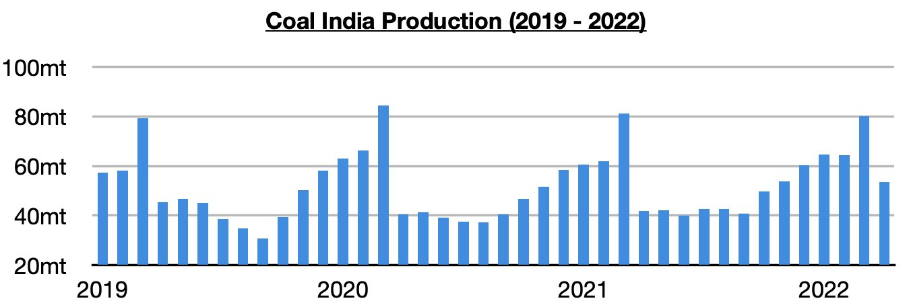
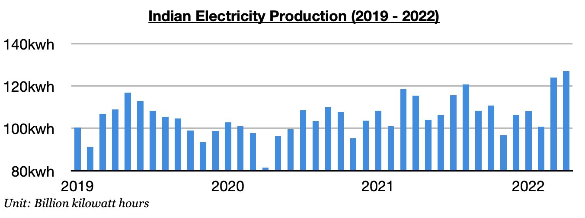
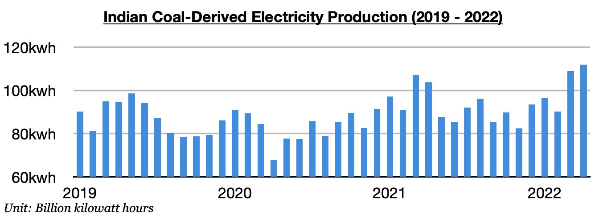

# Coal India's Production Remains Strong But Electricity Generation Continuing to Set New Records

**Date:** May 13, 2022  
**Publisher:** Breakwave Advisors | **Category:** Market Insights  
**Original URL:** [https://www.breakwaveadvisors.com/insights/2022/5/12/coal-indias-production-remains-strong-but-electricity-generation-continuing-to-set-new-records](https://www.breakwaveadvisors.com/insights/2022/5/12/coal-indias-production-remains-strong-but-electricity-generation-continuing-to-set-new-records)  

---

*By*[*Jeffrey Landsberg*](https://www.linkedin.com/in/jeffrey-landsberg-70ab957/)

Coal India produced approximately 53.5 million tons of coal last month, which marks a month-on-month decline of 26.6 million tons (-33%) but a year-on-year increase of 11.6 million tons (28%). The month-on-month decline is very normal. Much more significant is that production last month grew year-on-year by 27%. The first four months of this year have now seen Coal India’s production increase year-on-year by 16.9 million tons (7%).

> **Figure 1: Chart 1 (31)**  
> [Local Asset](file:///C:/Users/Dell/Github/Shipping/corpus/03-breakwave/insights/2022/assets/2022-05-13_coal-indias-production-remains-strong-but-electricity-generation-continuing-to-s_img_chart1283129_d1c6e1c54267.jpg)

Coal India's production has remained strong, but the nation's electricity generation is continuing to set new records and India's government has wisely been directing utilities to significantly increase coal imports. India produced approximately 127.1 billion kilowatt hours of electricity last month, which is up month-on-month by 3.2 billion kilowatt hours (3%) and up year-on-year by 11.6 billion kilowatt hours (10%). Production has now set a record for two consecutive months. Also very significant is that the 10% year-on-year growth seen last month has marked the largest growth seen since August.

> **Figure 2: Chart 2 (28)**  
> [Local Asset](file:///C:/Users/Dell/Github/Shipping/corpus/03-breakwave/insights/2022/assets/2022-05-13_coal-indias-production-remains-strong-but-electricity-generation-continuing-to-s_img_chart2282829_011ed3037ddf.jpg)

The last two months have seen a dramatic shift in India. As recently as in January and February, electricity production was contracting on a year-on-year basis. Coal-derived electricity generation has also continued to set new records as well. India’s coal-derived electricity generation totaled approximately 111.8 billion kilowatt hours last month. This has marked a month-on-month increase of 3.1 billion kilowatt hours (3%) and is up year-on-year by 8 billion kilowatt hours (8%). India’s coal-derived electricity generation has now also set new records during each of the last two months.

> **Figure 3: Chart 3 (23)**  
> [Local Asset](file:///C:/Users/Dell/Github/Shipping/corpus/03-breakwave/insights/2022/assets/2022-05-13_coal-indias-production-remains-strong-but-electricity-generation-continuing-to-s_img_chart3282329_0bc19813d272.jpg)

With the nation's demand for thermal coal so strong recently, India's near-term coal import prospects remain very encouraging. As we also have been discussing to Commodore's clients in our special market updates this week, the next several days will see temperatures in India climb to higher levels that will finally be well above the normal highs for this time of year. Temperatures turning even hotter in India is becoming another positive development for the seaborne coal market and dry bulk shipping market.
