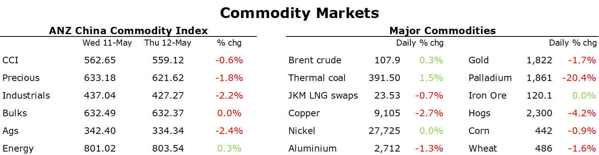

# European gas surges higher as Russia gas flows continue to fall

**Date:** May 13, 2022  
**Publisher:** Breakwave Advisors | **Category:** Market Insights  
**Original URL:** [https://www.breakwaveadvisors.com/insights/2022/5/13/european-gas-surges-higher-as-russia-gas-flows-continue-to-fall](https://www.breakwaveadvisors.com/insights/2022/5/13/european-gas-surges-higher-as-russia-gas-flows-continue-to-fall)  

---

*By*[*Daniel Hynes*](https://www.linkedin.com/in/dahynes/)

Mounting growth concerns weigh on commodity markets, with metals leading the complex lower. Energy managed to buck the trend with supply side issues pushing prices higher.

> **Figure 1: 1652392391082**  
> **Interactive Data & Source:** [Publications Anz](https://publications.anz.com/SingletrackCMS__DownloadDocument?docRef=2c1c7e65-d7fe-42de-80a0-ef6b03c0ef47&uid=bd219b92-f5cc-400e-9646-4178791864b7&jobRef=cfea2caa-7791-4e40-9317-c479ed185bf9) | [Local Asset](file:///C:/Users/Dell/Github/Shipping/corpus/03-breakwave/insights/2022/assets/2022-05-13_european-gas-surges-higher-as-russia-gas-flows-continue-to-fall_img_1652392391082_dff41ed4c03b.png)

**Crude oil**ended the session higher following another rollercoaster ride. The market continues to fret over the EU.s proposal to ban imports of Russian crude. Brent came under pressure during the session after some members of the EU said it may be time to consider delaying the ban so they can proceed with the rest of the sanctions package. Nevertheless, the risk of significant disruptions continues to hang over the market. After holding up relatively well, there are signs that Russian oil flows are now falling. Just one cargo of Sokol crude has been shipped since 27 April, while five more that should’ve been loaded have been missed, ship tracking data shows. The International Energy Agency warned that output losses of 1mb/d may triple in the second half of the year. We still expect the EU ban on Russian oil, which we estimate[**could displace around 2.5mb/d of oil**](https://publications.anz.com/SingletrackCMS__DownloadDocument?docRef=2c1c7e65-d7fe-42de-80a0-ef6b03c0ef47&uid=bd219b92-f5cc-400e-9646-4178791864b7&jobRef=cfea2caa-7791-4e40-9317-c479ed185bf9). Russia’s ability to find new customers is hindered by capacity constraints for land-based oil trade, as well as increasing constraints on shipping. Consequently, we expect inventories to drop sharply in Q3. We estimate a deficit of around 2mb/d will develop amid the supply disruptions.

**European natural gas**surged higher as Russian gas flows were disrupted. Dutch front month futures were up as much as 14% to EUR115/MWh as flows from Russia via Ukraine fell further following interruptions at a cross border entry point. Germany said the cuts amount to just 3% of the country’s imports, with the nation getting shipments from alternate sources. However, concerns of further disruption escalated after Russia sanctioned the owner of the Polish part of the Yamal-Europe pipeline. While its hardly been used this year, it’s a key alternative for gas to Ukraine. The ban means Gazprom cannot use that conduit anymore. Russia also sanctioned and halted sales to its German subsidiaries under control of the regulators. This includes an LNG marketing company based in London, and this could disrupt flows of its LNG supply.**North Asia LNG**futures were steady, with buyers focused on securing long term supply agreements amid the uncertainty that the Russia-Ukraine war has created.

**Asian coal**prices continue to push higher amid strong demand. India’s power ministry called on coal importers to ensure supplies, as the country battles an energy crisis amid heatwaves and blackouts. It will help with late payments from provincial utilities and meet with port & rail officials to ensure imported coal reaches plants quickly. Its seeking around 19m tonnes of imports this quarter.

**Base metals**prices plunged further on mounting worries about weak global demand. Copper pushed below USD9000/t for the first time since October as investors focus shifts from supply disruptions to weaker consumption. China remains the heart of these concerns as the country battles COVID-19. Economic activity remains subdued amid lockdowns in several major cities, while the debt crisis in the real estate market is threatening to curtail demand even further. Premier Li Keqiang urged officials to use fiscal and monetary policies to stabilise employment and the economy. Rampant inflation is also threatening to curtail demand. Central banks are tightening monetary policy, with the Fed starting what could be on an aggressive rate hike cycle. However, for the moment, global indicators suggest demand remains robust. The World Bank warned that demand for metals will surge, driven by decarbonisation efforts.**Gold**was also lower, with another strong US inflation report pushing the USD higher and weighing on investor appetite.

Data source:[Commodities Wrap](https://www.linkedin.com/newsletters/commodities-wrap-6692196755876012032/?fbclid=IwAR3kiXJqZdxmp9ZcRwBNI7FsBySI-XSC0pfPur1qzjt7OZp7PTE59Tsl1QI)
