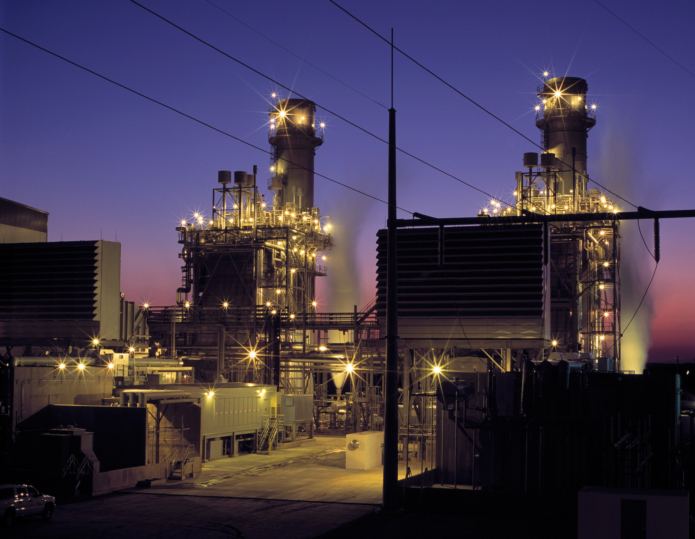

# Weekly Insights Review

**Date:** May 15, 2022  
**Publisher:** Breakwave Advisors | **Category:** Market Insights  
**Original URL:** [https://www.breakwaveadvisors.com/insights/2022/5/15/weekly-insights-review](https://www.breakwaveadvisors.com/insights/2022/5/15/weekly-insights-review)  

---

## Welcome to Our Weekly Insights Review

## Read Here Everything You Need to Know

## Shipping Decarbonization Weekly Insights

## Latest Trends on Fuel Transition, Shipyard Actions, Government, Ports, Financing and Industry Players

[Read More](https://www.breakwaveadvisors.com/insights/2022/5/9/shipping-decarbonization-weekly-insights)

> **Figure 1: 1**  
> **Interactive Data & Source:** [Breakwave Advisors Market Insights](https://www.breakwaveadvisors.com/insights/2022/5/11/the-indian-heatwave-and-the-impact-on-trade) | [Local Asset](file:///C:/Users/Dell/Github/Shipping/corpus/03-breakwave/insights/2022/assets/2022-05-15_weekly-insights-review_img_1_1a1f570fb0f8.jpg)

## The Indian Heatwave and the Impact on Trade

## India’s Already Low Coal Inventories Have Taken a Beating As the Temperatures Have Been Building

Temperatures in India have been soaring to unprecedented levels in recent days and weeks, putting lives, crops and energy supplies at risk.

> **Figure 2: 2**  
> **Interactive Data & Source:** [Breakwave Advisors Market Insights](https://www.breakwaveadvisors.com/insights/2022/5/12/signal-dry-bulk-weekly-report) | [Local Asset](file:///C:/Users/Dell/Github/Shipping/corpus/03-breakwave/insights/2022/assets/2022-05-15_weekly-insights-review_img_2_5d4cde9b0b9c.jpg)

## Signal Dry Bulk Weekly Report

## Snapshot of Spot Freight Rates, Supply-Demand Trends, Port Congestions

The freight market sentiment sustained the firmness of the last days with revival seen in the Capesize and Handysize segment, and Panamax recorded a gradual upward trend.

> **Figure 3: 3**  
> **Interactive Data & Source:** [Breakwave Advisors Market Insights](https://www.breakwaveadvisors.com/insights/2022/5/12/coal-indias-production-remains-strong-but-electricity-generation-continuing-to-set-new-records) | [Local Asset](file:///C:/Users/Dell/Github/Shipping/corpus/03-breakwave/insights/2022/assets/2022-05-15_weekly-insights-review_img_3_9195c69bbf54.jpg)

## Coal India's Production Remains Strong But Electricity Generation Continuing to Set New Records

## Temperatures Turning Even Hotter in India Is Becoming Another Positive Development

Coal India produced approximately 53.5 million tons of coal last month, which marks a month-on-month decline of 26.6 million tons (-33%) but a year-on-year increase of 11.6 million tons (28%).

> **Figure 4: 4**  
> **Interactive Data & Source:** [Breakwave Advisors Market Insights](https://www.breakwaveadvisors.com/insights/2022/5/13/european-gas-surges-higher-as-russia-gas-flows-continue-to-fall) | [Local Asset](file:///C:/Users/Dell/Github/Shipping/corpus/03-breakwave/insights/2022/assets/2022-05-15_weekly-insights-review_img_4_72a27bf81c7c.jpg)

## European Gas Surges Higher As Russia Gas Flows Continue to Fall

## Energy Managed to Buck the Trend with Supply Side Issues Pushing Prices Higher

Mounting growth concerns weigh on commodity markets, with metals leading the complex lower. Energy managed to buck the trend with supply side issues pushing prices higher.

> **Figure 5: 5**  
> **Interactive Data & Source:** [Breakwave Advisors Market Insights](https://www.breakwaveadvisors.com/insights/2022/5/13/dry-bulk-demand-quarterly-review-2022) | [Local Asset](file:///C:/Users/Dell/Github/Shipping/corpus/03-breakwave/insights/2022/assets/2022-05-15_weekly-insights-review_img_5_bd072408394a.jpg)

## Dry Bulk Demand Quarterly Review | 2022

## The First Half Was Not Promising for the Performance of Freight Rates As the Dry Bulk Demand Was Also in a Downward Trend.

The current year presents year to date an overall slower dry bulk demand growth in ton days with an aggressive downward correction seen from March onwards.

> **Figure 6: 6**  
> [Local Asset](file:///C:/Users/Dell/Github/Shipping/corpus/03-breakwave/insights/2022/assets/2022-05-15_weekly-insights-review_img_6_9c0c98a8e9df.png)
