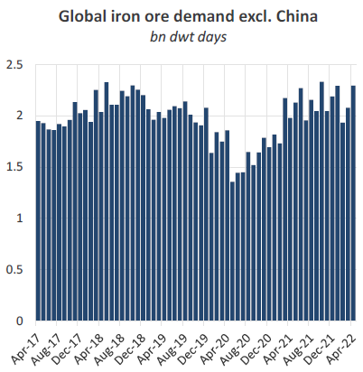
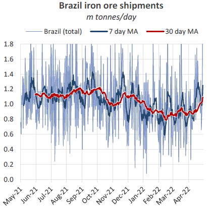
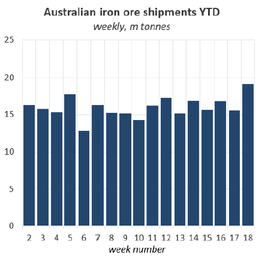
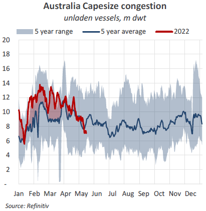

# The Big Picture: Iron ore improving

**Date:** May 17, 2022  
**Publisher:** Breakwave Advisors | **Category:** Market Insights  
**Original URL:** [https://www.breakwaveadvisors.com/insights/2022/5/17/the-big-picture-iron-ore-improving](https://www.breakwaveadvisors.com/insights/2022/5/17/the-big-picture-iron-ore-improving)  

---

*By*[*Mark Nugent*](https://www.linkedin.com/in/mark-nugent-3724a3192/)

## Shipments Growing in May

As weather in Brazil starts to subside and the end of the financial year for several miners approaches, we look at the iron ore market and what may be in store going forward.

## Demand Outside of China Strong

Global iron ore shipments totalled 131.5m tonnes in April, coming in flat YoY. However, vessel demand from iron ore increased by 6% YoY in April on the back of stronger liftings in the Capesize sector, while demand from the smaller segments all declined during the same period. In China, iron ore imports declined by 3.2% YoY to 88.8m tonnes in April, therefore the growth in demand has come from elsewhere. Excluding China, iron ore imports increased by 1.9% YoY to 40.3m tonnes. Bulker demand outside of China, in comparison, increased by 15.9% YoY. This, in part, is a result of more robust steel production globally apart from in China which currently faces both production curbs and demand constraints.

> **Figure 1: Market Chart 1**  
> [Local Asset](file:///C:/Users/Dell/Github/Shipping/corpus/03-breakwave/insights/2022/assets/2022-05-17_the-big-picture-iron-ore-improving_img_image0_88722c8d2bbe.png)

Demand from Japanese iron ore imports increased by 18.9% on the back of shipments from Brazil more than doubling to 1.3m tonnes in April. Further, a 12% increase in European imports, totalling 8.5m tonnes, has also added to support in iron ore and contributed to Capesize port inefficiencies in the region as we noted in The Big Picture last week when referring to coal.

In recent weeks the DCE iron ore price in China has declined by 8.1% WoW to $138.8 per tonne. While China has frequently expressed aims to limit speculation on commodity prices, demand fears in the country have ultimately driven this most recent decline.

As the lockdowns remain in place, these levels are likely to be maintained. Nevertheless, any indication of restrictions lifting will raise expectations of improved steel production, though the property sector in China has yet to show signs of recovery. So far, despite cases reportedly declining, the Covid policy has not changed.

## Brazil Gradually Returns

Out of Brazil, iron ore liftings have improved in recent weeks fuelling more positive sentiment in the Capesize market. Shipments totalled 25.8m tonnes in April, the highest monthly total so far this year. The well-documented rainy season in Brazil is now starting to fade, subsequently driving greater iron ore export volumes. Average monthly precipitation in the northern region declined by 24.4% in April. As a result, the past two weeks have been the strongest for iron ore shipments out of Brazil this year, averaging 7.3m tonnes per week. Given it is expected to remain dry in the near-term and liftings have started strong in May, we expect another monthly increase in Brazilian iron ore volumes this month.

> **Figure 2: Market Chart 2**  
> [Local Asset](file:///C:/Users/Dell/Github/Shipping/corpus/03-breakwave/insights/2022/assets/2022-05-17_the-big-picture-iron-ore-improving_img_image1_6747e7204745.png)

So far, exported volumes have predominantly been lifted by the VLOC fleet. Average daily liftings in the previous 30 days on the VLOCs lie at 620k tonnes, the highest level in the past 12 months. Although a niche trade, Brazil has seen interest from the Middle East, with 1.9m tonnes of iron ore loaded for Oman in April. Meanwhile to the Netherlands, shipments more than doubled to 1.1m tonnes. Naturally less important to the market as China, upturns in these trades have assisted in keeping Brazilian iron ore demand healthy.

## Relaxed Restrictions Lift Australian Liftings

In Australia, production constraints that miners have faced, namely labour shortages due to travel restrictions, have started to subside as the country moves out of lockdowns. As expected, this has vastly improved the overall efficiency of miners’ operations in the country. Shipments have also been bolstered because no major maintenances have been carried out recently.

> **Figure 3: Market Chart 3**  
> [Local Asset](file:///C:/Users/Dell/Github/Shipping/corpus/03-breakwave/insights/2022/assets/2022-05-17_the-big-picture-iron-ore-improving_img_image2_b3e884222727.png)

Shipments have ramped up in May as the end of the financial year for various miners draws closer. In April the country exported 74.7m tonnes of iron ore, coming in flat YoY. However, last week, Australian producers exported 19m tonnes of iron ore, the highest weekly total so far this year.

Heading out of lockdowns has however resulted in a sharp decline in Australian congestion levels. Capesize queues currently amount to 7m dwt, declining by 22.5% WoW and 18% below the 5-year average. As many vessels opted to continue on the C5 route as Brazil volumes were lighter, this dynamic has changed with more ships head east for Brazil, India and European stems, which have grown in Q2. Capesizes have also garnered more enquiry for coal voyages to Europe from the east, providing ships with an ideal haul to reposition. Combining reduced tonnage in West Australia and a ramp up in iron ore shipments, rates have moved to the upside. The C5 route now commands $15.2/t, increasing by 68.9% MoM according to the Baltic Exchange’s latest figures, although some fixtures have been rumoured even firmer.

> **Figure 4: Market Chart 4**  
> [Local Asset](file:///C:/Users/Dell/Github/Shipping/corpus/03-breakwave/insights/2022/assets/2022-05-17_the-big-picture-iron-ore-improving_img_image3_2f7cda23137c.png)

## India Stronger in April

Indian iron ore exports totalled 4.4m tonnes in April, the highest since March 2021. While steel mills continue to face higher costs because of elevated energy and coking coal prices, a lower grade iron ore may provide some relief to producers’ bottom line. Indian iron ore is of a lower grade in comparison to Brazil and Australia, which as a result offers a lower price and thus may be more favourable to steelmakers whose margins have been diminished. With input costs set to remain high, steelmakers are likely to continue their interest in Indian iron ore. This comes as some regions in the country are considering removing a mining cap in order to expand production for domestic steel production and exports.

## Longer Term Impact of Ukraine

While no shipments have occurred since late February, the majority of Ukrainian iron ore typically shipped to the Far East, namely China and Japan. In finding replacement volumes, these countries have naturally looked to Australia and India given their proximity. Iron ore shipments from Australia to China increased by 3.2% YoY in April, totalling 60.8m tonnes.

Substituting Ukrainian iron ore, which exported on average 2.3m tonnes per month pre-invasion, may continue in the longer term beyond an end to the war. As the country will require significant rebuilding when the time comes, iron ore is likely to remain in the country to be used for domestic steel production. Subsequently, Ukrainian iron ore buyers will need to maintain purchases from replacement sources.

So far in Q2, the re-emergence of solid volumes out of Brazil has rebounded bulker demand from iron ore and has particularly helped lift Capesize rates. Australia has maintained strong export volumes in Q2 providing stable employment on the C5 route. Despite Chinese demand being relatively muted, iron ore flows have been positive in the second quarter. With bauxite flows also performing strongly, any positive news from China with regards to lockdowns, could see Capesize demand, and thus rates, continue to move higher.
