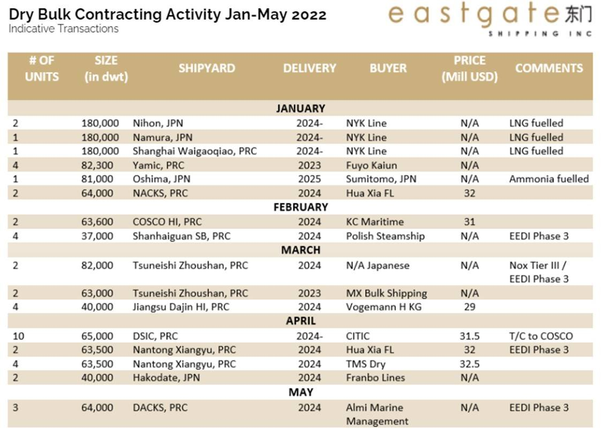
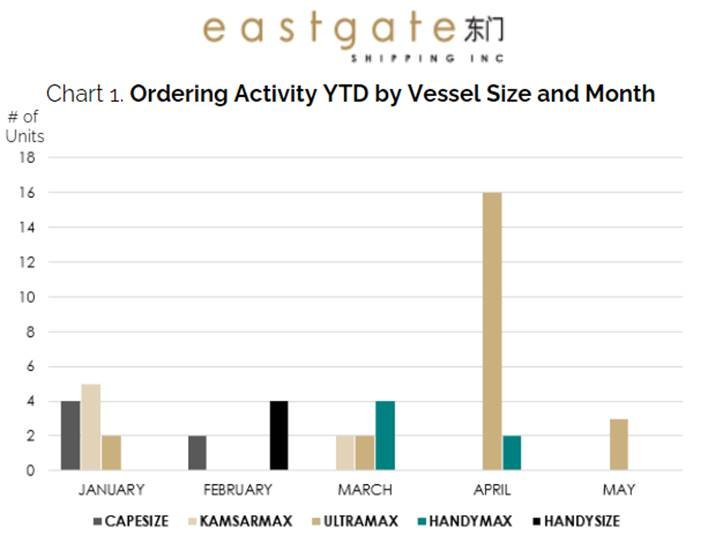
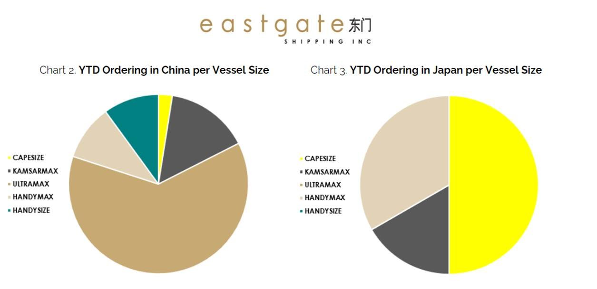
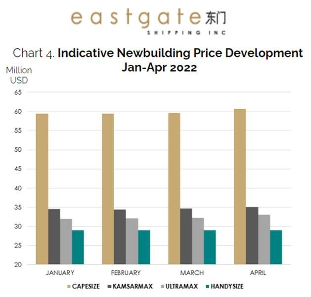
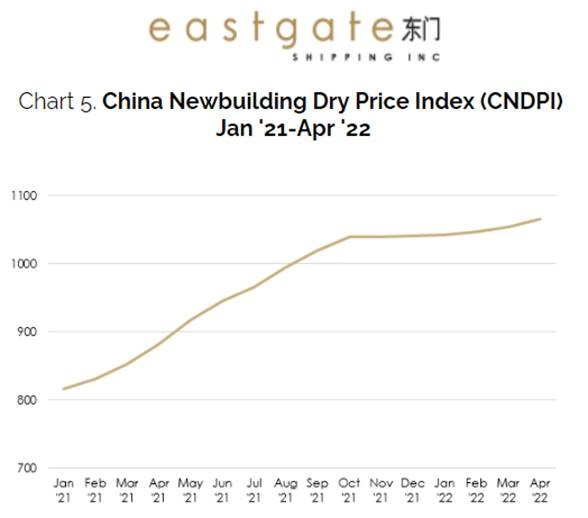
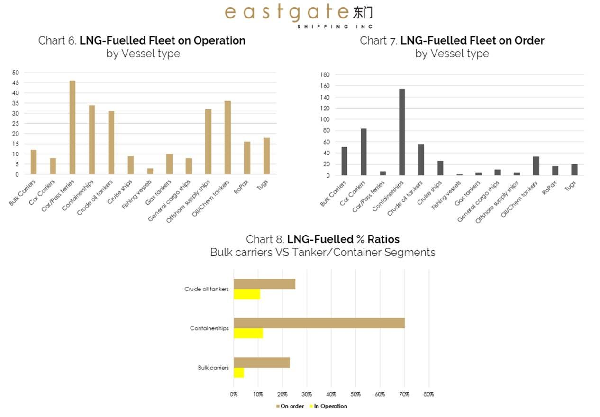
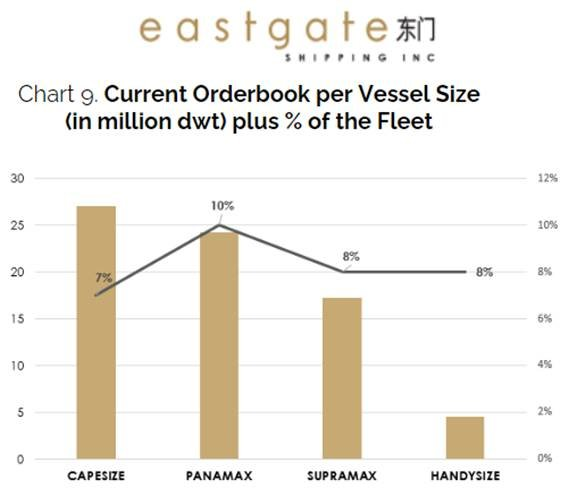

# Dry Bulk Newbuilding Review: The Spring Sentiment

**Date:** May 19, 2022  
**Publisher:** Breakwave Advisors | **Category:** Market Insights  
**Original URL:** [https://www.breakwaveadvisors.com/insights/2022/5/19/dry-bulk-newbuilding-review-the-spring-sentiment](https://www.breakwaveadvisors.com/insights/2022/5/19/dry-bulk-newbuilding-review-the-spring-sentiment)  

---

## Ordering Trends in the Bulker Segment 1h 2022

Amid a climate of increased uncertainty fuelled by a variety of admittedly worrying factors, investors’ appetite for newbuilding orders in the dry bulk segment remains relatively controlled, thus offering ground for low fleet growth and utilization projections.

China’s “zero-covid” policy measures that trigger concerns regarding domestic steel production and thereby iron ore demand as well as the Russia-Ukraine war which has jeopardised coal and grain cargo flows, appear to pressure contracting interest. The trend is further enhanced by the costly decarbonisation solutions that are being put forward and the technological challenges that lie ahead as well as the limited availability of slots in the yards.

This year thus far, we have observed a slowdown in the activity of new transactions compared to the volume of the previous two years. The total number for the first five months has reached almost 50 new orders compared to around 100 and 150 units ordered in the same period in 2021 and 2020 respectively. January was a busy month, followed by thinning ordering activity in February and March, while in April the interest was somewhat reignited, particularly in the Ultramax segment.

## Contracting Activity Thus Far

The lion’s share of the bulker ordering is taken by the medium-sized Kamsarmax and Ultramax vessels, particularly in Chinese shipyards, while Japanese builders saw some fresh activity in the Capesize sector with LNG-fuelled vessel ordering by NYK Line.

January and April were the busiest months of 2022 so far, with January taking a 23% share of the total volume of new orders and April 48%.

In May so far, a new order was placed for a trio of Ultramax bulk carriers by a Greek player at a Chinese yard, while Himalaya Shipping of Norway are said to have increased their previous order at New Times by adding 4 Newcastlemax units (208,000dwt) for delivery in 2H2025/beginning 2026 at levels around US$67m per unit; the vessels will be fitted with dual-fuel LNG engines.

In the below Table we have summarised the new orders reported since the beginning of the year per vessel size category. In terms of pricing, almost all of the orders that emerged at Chinese or Japanese shipyards are reported at an undisclosed contract price, with some evidence of prices for Ultramax dry bulk carriers.

> **Figure 1: Market Chart 1**  
> [Local Asset](file:///C:/Users/Dell/Github/Shipping/corpus/03-breakwave/insights/2022/assets/2022-05-19_dry-bulk-newbuilding-review-the-spring-sentiment_img_image011_a9b272d43651.jpg)

Looking at ordering trends per vessel size, (Chart 1) we can view the spike of April in the Ultramax segment mentioned above, while activity in the other segments appears insignificant to alter the orderbook to existing fleet ratio.

> **Figure 2: Market Chart 2**  
> [Local Asset](file:///C:/Users/Dell/Github/Shipping/corpus/03-breakwave/insights/2022/assets/2022-05-19_dry-bulk-newbuilding-review-the-spring-sentiment_img_image015_05b2f6f08c9a.jpg)

With reference to the allocation between the yards, 60% of Ultramax orders were placed at Chinese shipyards (Chart 2). The Chinese yards are growing their share of newbuilding ordering which is also affecting the prices of the units that are also rising as a result of the renewed appetite for Chinese built vessels.

> **Figure 3: Market Chart 3**  
> [Local Asset](file:///C:/Users/Dell/Github/Shipping/corpus/03-breakwave/insights/2022/assets/2022-05-19_dry-bulk-newbuilding-review-the-spring-sentiment_img_image01628129_c3481e9f1d39.jpg)

## Indicative Chinese Newbuilding Prices

The activity of new orders at Chinese yards in April brings a spike in prices. In the Capesize segment, indicative prices rose above US$60m while in the Kamsarmax segment, levels stood in excess of US$35m. In the smaller sectors, we see indications in the region of US$33m for Ultramax and US$29.4m for Handysize bulkers.

> **Figure 4: Market Chart 4**  
> [Local Asset](file:///C:/Users/Dell/Github/Shipping/corpus/03-breakwave/insights/2022/assets/2022-05-19_dry-bulk-newbuilding-review-the-spring-sentiment_img_image017_c60e94c03b48.jpg)

## Chinese Newbuilding Price Index

The China Newbuilding Price Index (CNPI) released at the end of April rose by another 11 points to 1033, while the China Newbuilding Dry Price Index (CNDPI) has increased by 12 points to 1,066 (Chart 5).

The index was higher in major vessel size categories: Newcastlemax (1.4%), Capesize (1.35%), Ultramax (1.35%), Handysize (1.1%), Kamsarmax (0.8%), with limited yard availability and an expected delivery in 2024.

> **Figure 5: Market Chart 5**  
> [Local Asset](file:///C:/Users/Dell/Github/Shipping/corpus/03-breakwave/insights/2022/assets/2022-05-19_dry-bulk-newbuilding-review-the-spring-sentiment_img_image018_3035e12c0863.jpg)

## LNG-Fuelled Fleet Development

Capesize orderbook acquires the largest share in the overall dry bulk orderbook with mainly Newcastlemax and Capesize newbuildings to proceed with LNG technology. However, the overall dry bulk LNG-fuelled fleet, both in operation and on order, is at the lowest level compared to the other vessel segments (Chart 8).

> **Figure 6: Market Chart 6**  
> [Local Asset](file:///C:/Users/Dell/Github/Shipping/corpus/03-breakwave/insights/2022/assets/2022-05-19_dry-bulk-newbuilding-review-the-spring-sentiment_img_image019_baf12080aa43.jpg)

## Tonnage Supply Growth Projections

The orderbook to fleet ratio currenlty stands at nearly 8%, in terms of million dwt, cruising at a two-decade low (Chart 9). Further, the projected annual fleet growth remains controlled, by a gross 3% of the fleet for full year 2022. That said, vessel ordering is more concentrated on the medium-sized assets (Kamsarmax and Ultramax vessels) which are expected to see their capacity expand by nearly 10% and 8% respectively by the end of next year, thus posing particular challenges regarding the sectors’ freight market performance.

> **Figure 7: Market Chart 7**  
> [Local Asset](file:///C:/Users/Dell/Github/Shipping/corpus/03-breakwave/insights/2022/assets/2022-05-19_dry-bulk-newbuilding-review-the-spring-sentiment_img_image020_47790b01966e.jpg)

## Going Forward

Ultimately, the question is whether the projected mid-term fleet supply will outpace the existing and future dry bulk demand growth.

In our view, we will be witnessing a two-tier market where the larger Capesize vessels will face increased volatility underpinned by the relatively weak steel industry in China, whereas the Sub-Capesize segment is likely to see a healthy demand, mainly assisted by the more flexible trade that these vessels can accommodate as well as the increased tonne-miles as a by-product of the geopolitical tensions in key regions.

Of course, since most of the newbuilding orders are concentrated on that very sector, one could assume that eventually the fleet supply/demand fundamentals in the Ultramax and Kamsarmax segments will remain relatively balanced.

And although the ordering activity this year has somewhat resumed, investors’ appetite remains lukewarm. Further, measures taken by the Chinese government to tackle covid are having a domino effect on shipbuilding operations among else, causing additional delays in delivery of newbuild units.

In conclusion, we’d expect the appetite for new orders to remain anemic for the rest of the year and likely stay below last year’s ordering activity. With everything that’s been happening in the world and all things considered, we are inclined to believe that we should experience a relatively balanced market until the end of 2023.
