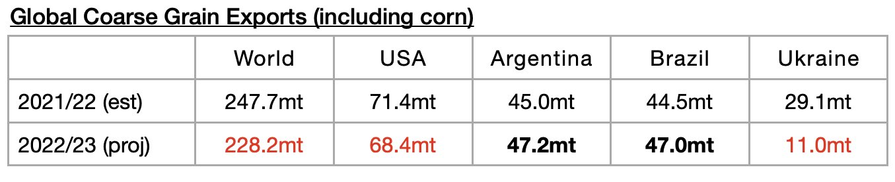
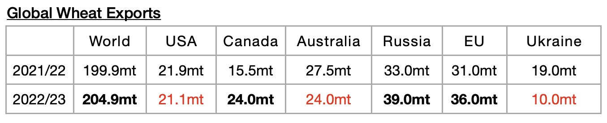
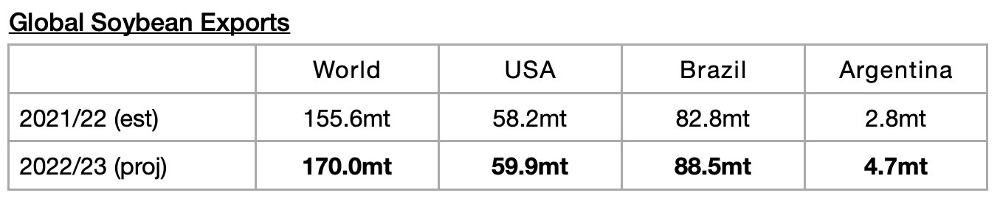
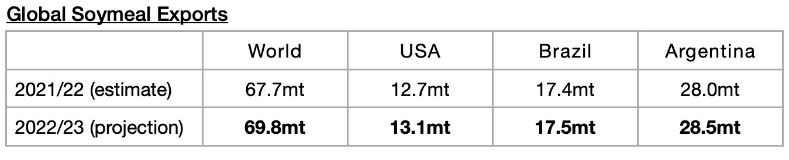

# Preliminary 2022/23 Grain Trade Forecast

**Date:** May 19, 2022  
**Publisher:** Breakwave Advisors | **Category:** Market Insights  
**Original URL:** [https://www.breakwaveadvisors.com/insights/2022/5/19/preliminary-202223-grain-trade-forecast](https://www.breakwaveadvisors.com/insights/2022/5/19/preliminary-202223-grain-trade-forecast)  

---

*By*[*Jeffrey Landsberg*](https://www.linkedin.com/in/jeffrey-landsberg-70ab957/)

The United States Department of Agriculture (USDA) recently released their first global grain export forecast for the upcoming 2022/23 season. The forecast is still very preliminary, but of note is that only 487.3 million tons of exports are expected. If 487.3 million tons is ultimately exported, then this would mark a year-on-year decline of 12.9 million tons (-3%) from the 500.2 million tons that is expected for the current 2021/22 season. Wheat exports are expected to rebound in 2022/23, but coarse grain exports are expected to decline by a large amount.

The USDA is now forecasting that global coarse grain exports in 2022/23 will total 228.2 million tons, which is 19.5 million tons (-8%) less than is expected for the current 2021/22 season. A small decline is expected for exports from the United States, and a much larger decline is expected for exports from Ukraine.

> **Figure 1: Chart 1 (32)**  
> [Local Asset](file:///C:/Users/Dell/Github/Shipping/corpus/03-breakwave/insights/2022/assets/2022-05-19_preliminary-202223-grain-trade-forecast_img_chart1283229_414034987c83.jpg)

Global wheat exports are expected to total 204.9 million tons. This is 5 million tons (3%) more than is expected for the current 2021/22 season. As with in the coarse grain market, a significant decline in wheat exports is expected for exports from Ukraine.

> **Figure 2: Chart 2 (29)**  
> [Local Asset](file:///C:/Users/Dell/Github/Shipping/corpus/03-breakwave/insights/2022/assets/2022-05-19_preliminary-202223-grain-trade-forecast_img_chart2282929_1e7c5fb1449d.jpg)

Global soybean exports (soybeans are not technically classified as a grain) are expected to total 170 million tons. This is 14.4 million tons (9%) more than is expected for the current 2021/22 season. Growth is expected from all major exporters.

> **Figure 3: Chart 3 (24)**  
> [Local Asset](file:///C:/Users/Dell/Github/Shipping/corpus/03-breakwave/insights/2022/assets/2022-05-19_preliminary-202223-grain-trade-forecast_img_chart3282429_74a6713c6c4e.jpg)

Global soymeal exports are expected to total 69.8 million tons. This is 2.1 million tons (3%) more than is expected for the current 2021/22 season. Growth is also expected from all major exporters.

> **Figure 4: Chart 4 (14)**  
> [Local Asset](file:///C:/Users/Dell/Github/Shipping/corpus/03-breakwave/insights/2022/assets/2022-05-19_preliminary-202223-grain-trade-forecast_img_chart4281429_d48306fa398c.jpg)
