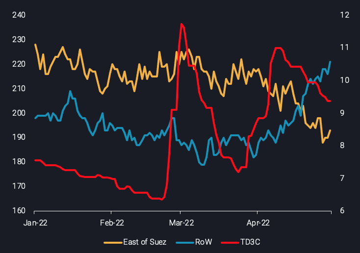
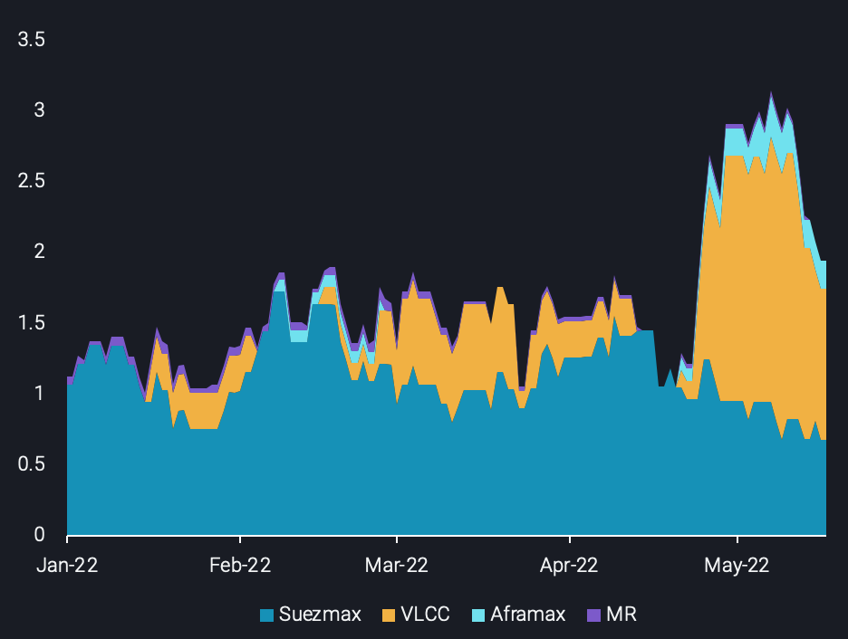

# Turbulent seas for the VLCCs

**Date:** May 20, 2022  
**Publisher:** Breakwave Advisors | **Category:** Market Insights  
**Original URL:** [https://www.breakwaveadvisors.com/insights/2022/5/20/turbulent-seas-for-the-vlccs](https://www.breakwaveadvisors.com/insights/2022/5/20/turbulent-seas-for-the-vlccs)  

---

*By*[*Ioannis Papadimitriou*](https://www.linkedin.com/in/ipapadimitriou/)

## In This Insight, Vortexa Examines the Current Status-Quo for VLCC Rates, and Provides an Outlook of Whether the Repositioning to the Western Hemisphere Can Prove to Be Supportive in the Months to Come.

After a short-lived spike during the start of April, VLCC rates have tumbled, losing around 25% of the value on the most heavily traded route worldwide: Middle East-to-East Asia (TD3C). The main drivers for this shortfall lie on both the export and the importing side:

- OPEC crude exports are[set to drop for the third consecutive month](https://analytics.vortexa.com/?dateRange=year-to-date&filtersEnabled=%5B%22p%22%2C%22o%22%2C%22d%22%2C%22d_r%22%2C%22v%22%2C%22intra%22%2C%22sts_o%22%2C%22c_o%22%2C%22w%22%2C%22sts%22%2C%22c%22%2C%22v_a%22%2C%22v_o%22%5D&from=%5B%225057dafe08229da478858da705209d61d88db8dcaadf8376c266eeabdbe1f0ee%22%5D&geoBreakdownOriginGlobal=trading_region&metric=bpd&page=Flows&products=%5B%2254af755a090118dcf9b0724c9a4e9f14745c26165385ffa7f1445bc768f06f11%22%5D&tabId=f15f03f6-72b4-41f3-887a-895735a2e10c&timeSeriesProperty=origin_trading_region)in May. The decline is led by Middle Eastern crude exports, which are continuing to slide since the start of the year.
- Overall[Chinese purchasing activity has been reduced](https://analytics.vortexa.com/?dateRange=year-to-date&filtersEnabled=%5B%22p%22%2C%22o%22%2C%22d%22%2C%22d_r%22%2C%22v%22%2C%22intra%22%2C%22sts_o%22%2C%22c_o%22%2C%22w%22%2C%22sts%22%2C%22c%22%2C%22v_a%22%2C%22v_o%22%5D&from=%5B%225057dafe08229da478858da705209d61d88db8dcaadf8376c266eeabdbe1f0ee%22%5D&geoBreakdownOriginGlobal=trading_region&metric=bpd&page=Flows&products=%5B%2254af755a090118dcf9b0724c9a4e9f14745c26165385ffa7f1445bc768f06f11%22%5D&tabId=f15f03f6-72b4-41f3-887a-895735a2e10c&timeSeriesProperty=origin_trading_region&to=%5B%22934c47f36c16a58d68ef5e007e62a23f5f036ee3f3d1f5f85a48c572b90ad8b2%22%5D)significantly over the course of 2022. This is on the back of low demand amidst a re-introduction of Covid-induced lockdowns and a slowdown in refining activity.

As a result, a portion of VLCCs repositioned towards the Atlantic Basin, where flows have displayed a stronger performance, with Europe attempting to find replacements of Russian barrels. This has evidently created a clear diverging trend in employment of VLCCs heading towards[East](https://analytics.vortexa.com/?dateRange=year-to-date&page=FleetUtilisation&primarySplitProperty2=origin_shipping_region&primaryTimeSeries1=utilisation&products=%5B%2254af755a090118dcf9b0724c9a4e9f14745c26165385ffa7f1445bc768f06f11%22%5D&secondaryTimeSeries1=hide&tabId=4ab88c6c-d727-4c5a-9f74-e2f9c2ca16fd&to=%5B%22fc6694742ebce49ff955fffa066898c41686d460ab683ab5c44dc7b799aeac58%22%5D&vesselClasses=%5B%22vlcc_plus%22%5D)and[West](https://analytics.vortexa.com/?dateRange=year-to-date&page=FleetUtilisation&primarySplitProperty2=origin_shipping_region&primaryTimeSeries1=utilisation&products=%5B%2254af755a090118dcf9b0724c9a4e9f14745c26165385ffa7f1445bc768f06f11%22%5D&secondaryTimeSeries1=hide&tabId=4ab88c6c-d727-4c5a-9f74-e2f9c2ca16fd&to=%5B%226478105a82fd32e1dabb3d11f0dd3cfe42fc93863a480967e15f5ec72ac10319%22%5D&vesselClasses=%5B%22vlcc_plus%22%5D)of Suez.

> **Figure 1: VLCC Utilisation in Theeast of Suezvs Therest of the World(no**  
> *VLCC utilisation in theEast of Suezvs therest of the world(no. of vessels, LHS) and theTD3C freight rate($/ton, RHS)*  
> **Interactive Data & Source:** [Analytics Vortexa](https://analytics.vortexa.com/?dateRange=year-to-date&page=FleetUtilisation&primarySplitProperty2=origin_shipping_region&primaryTimeSeries1=utilisation&products=%5B%2254af755a090118dcf9b0724c9a4e9f14745c26165385ffa7f1445bc768f06f11%22%5D&secondaryTimeSeries1=hide&tabId=4ab88c6c-d727-4c5a-9f74-e2f9c2ca16fd&to=%5B%22fc6694742ebce49ff955fffa066898c41686d460ab683ab5c44dc7b799aeac58%22%5D&vesselClasses=%5B%22vlcc_plus%22%5D) | [Local Asset](file:///C:/Users/Dell/Github/Shipping/corpus/03-breakwave/insights/2022/assets/2022-05-20_turbulent-seas-for-the-vlccs_img_screenshot2022-05-18at183323_afb60d8355b5.png)

Zooming into the Western Hemisphere’s VLCC activity, our data shows an[increasing number of cargoes from WAf heading to ARA](https://analytics.vortexa.com/?dateRange=year-to-date&page=FleetUtilisation&primarySplitProperty1=destination_country&primarySplitProperty2=origin_shipping_region&products=%5B%2254af755a090118dcf9b0724c9a4e9f14745c26165385ffa7f1445bc768f06f11%22%5D&secondaryTimeSeries1=hide&tabId=4ab88c6c-d727-4c5a-9f74-e2f9c2ca16fd&to=%5B%226478105a82fd32e1dabb3d11f0dd3cfe42fc93863a480967e15f5ec72ac10319%22%5D&vesselClasses=%5B%22vlcc_plus%22%5D). The demise of[West Africa-to-China](https://www.vortexa.com/insight/west-african-crude-to-china-continues-to-fall)flows has been a key driver of this. Additionally,[four VLCCs](https://analytics.vortexa.com/?dateRange=year-to-date&from=%5B%224e79eb8e84d26f5c3c0006283bc1aa52c170b58d667be9848e136afea91a57e9%22%5D&geoBreakdownDestinationGlobal=trading_region&page=FleetUtilisation&primarySplitProperty1=vessel_class&primarySplitProperty2=destination_country&products=%5B%2254af755a090118dcf9b0724c9a4e9f14745c26165385ffa7f1445bc768f06f11%22%5D&tabId=4ab88c6c-d727-4c5a-9f74-e2f9c2ca16fd&to=%5B%22f39d455f5d38907394d6da3a91da4e391f9a34bd6a17e826d6042761067e88f4%22%5D&vesselClasses=%5B%22vlcc_plus%22%5D)are currently occupied on the US Gulf-to-Europe trade route, which is a yearly high. However, it is worth remembering that though this is an interesting change, it is in the context of a global fleet of more than 800 VLCCs.

With this in mind, it is clear that the current trade developments supporting VLCC demand in the West are not substantial enough to offset losses stemming from poor Chinese activity. This has triggered an overall drop in[VLCC tonne-mile demand](https://analytics.vortexa.com/?dateRange=year-to-date&page=FleetUtilisation&primarySplitProperty2=origin_shipping_region&primaryTimeSeries3=tonne-miles&products=%5B%2254af755a090118dcf9b0724c9a4e9f14745c26165385ffa7f1445bc768f06f11%22%5D&secondaryTimeSeries1=hide&tabId=4ab88c6c-d727-4c5a-9f74-e2f9c2ca16fd&vesselClasses=%5B%22vlcc_plus%22%5D), reflected in the stale VLCC freight rates across the board. Moreover,[VLCCs penetrating the Suezmax route](https://analytics.vortexa.com/?dateRange=year-to-date&from=%5B%229f9774f40a5a36f75ae844510feaf1c01c262cf84ba1f229ff6a93fb8e0171e2%22%5D&page=FleetUtilisation&primarySplitProperty1=vessel_class&primarySplitProperty2=origin_shipping_region&primaryTimeSeries1=tonne-days&primaryTimeSeries3=tonne-miles&products=%5B%2254af755a090118dcf9b0724c9a4e9f14745c26165385ffa7f1445bc768f06f11%22%5D&secondaryTimeSeries1=hide&tabId=4ab88c6c-d727-4c5a-9f74-e2f9c2ca16fd&to=%5B%227fe5c7cd39e8e95bfab135ca495b1fb577367ae89e3f6148375b9122bd8c461a%22%5D)(see chart below) have also kept West Africa-to-UK Cont (TD20) Suezmax rates suppressed, 52% down from the peak realised at the start of April.

> **Figure 2: Tonne-Day Market Share for the West Africa-to-Uk Cont Route Per**  
> *Tonne-day market share for the West Africa-to-UK Cont route per vessel class(mn tonnes)*  
> **Interactive Data & Source:** [Analytics Vortexa](https://analytics.vortexa.com/?dateRange=year-to-date&from=%5B%229f9774f40a5a36f75ae844510feaf1c01c262cf84ba1f229ff6a93fb8e0171e2%22%5D&page=FleetUtilisation&primarySplitProperty1=vessel_class&primarySplitProperty2=origin_shipping_region&primaryTimeSeries1=tonne-days&primaryTimeSeries3=tonne-miles&products=%5B%2254af755a090118dcf9b0724c9a4e9f14745c26165385ffa7f1445bc768f06f11%22%5D&secondaryTimeSeries1=hide&tabId=4ab88c6c-d727-4c5a-9f74-e2f9c2ca16fd&to=%5B%227fe5c7cd39e8e95bfab135ca495b1fb577367ae89e3f6148375b9122bd8c461a%22%5D) | [Local Asset](file:///C:/Users/Dell/Github/Shipping/corpus/03-breakwave/insights/2022/assets/2022-05-20_turbulent-seas-for-the-vlccs_img_screenshot2022-05-18at183652_8d9a708bbf3f.png)

### VLCC Employability in the Western Hemisphere

**West Africa:**It is unclear whether the flows from West Africa to Europe will continue at current or higher levels. It may be that the combination of lower Chinese demand for WAf barrels, combined with lower VLCC employment in the East of Suez, has given fertile grounds for a paradigm shift on the parcel sizing of the TD20 route. Yet, it could also be that the strong WAf volumes to Europe seen in April were an exception to the rule: cargoes that were rerouted from China to Europe due to the weak demand picture in the East. After all, preliminary data for May show that Angolan cargoes headed to Europe indicate a drastic m-o-m drop, accompanied by wider discounts of WAf barrels to North Sea crude.

**US Gulf/Latin America to Europe:**Similar to the situation in West Africa, VLCC employment has shown relative strength, yet there are question marks around whether this trade route will continue to employ VLCCs. Preliminary data display a[stability in overall USG-to-Europe volumes](https://analytics.vortexa.com/?dateRange=2022-01-01T00%3A00%3A00.000Z__2022-05-15T23%3A59%3A59.999Z&from=%5B%224e79eb8e84d26f5c3c0006283bc1aa52c170b58d667be9848e136afea91a57e9%22%5D&metric=bpd&page=Flows&products=%5B%2254af755a090118dcf9b0724c9a4e9f14745c26165385ffa7f1445bc768f06f11%22%5D&tabId=1aa61815-d5ce-4a07-808d-005fbc568704&timeSeriesProperty=vessel_class&to=%5B%22f39d455f5d38907394d6da3a91da4e391f9a34bd6a17e826d6042761067e88f4%22%5D)on a m-o-m basis for May. However, deterioration is reflected in VLCC employability when looking at fixtures. Only three VLCCs are expected to load either from the US Gulf or Latin America and discharge in Europe over the next 30 days.

**Russia:**VLCCs carrying Russian barrels may be under threat as well. Currently, according to our platform[seven VLCCs are in transit having loaded Urals](https://analytics.vortexa.com/?dateRange=year-to-date&geoBreakdownDestinationGlobal=trading_region&page=FleetUtilisation&primarySplitProperty1=vessel_class&primarySplitProperty2=destination_country&products=%5B%22c8803c073c2980d9849784c16bcd41d7f7b7561d2c8c1799a16166527b120242%22%5D&tabId=4ab88c6c-d727-4c5a-9f74-e2f9c2ca16fd&vesselClasses=%5B%22vlcc_plus%22%5D)headed towards UAE, China and India. These trades are mostly orchestrated[by trading houses](https://analytics.vortexa.com/?dateRange=2022-03-01T00%3A00%3A00.000Z__2022-05-31T23%3A59%3A59.999Z&filtersEnabled=%5B%22p%22%2C%22o%22%2C%22d%22%2C%22d_r%22%2C%22v%22%2C%22intra%22%2C%22sts_o%22%2C%22c_o%22%2C%22w%22%2C%22sts%22%2C%22c%22%2C%22v_a%22%2C%22v_o%22%5D&maxEventFilter=1651363199999&metric=bpd&minEventFilter=1648771200000&page=Flows&products=%5B%22c8803c073c2980d9849784c16bcd41d7f7b7561d2c8c1799a16166527b120242%22%5D&tabId=f15f03f6-72b4-41f3-887a-895735a2e10c&timeSeriesProperty=origin_country&vesselClasses=%5B%22vlcc_plus%22%5D). Nevertheless, since May 15, major trading houses have reduced crude and fuel purchases from Russian oil companies in order to avoid any breach related to European Union’s sanctions on Russia.

Taking into consideration all of the above, the outlook is gloomy for VLCC earnings, with little solace offered from operating in the West of Suez market. At the same time, the European Union is not aligned regarding the form and the magnitude of the next round of sanctions imposed on Russia, even though crude exports out of the country have been rising of late. This could potentially further limit the viability of VLCC trading opportunities in the West, should Europe ramp up Russian crude exposure again. It seems that a rebound of crude demand from the raison d’être of VLCCs - China - is a necessary condition for a potential freight rate recovery. The case of a higher crude intake globally over the coming months is a realistic scenario, signalled by seasonal demand patterns, the end of refining maintenance periods, a[massive pick-up in fuel exports](https://www.linkedin.com/posts/activity-6932758906897133568-R9p3?utm_source=linkedin_share&utm_medium=member_desktop_web)and healthy refining margins.

Data Source:[Vortexa](https://www.vortexa.com//oil-gas-data-traders-analysts-data-scientists?gclid=Cj0KCQjw8_qRBhCXARIsAE2AtRZKOvMnbilZ_6_91d7huSFFy71pWLrnPwGwOHVzXsmsG-1a1mZnQw8aAt89EALw_wcB&hsa_acc=1782073842&hsa_ad=548425387665&hsa_cam=14746637662&hsa_grp=125038601902&hsa_kw=&hsa_mt=&hsa_net=adwords&hsa_src=g&hsa_tgt=dsa-1431852288425&hsa_ver=3&utm_campaign=%5BCD%5D%20-%20DSA%20-%20EMEA&utm_medium=cpc&utm_medium=ppc&utm_source=google&utm_source=adwords&utm_term=)
