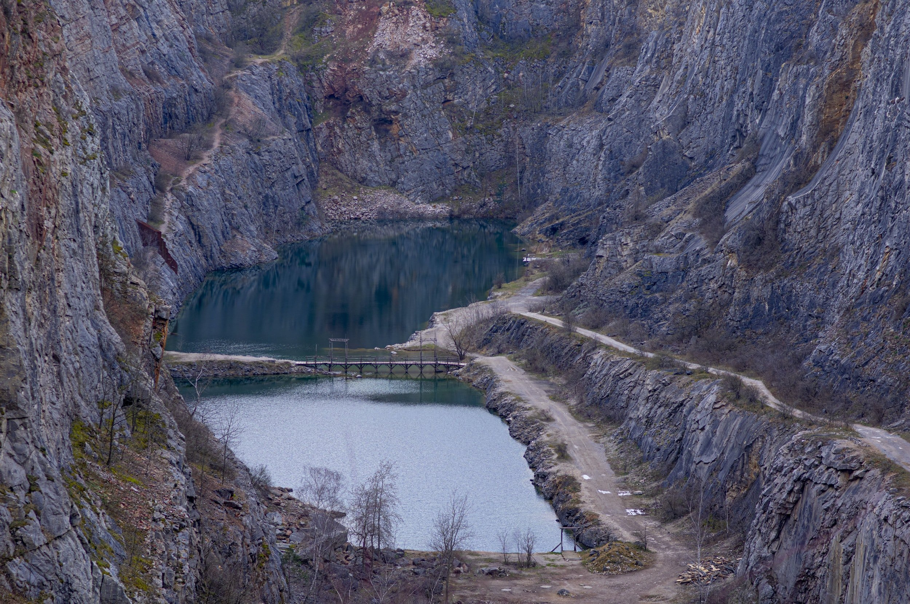
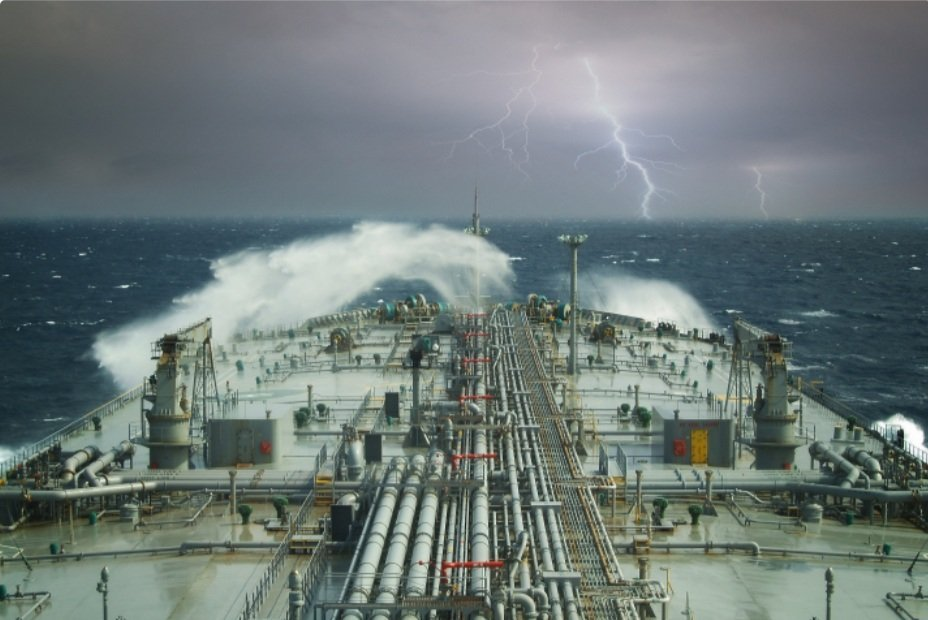

# Weekly Insights Review

**Date:** May 22, 2022  
**Publisher:** Breakwave Advisors | **Category:** Market Insights  
**Original URL:** [https://www.breakwaveadvisors.com/insights/2022/5/21/weekly-insights-review](https://www.breakwaveadvisors.com/insights/2022/5/21/weekly-insights-review)  

---

## Welcome to Our Weekly Insights Review

## Read Here Everything You Need to Know

## Shipping Decarbonization Weekly Insights

## Latest Trends on Fuel Transition, Shipyard Actions, Government, Ports, Financing and Industry Players.

The transition of the shipping industry to green future is in full force with 63% of orders for newbuilding vessels this year to have been for alternative fuel capable units. LNG remains the leading alternative fuel today, featuring in 59% of orders in 2022 so far where as it factored into just 28% of orders last year.

[Read More](https://www.breakwaveadvisors.com/insights/2022/5/16/shipping-decarbonization-weekly-insights)

> **Figure 1: Unsplash Image Dcyrvs41c9y**  
> **Interactive Data & Source:** [Breakwave Advisors Market Insights](https://www.breakwaveadvisors.com/insights/2022/5/17/the-big-picture-iron-ore-improving) | [Local Asset](file:///C:/Users/Dell/Github/Shipping/corpus/03-breakwave/insights/2022/assets/2022-05-22_weekly-insights-review_img_unsplash-image-dcyrvs41c9y_3f7251c4bef2.jpg)

## The Big Picture: Iron Ore Improving

> **Figure 2: Unsplash Image Li Uksslyje**  
> **Interactive Data & Source:** [Breakwave Advisors Market Insights](https://www.breakwaveadvisors.com/insights/2022/5/17/the-big-picture-iron-ore-improving) | [Local Asset](file:///C:/Users/Dell/Github/Shipping/corpus/03-breakwave/insights/2022/assets/2022-05-22_weekly-insights-review_img_unsplash-image-li-uksslyje_cba7177e00b0.jpg)

## Shipments Growing in May

As weather in Brazil starts to subside and the end of the financial year for several miners approaches, we look at the iron ore market and what may be in store going forward.

[Read More](https://www.breakwaveadvisors.com/insights/2022/5/17/the-big-picture-iron-ore-improving)

> **Figure 3: Unsplash Image Zlayqbb36ts**  
> **Interactive Data & Source:** [Breakwave Advisors Market Insights](https://www.breakwaveadvisors.com/insights/2022/5/19/preliminary-202223-grain-trade-forecast) | [Local Asset](file:///C:/Users/Dell/Github/Shipping/corpus/03-breakwave/insights/2022/assets/2022-05-22_weekly-insights-review_img_unsplash-image-zlayqbb36ts_a7a61e693e70.jpg)

## Preliminary 2022/23 Grain Trade Forecast

## First Global Grain Export Forecast for the Upcoming 2022/23 Season

The United States Department of Agriculture (USDA) recently released their first global grain export forecast for the upcoming 2022/23 season. The forecast is still very preliminary, but of note is that only 487.3 million tons of exports are expected.
[Read More](https://www.breakwaveadvisors.com/insights/2022/5/19/preliminary-202223-grain-trade-forecast)

> **Figure 4: Unsplash Image Gfadxp32uv4**  
> **Interactive Data & Source:** [Breakwave Advisors Market Insights](https://www.breakwaveadvisors.com/insights/2022/4/15/seaborne-coal-due-for-a-shakeup) | [Local Asset](file:///C:/Users/Dell/Github/Shipping/corpus/03-breakwave/insights/2022/assets/2022-05-22_weekly-insights-review_img_unsplash-image-gfadxp32uv4_52ee22f0c40e.jpg)

## Dry Bulk Newbuilding Review: The Spring Sentiment

Shipping News Update

Amid a climate of increased uncertainty fuelled by a variety of admittedly worrying factors, investors’ appetite for newbuilding orders in the dry bulk segment remains relatively controlled, thus offering ground for low fleet growth and utilization projections.
[Read More](https://www.breakwaveadvisors.com/insights/2022/4/15/seaborne-coal-due-for-a-shakeup)

> **Figure 5: Unsplash Image 9dohz7wjvdm**  
> **Interactive Data & Source:** [Breakwave Advisors Market Insights](https://www.breakwaveadvisors.com/insights/2022/5/20/taking-stock-of-gender-diversity-in-shipping-for-womens-history-month) | [Local Asset](file:///C:/Users/Dell/Github/Shipping/corpus/03-breakwave/insights/2022/assets/2022-05-22_weekly-insights-review_img_unsplash-image-9dohz7wjvdm_cda0b014016a.jpg)

## Taking Stock of Gender Diversity in Shipping for Women’s History Month

## Giant Leap for Woman

In October of 1974, five previously all-male colleges of the University of Oxford admitted female undergraduates for the first time in its 878 years of history.
[Read More](https://www.breakwaveadvisors.com/insights/2022/5/20/taking-stock-of-gender-diversity-in-shipping-for-womens-history-month)

## Metals Rebound As Focus Returns to Tight Supplies and Stimulus Measures

> **Figure 6: Unsplash Image Wtxlry3nnto**  
> **Interactive Data & Source:** [Breakwave Advisors Market Insights](https://www.breakwaveadvisors.com/insights/2022/4/16/q1-2022-tonne-mile-review) | [Local Asset](file:///C:/Users/Dell/Github/Shipping/corpus/03-breakwave/insights/2022/assets/2022-05-22_weekly-insights-review_img_unsplash-image-wtxlry3nnto_27958a20b8ea.jpg)

## Investors Shrugged Off Concerns of Weaker Economic Growth

As we move into the second quarter of this year, we analyse the effects of recent developments on the tonne-mile demand of crude and clean tanker fleets. Individual crude tanker classes are indicating a tonne-mile trend reversal, as well as clean LR tankers, while MRs have shown signs of continued strength in the months ahead.

[Read More](https://www.breakwaveadvisors.com/insights/2022/4/16/q1-2022-tonne-mile-review)

## Turbulent Seas for the Vlccs

## Losing Around 25% of the Value on the Most Heavily Traded Route Worldwide

> **Figure 7: 1**  
> **Interactive Data & Source:** [Breakwave Advisors Market Insights](https://www.breakwaveadvisors.com/insights/2022/5/20/turbulent-seas-for-the-vlccs) | [Local Asset](file:///C:/Users/Dell/Github/Shipping/corpus/03-breakwave/insights/2022/assets/2022-05-22_weekly-insights-review_img_1_a6f53bb13b27.jpg)

After a short-lived spike during the start of April, VLCC rates have tumbled, losing around 25% of the value on the most heavily traded route worldwide.
[Read More](https://www.breakwaveadvisors.com/insights/2022/5/20/turbulent-seas-for-the-vlccs)
