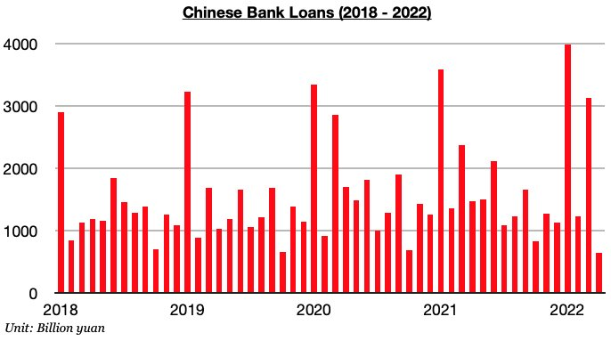
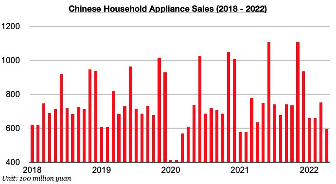
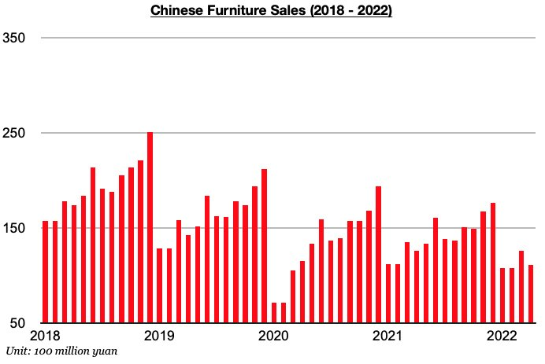
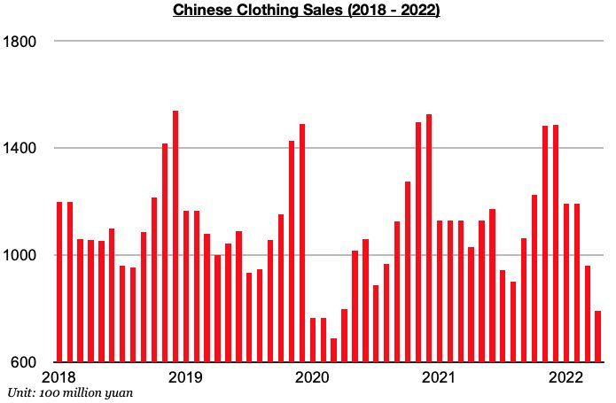

# Greater Weakness Recently in Chinese Lending and Spending

**Date:** May 25, 2022  
**Publisher:** Breakwave Advisors | **Category:** Market Insights  
**Original URL:** [https://www.breakwaveadvisors.com/insights/2022/5/25/greater-weakness-recently-in-chinese-lending-and-spending](https://www.breakwaveadvisors.com/insights/2022/5/25/greater-weakness-recently-in-chinese-lending-and-spending)  

---

*By*[*Jeffrey Landsberg*](https://www.linkedin.com/in/jeffrey-landsberg-70ab957/)

As we have highlighted to our clients in our recent Weekly China Reports, Chinese banks issued only 645 trillion yuan in new loans in April. This has marked a month-on-month decline of 2.49 billion yuan (-80%) and a year-on-year decline of 825 billion yuan (-56%). While it is normal for lending to fall by a large amount every April (after an annual March surge), lockdowns in various cities last month — including the lockdown in the financial hub of Shanghai — significantly affected lending.

> **Figure 1: Chart 1 (33)**  
> [Local Asset](file:///C:/Users/Dell/Github/Shipping/corpus/03-breakwave/insights/2022/assets/2022-05-25_greater-weakness-recently-in-chinese-lending-and-spending_img_chart1283329_afea0d41e2b5.jpg)

Prior to April, the amount of new loans issued during the first three months of this year had grown year-on-year by 14% (in comparison, new loans during all of last year 2021 were basically unchanged from 2020). Now through the first four months of this year, new loans have grown year-on-year by just 2%.

Also covered in our recent Weekly China Reports is that consumer spending in China has weakened further as anticipated. April ended up seeing consumer spending contract on a year-on-year basis by 11.1%, which has marked only the second year-on-year contraction seen since July 2020. The surge in new daily coronavirus cases has been the primary reason for the contraction. Not surprisingly, domestic appliance sales, clothing sales, and furniture sales last month all contracted on a year-on-year basis by an even larger amount than seen in March.

Appliance sales (which includes consumer electronics) totaled 59.4 billion yuan last month, which has marked a year-on-year contraction of 7%. Appliance sales have now contracted on a year-on-year basis for two straight months after having previously increased on a year-on-year basis during fifteen of the prior seventeen months.

> **Figure 2: Chart 2 (30)**  
> [Local Asset](file:///C:/Users/Dell/Github/Shipping/corpus/03-breakwave/insights/2022/assets/2022-05-25_greater-weakness-recently-in-chinese-lending-and-spending_img_chart2283029_b5114c23d457.jpg)

Furniture sales in April totaled 11.1 billion yuan, which has marked a year-on-year contraction of 12%. Furniture sales have now contracted on a year-on-year basis for nine consecutive months. Last month’s contraction has marked the largest contraction seen since December 2020.

> **Figure 3: Chart 3 (25)**  
> [Local Asset](file:///C:/Users/Dell/Github/Shipping/corpus/03-breakwave/insights/2022/assets/2022-05-25_greater-weakness-recently-in-chinese-lending-and-spending_img_chart3282529_9e640bb5ea07.jpg)

Clothing sales (which includes garments, footwear, hats, and knitwear) in April totaled 79.1 billion yuan, which has marked a year-on-year contraction of 23%. Appliance sales have now contracted on a year-on-year basis during seven of the last nine months. Last month’s contraction has marked the largest contraction seen since April 2020.

> **Figure 4: Chart 4 (15)**  
> [Local Asset](file:///C:/Users/Dell/Github/Shipping/corpus/03-breakwave/insights/2022/assets/2022-05-25_greater-weakness-recently-in-chinese-lending-and-spending_img_chart4281529_d71407445e65.jpg)

Going forward, we anticipate that lending will soon start to experience more growth again as the central government continues to work to stimulate the economy. New daily coronavirus cases have also now stayed low for three straight weeks and covid restrictions continue to gradually be lifted.
