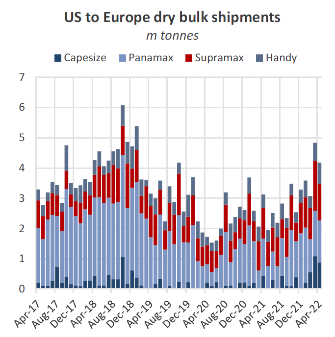
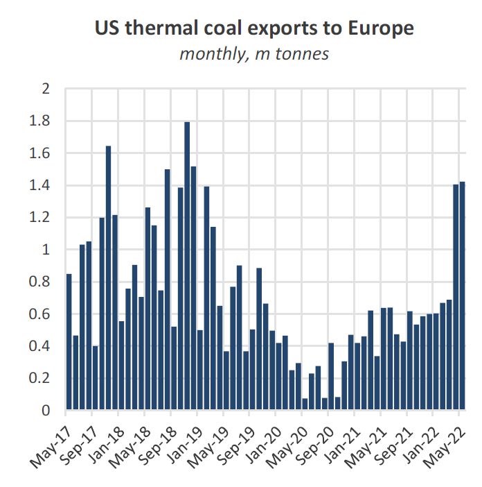
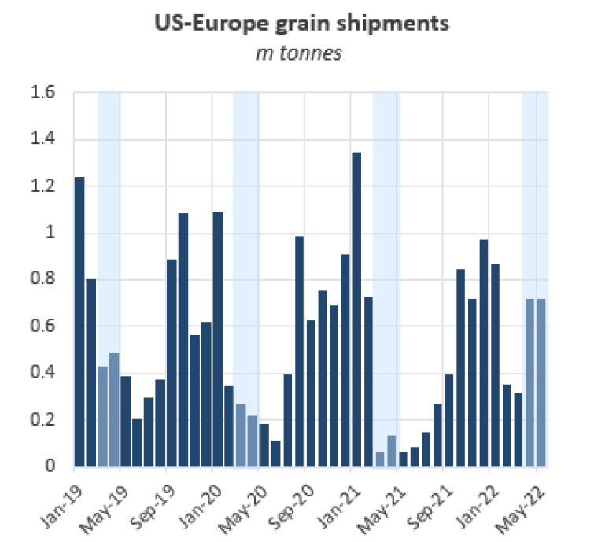
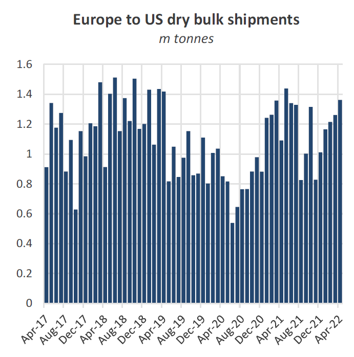

# The Big Picture: US-Europe trade

**Date:** May 27, 2022  
**Publisher:** Breakwave Advisors | **Category:** Market Insights  
**Original URL:** [https://www.breakwaveadvisors.com/insights/2022/5/27/jong4q8e6zzsf15wk9r1i5xczl1fey](https://www.breakwaveadvisors.com/insights/2022/5/27/jong4q8e6zzsf15wk9r1i5xczl1fey)  

---

*By*[*Mark Nugent*](https://www.linkedin.com/in/mark-nugent-3724a3192/)

## Fresh Demand in the Atlantic

*As trade flows continue to change as the Ukraine-Russia war unfolds, we look at how the US has increased shipments to Europe across several dry bulk commodities and what it means for dry bulk markets.*

So far since the Russian invasion of Ukraine and significant dry bulk trade routes have changed, transatlantic flows from the US to Europe have been particularly strong. The US government has pledged to support European countries which are now facing deficits across several commodities as a result of sanctions and the closure of Ukrainian ports. The US and EU Trade and Technology Council (TTC) convened earlier this month to resolve trade disagreements and remove bilateral trade barriers. While this initiative was initially geared towards items such as semiconductors, the cooperation bodes well for trade amongst other goods, including raw materials. In April, 4.9m tonnes of US-exported dry bulk commodities were discharged in Europe, more than doubling YoY and the highest level since February 2019.

> **Figure 1: Market Chart 1**  
> [Local Asset](file:///C:/Users/Dell/Github/Shipping/corpus/03-breakwave/insights/2022/assets/2022-05-27_jong4q8e6zzsf15wk9r1i5xczl1fey_img_image028329_0832b02af418.png)

The surge in shipments has mostly come in favour of the Capesizes from coal stems replacing those typically done on a Panamax. Further, the smaller vessels have benefitted from an abnormal spike in grain shipments. Bulker demand from US-European voyages has hit 2-year highs in April in tandem with overall trade. This has been exacerbated by slower propulsion and lengthy queues in the ARAG region. In April, dry bulk demand from US-Europe trade, measured in dwt days, more than tripled YoY and reached the highest level since December 2018.

### Coal Drives the Surge

Coal shipments from the US to Europe have hit over 2-year highs. In May, steam coal exports have so far amounted to 1.4m tonnes, already more than doubling YoY. The US has emerged as the primary outlet for replaced Russian coal for European buyers.

> **Figure 2: Market Chart 2**  
> [Local Asset](file:///C:/Users/Dell/Github/Shipping/corpus/03-breakwave/insights/2022/assets/2022-05-27_jong4q8e6zzsf15wk9r1i5xczl1fey_img_image128329_b2e6e58811ac.png)

With US coal producers effectively operating at full capacity, the extra volumes that have shipped to Europe have been removed from Far Eastern coal trades, namely to China and Japan. To Japan, only 299k tonnes of coal was shipped from US ports in April compared to 1.1m tonnes in April 2021. To China, shipments declined 61.6% YoY in April to just 339k tonnes. With China now boosting domestic production, any additional demand for coal from the seaborne market has been filled by Indonesia primarily.

Overall, the change to the coal trade from the US to Europe has brought more employment to transatlantic trades in replacement of those to the Far East. The absence of Russian coal heading west, or east in some cases, has created increased demand from limited suppliers. With Europe favouring US-produced coal, competition for coal in the Pacific is set to increase further as US volumes become less available unless buyers are willing to pay firm prices and a larger outlay on freight.

### Unseasonal Grain Shipment Spike

While coal has largely driven the surge in trade between the US and Europe, there has also been an unseasonal spike in grain shipments on this route. So far in May 718k tonnes of grain has been shipped to Europe, compared to just 64k tonnes in May last year. This is already the highest volume in May across each of the last 5 years. In April, we saw a similar increase at 717k tonnes loaded. While these are relatively minor volumes in comparison to coal, the US exporting an unseasonal amount of grain to Europe bodes well for the prospects of this trade during the US grain exporting season. Per the USDA’s latest WASDE, the US is forecast to export 165m tonnes of grain in the 2021-22 marketing year.

> **Figure 3: Market Chart 3**  
> [Local Asset](file:///C:/Users/Dell/Github/Shipping/corpus/03-breakwave/insights/2022/assets/2022-05-27_jong4q8e6zzsf15wk9r1i5xczl1fey_img_image228329_def2e559cb8d.png)

With China a key buyer of US-sown corn, European buyers will face firm competition from the world’s largest seaborne grain buyer, which continues to assure food security for its population. In anticipation of a complete loss of Ukrainian grain exports, countries in Europe, and indeed elsewhere, are now aiming to stockpile available supplies. This has driven the unseasonal surge in US-Europe grain shipments.

### Backhaul Trades Perform Well

Further to the US to Europe trade, cargoes heading back to the US have also been strong. While shipments had ramped up during the post-pandemic surge in trade, activity started to soften towards the end of 2021. However, since the invasion in March, these levels have returned. In April, 1.4m tonnes of dry bulk commodities loaded in Europe destined for the US. While no particular cargo has stood out, this rebound is predominantly made up of aggregates, steels and cement. In 2021, US farmers had also been buying healthy volumes of European fertilisers, although this trade has since stalled due to fertiliser shortages in Europe driven by trade sanctions and exports bans in Russia and Belarus. On the cement side, several southern states have reported shortages of the construction material, owed largely to reduced inventories form strong demand in the winter months and labour shortages at production plants.

> **Figure 4: Market Chart 4**  
> [Local Asset](file:///C:/Users/Dell/Github/Shipping/corpus/03-breakwave/insights/2022/assets/2022-05-27_jong4q8e6zzsf15wk9r1i5xczl1fey_img_image328429_1620824ea806.png)

Overall, as the geopolitical situation continues, we see demand from these transatlantic trades to be sustained at these levels, if not continuing higher. When the full European sanctions on Russian coal take effect in August, we expect the US to contribute a significant share of the replacement volumes Europe will need, as they have done already since the invasion. Total dry bulk liftings between the US and the bloc reached 6.1m tonnes in March, the highest level since January 2019, with April coming in marginally lower than these levels.

However, the net result is an unfamiliar amount of vessels opening in the ARAG range when considering the additional arrivals from elsewhere. The one factor providing support against this for now is the lengthy queues at ports in this region. Many vessels opening ARAG have reportedly re-fixed for cargoes back across the Atlantic. The boost in trade into Europe has increased supply of tonnage in the Atlantic basin significantly. According to AIS tracking, the number of bulk carriers in the Atlantic is at its highest point in over three years, bringing the balance between the Pacific-Atlantic relatively tight compared to previous years. While demand from Atlantic trades is strong this should bode well for the dry bulk markets going forward.
