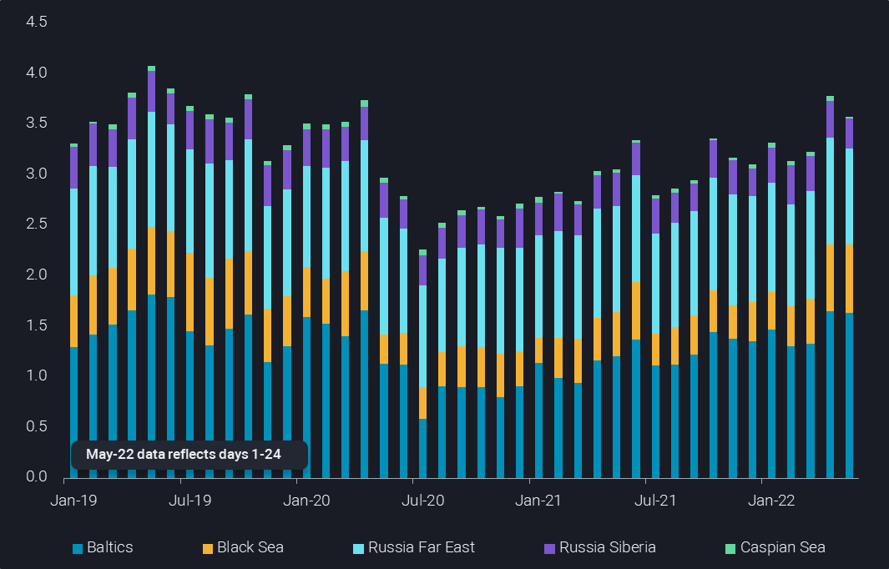
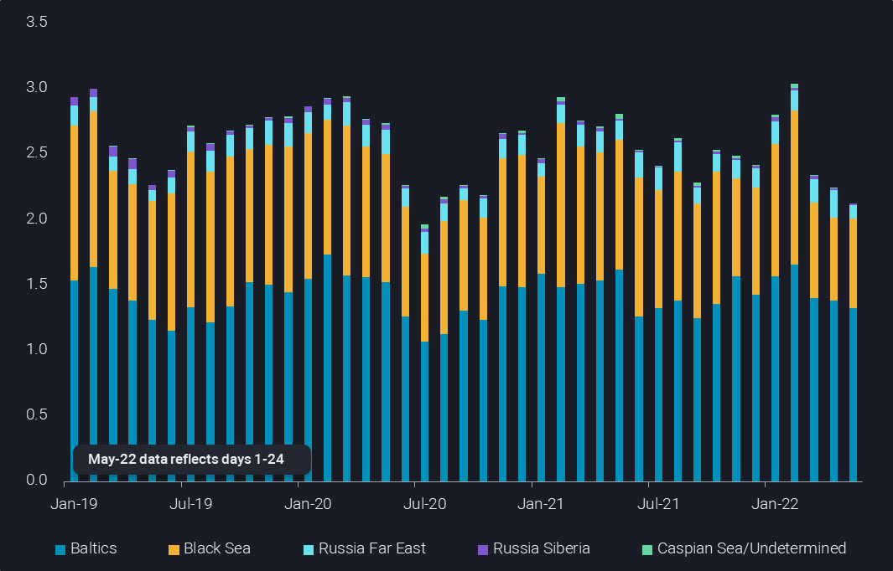
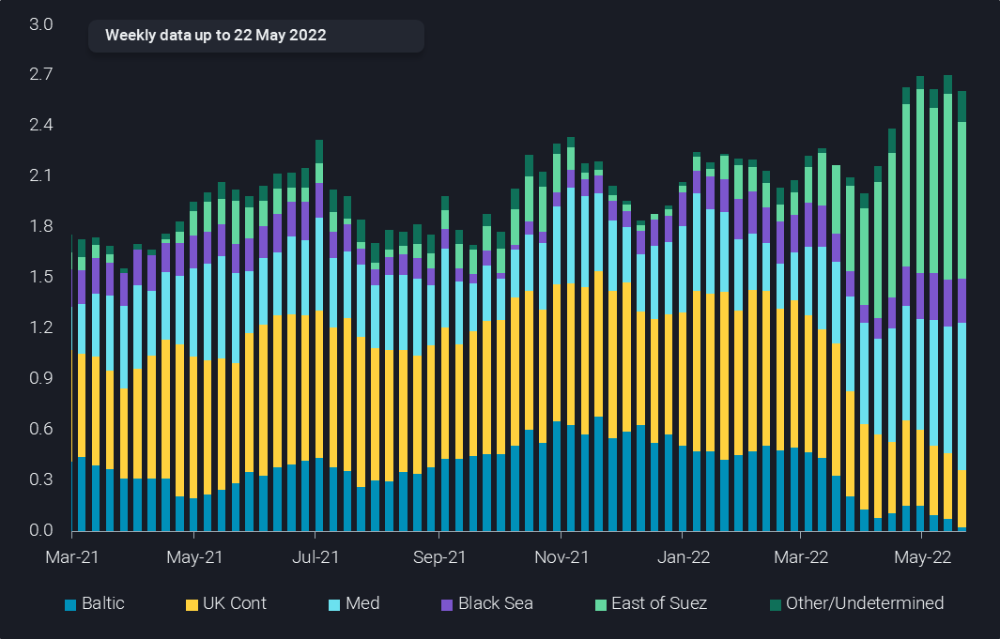

# Russian crude exports remain high

**Date:** May 28, 2022  
**Publisher:** Breakwave Advisors | **Category:** Market Insights  
**Original URL:** [https://www.breakwaveadvisors.com/insights/2022/5/28/russian-crude-exports-remain-high](https://www.breakwaveadvisors.com/insights/2022/5/28/russian-crude-exports-remain-high)  

---

*By*[*David Wech*](https://www.linkedin.com/in/david-wech-83a163165/)

**In contrast to widespread assumptions and news pieces, Russian crude oil exports remain very high. Curtailments to domestic use, as struggling product exports limit refining operations, have been a crucial supporting factor for crude exports. Meanwhile, sanctions are unlikely to hinder Russian players from exporting oil over the coming months more than they already do. Accordingly, further production losses appear to be off the table for now.**

In the first 24 days of May, Russian seaborne crude and condensate exports have averaged 3.6mbd. This is slightly down by 170kbd from April, but nearly 0.4mbd higher than the Q1 2022 average. If sustained for the full month, exports would be back to the pre-Covid 2019 of 3.6mbd. Exports in 2020 and 2021 have averaged slightly below 3mbd.

The increase in exports is clearly due to higher flows towards European waters via the Baltic and Black Sea. Seaborne exports via these two routes increased from below 1.8mbd in Q1 2022 to above 2.3mbd in April and May.

> **Figure 1: Pasted Image 0 (6)**  
> **Interactive Data & Source:** [Analytics Vortexa](https://analytics.vortexa.com/?dateRange=2019-01-01T00%3A00%3A00.000Z__2022-05-24T23%3A59%3A59.999Z&filtersEnabled=%5B%22p%22%2C%22o%22%2C%22d%22%2C%22d_r%22%2C%22v%22%2C%22intra%22%2C%22sts_o%22%2C%22c_o%22%2C%22w%22%5D&from=%5B%22b996521be9c996db3560ca234a56286ac38f798d34be229437555fab4f12a6a5%22%5D&geoBreakdownOriginGlobal=trading_region&metric=bpd&page=Flows&products=%5B%2254af755a090118dcf9b0724c9a4e9f14745c26165385ffa7f1445bc768f06f11%22%5D&productsExcluded=%5B%22bb70cf56200f5b72ba69a90bda2c6b47ba29da23945c6f1994cfd4c2ef2fe0ff%22%5D&sortDirection=asc&sortField=destination&tabId=c6f9e5c5-5194-4257-8a66-ff4ad1067951&timeSeriesProperty=origin_trading_region&vesselClassChartView=count&vesselClassesExcluded=%5B%22tiny_tanker%22%5D) | [Local Asset](file:///C:/Users/Dell/Github/Shipping/corpus/03-breakwave/insights/2022/assets/2022-05-28_russian-crude-exports-remain-high_img_pastedimage028629_ffdddd781654.png)

While Russia faced only temporary difficulties to move all crude onto international waters, the story is different for refined products. Especially fuel oil and naphtha, of minor global relevance when compared to crude oil and diesel, faced major reductions. Refined product exports to the Baltic and Black Sea regions averaged 2mbd over April and the first 24 days of May. This is down by 0.7mbd compared to the unusually high levels on average over January and February 2020. But it is also 0.4mbd lower than the average of 2021.

The inability to export fuel oil and naphtha forced Russian refineries to curtail throughput, freeing up crude for export markets. As naphtha and fuel oil are only a part of a refinery’s output, the impact can be bigger than the respective lost export volumes. Local demand declines also help to explain higher crude exports. Nevertheless, current export levels do not correspond well with crude output cuts of 1mbd, let alone of up to 3mbd as forecast by the IEA.

> **Figure 2: Pasted Image 0 (7)**  
> **Interactive Data & Source:** [Analytics Vortexa](https://analytics.vortexa.com/?dateRange=2019-01-01T00%3A00%3A00.000Z__2022-05-24T23%3A59%3A59.999Z&filtersEnabled=%5B%22p%22%2C%22o%22%2C%22d%22%2C%22d_r%22%2C%22v%22%2C%22intra%22%2C%22sts_o%22%2C%22c_o%22%2C%22w%22%5D&from=%5B%22b996521be9c996db3560ca234a56286ac38f798d34be229437555fab4f12a6a5%22%5D&geoBreakdownOriginGlobal=trading_region&metric=bpd&page=Flows&products=%5B%22b68cbb746f8b9098c50e2ba36bcad83001a53bd362e9031fb49085d02c36659c%22%2C%225de0b00094e0fd7542c10f9f8a71b4008d55750f21dc905cda9b0f7f5f76bc08%22%5D&sortDirection=asc&sortField=destination&tabId=c6f9e5c5-5194-4257-8a66-ff4ad1067951&timeSeriesProperty=origin_trading_region&vesselClassChartView=count&vesselClassesExcluded=%5B%22tiny_tanker%22%5D) | [Local Asset](file:///C:/Users/Dell/Github/Shipping/corpus/03-breakwave/insights/2022/assets/2022-05-28_russian-crude-exports-remain-high_img_pastedimage028729_686da29e902d.png)

Russia’s war on Ukraine caused a drastic change in the ultimate discharge locations of Russian crude oil that is exported towards European waters via the Arctic, Baltic and Black Sea regions. While 95% of cargoes leaving these outlets in Q4 2021 stayed in Europe, only 57% of barrels exported over April/May still found a home in Europe. About 1mbd is targeting markets East of Suez, mostly in India and China.

Not all vessels moving towards the Med or East of Suez have already final buyers, with a few cargoes also on floating storage. Higher exports, the much longer trips to Asia, and delayed shipments lift the amount of crude on the water from the European side of Russia to spike from about 21mb in early 2022 to 67mb more recently.

> **Figure 3: Pasted Image 0 (8)**  
> **Interactive Data & Source:** [Analytics Vortexa](https://analytics.vortexa.com/?dateRange=2021-01-01T00%3A00%3A00.000Z__2022-05-22T23%3A59%3A59.999Z&filtersEnabled=%5B%22p%22%2C%22o%22%2C%22d%22%2C%22d_r%22%2C%22v%22%2C%22intra%22%2C%22sts_o%22%2C%22c_o%22%2C%22w%22%5D&frequency=week&from=%5B%22c48ec599431027d68fbdc85031399ba463394e0e7dbec392ba3ce6979ee01c15%22%2C%2244a1b0bb0e2afdb98d07b20184550b77449745bb650cb31628fb4c6ceeb64603%22%2C%22488300bb8d94adfdd2e29bea7f692c69133b016810805dd012245882e2f2f6f7%22%5D&geoBreakdownOriginGlobal=trading_region&metric=bpd&page=Flows&products=%5B%2254af755a090118dcf9b0724c9a4e9f14745c26165385ffa7f1445bc768f06f11%22%5D&productsExcluded=%5B%22bb70cf56200f5b72ba69a90bda2c6b47ba29da23945c6f1994cfd4c2ef2fe0ff%22%5D&sortDirection=asc&sortField=destination&tabId=c6f9e5c5-5194-4257-8a66-ff4ad1067951&timeSeriesProperty=destination_shipping_region&vesselClassChartView=count&vesselClassesExcluded=%5B%22tiny_tanker%22%5D) | [Local Asset](file:///C:/Users/Dell/Github/Shipping/corpus/03-breakwave/insights/2022/assets/2022-05-28_russian-crude-exports-remain-high_img_pastedimage028829_aa19cb73a05b.png)

But also within Europe there is a sharp shift of buyers, with Northwest European buyers (Baltic and UK Cont) recently taking less than 0.4kbd, down from peaks above 1.4mbd in late 2021 and early 2022. In exchange, volumes to the Mediterranean (incl. Black Sea and Turkey) increased from 0.6mbd over Q4 2021/Q1 2022 to 1.1mbd more recently.

This illustrates that the self-sanctioning schemes are limited to certain players, and European politicians appear somewhere between unable or unwilling to provide a strong guidance any time soon. Even if the discussed sanctions are decided on, it will not hinder imports of Russian oil for the next six months or so. Accordingly, it is reasonable to assume that Russian oil supplies will stay in the market for the coming months at similar levels than currently.

This appears to be also increasingly reflected in pricing, such as easing diesel cracks and refining margins. Meanwhile, the recent upside trend in crude prices reflects to quite some extent non-Russian factors, such as the inability of all other OPEC+ countries to raise supplies and demand picking up seasonally and from China where Covid restrictions are set to ease.

Data Source:[Vortexa](https://www.vortexa.com//oil-gas-data-traders-analysts-data-scientists?gclid=Cj0KCQjw8_qRBhCXARIsAE2AtRZKOvMnbilZ_6_91d7huSFFy71pWLrnPwGwOHVzXsmsG-1a1mZnQw8aAt89EALw_wcB&hsa_acc=1782073842&hsa_ad=548425387665&hsa_cam=14746637662&hsa_grp=125038601902&hsa_kw=&hsa_mt=&hsa_net=adwords&hsa_src=g&hsa_tgt=dsa-1431852288425&hsa_ver=3&utm_campaign=%5BCD%5D%20-%20DSA%20-%20EMEA&utm_medium=cpc&utm_medium=ppc&utm_source=google&utm_source=adwords&utm_term=)
