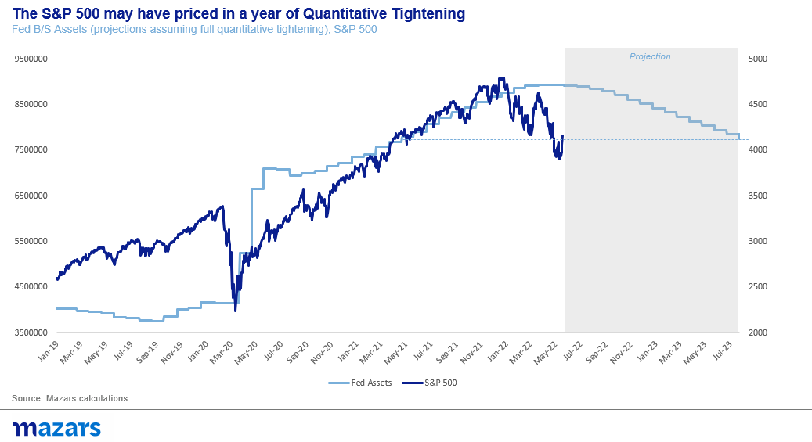
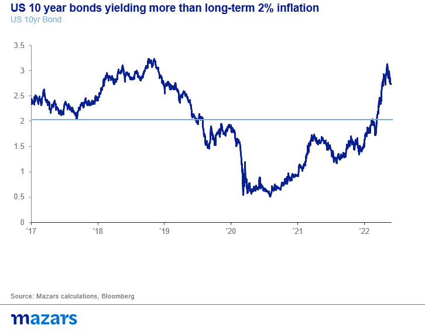
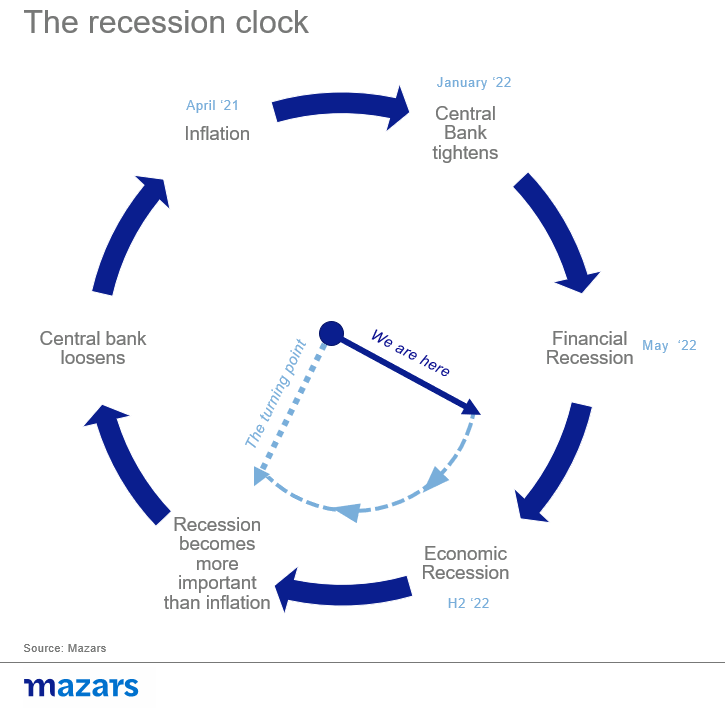
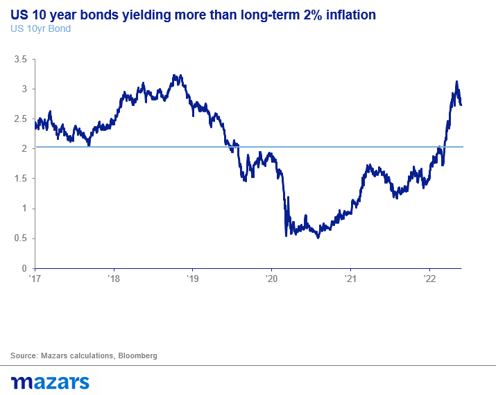

# Dead Cats don't bounce

**Date:** May 31, 2022  
**Publisher:** Breakwave Advisors | **Category:** Market Insights  
**Original URL:** [https://www.breakwaveadvisors.com/insights/2022/5/31/dead-cats-dont-bounce](https://www.breakwaveadvisors.com/insights/2022/5/31/dead-cats-dont-bounce)  

---

*By*[*George Lagarias*](https://www.linkedin.com/in/george-lagarias-mba-3baa769/)

Last week saw the best performing week since November 2020 for equities, after the Fed’s Minutes suggested that the Fed will not be more aggressive than already anticipated. Ostensibly, everything in this move screams “Bear Market rally”. After all, how can we call an end to the Bear Market when Quantitative Tightening, the great process to unwind some of the Fed’s recent purchases, hasn’t even began.

However, we should not forget that the Fed continues to be the “only game in town”. And that asset managers lost the right to cry “Bear Market Rally” in 2013, when everyone was certain that Quantitative Easing would come to an end and markets would revert to crisis form.

However, a quick look at where the S&P 500 rebounded (at 4150 points), and where the Fed’s assets are projected to be (assuming full quantitative tightening) by the next summer. In other words, markets have priced in a year’s worth of quantitative tightening.

> **Figure 1: Market Chart 1**  
> [Local Asset](file:///C:/Users/Dell/Github/Shipping/corpus/03-breakwave/insights/2022/assets/2022-05-31_dead-cats-dont-bounce_img_image001_93b274fe6943.png)

One can’t say for certain that we have reached a bottom. The S&P could well fall another 800 points, towards significant technical levels which coincide with Fed asset levels before the latest round of QE.

In other words, markets have priced in some quantitative tightening, but not a full reduction of assets to pre-Covid level. For that to happen, we would need to see a significantly more hawkish Fed. Last week’s Minutes from the latest central bank meeting suggest that this is not the case.

The rebound in bonds after the US 10-year reaching 3% means that markets have also priced in this and possibly next year’s rate hikes as well. The global bond benchmark yielding 1% over long-term inflation is certainly reason for pause.

> **Figure 2: Market Chart 2**  
> [Local Asset](file:///C:/Users/Dell/Github/Shipping/corpus/03-breakwave/insights/2022/assets/2022-05-31_dead-cats-dont-bounce_img_image002_7365c9b422e6.png)

We are now moving to the phase of the cycle where at least some of the financial recession has happened, but the economic recession has yet to come.

> **Figure 3: Market Chart 3**  
> [Local Asset](file:///C:/Users/Dell/Github/Shipping/corpus/03-breakwave/insights/2022/assets/2022-05-31_dead-cats-dont-bounce_img_image003_fb9b5a1ffa0a.png)

And there’s more good news. By now, members of the Federal Open Markets Committee will know that even their most constrictive policies will have little effect on inflation and that the labour market is very tight. Therefore, their principal concern will be growth. The quarter’s results by Amazon and Wal-Mart were disconcerting enough to raise some flags in the Fed. Meanwhile, the US housing market continues to lose steam while prices remain sticky, the usual mark of a disconnect between buyers and sellers -just before the prices eventually cave.

> **Figure 4: Market Chart 4**  
> [Local Asset](file:///C:/Users/Dell/Github/Shipping/corpus/03-breakwave/insights/2022/assets/2022-05-31_dead-cats-dont-bounce_img_image004_78e1cb089ea2.png)

So markets have retrenched enough to price in some quantitative tightening. At the same time, economic news are taking enough of a negative turn to at the very least sow the first seeds of dovishness that should kick off the next cycle.

Calling the latest rebound a “dead cat bounce” might be a misnomer. Dead cats don’t bounce. On the one hand, what we are seeing might very well be a “bear market rally”. Stocks can further retrench as a result of bearishness, forecasts and algorithmic trading. But we have reached a level in the equity and the bond markets where markets stop for pause.

This doesn’t mean the beginning of a new cycle. Things going in the right direction is not enough. A strong theme is needed for a new bull market, and that will probably not come until inflation eases and central banks perform an about-turn and stop Quantitative Tightening.
