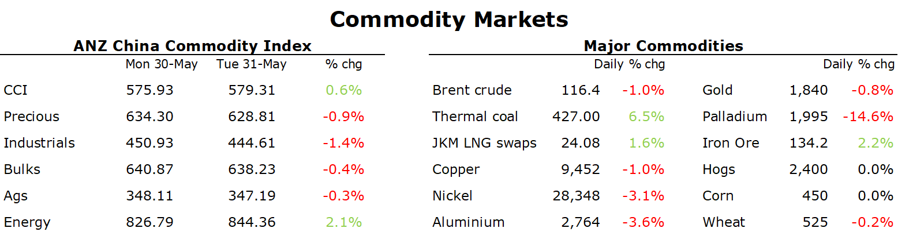

# Crude oil gains after EU bans Russian oil imports

**Date:** June 01, 2022  
**Publisher:** Breakwave Advisors | **Category:** Market Insights  
**Original URL:** [https://www.breakwaveadvisors.com/insights/2022/6/1/crude-oil-gains-after-eu-bans-russian-oil-imports](https://www.breakwaveadvisors.com/insights/2022/6/1/crude-oil-gains-after-eu-bans-russian-oil-imports)  

---

*By*[*Daniel Hynes*](https://www.linkedin.com/in/dahynes/)

Energy markets gained amid concerns of further supply disruptions. That was offset by concerns of inflation-induced slowdown in economic activity, which weighed on sentiment across metals and agriculture sectors.

> **Figure 1: 1654034489876**  
> **Interactive Data & Source:** [Linkedin](https://www.linkedin.com/newsletters/commodities-wrap-6692196755876012032/?fbclid=IwAR3kiXJqZdxmp9ZcRwBNI7FsBySI-XSC0pfPur1qzjt7OZp7PTE59Tsl1QI) | [Local Asset](file:///C:/Users/Dell/Github/Shipping/corpus/03-breakwave/insights/2022/assets/2022-06-01_crude-oil-gains-after-eu-bans-russian-oil-imports_img_1654034489876_08b0dd10e835.png)

**Crude oil**prices jumped sharply as the European Union finally managed to agree to a sanction package that includes a ban on Russian oil imports. The sanctions would forbid the purchase of crude oil and petroleum products from Russia delivered to member states by sea. However, to appease Hungary, crude oil delivered by pipelines would be exempt. The sanction package still covers more than two-thirds of oil imports from Russia. However, with Germany and Poland already confirmed they won’t be buying Russian oil via pipeline or sea, the total effect would be to cut 90% of Russian crude sales to the EU by year’s end. Crude oil gave up some gains late in the session after reports that OPEC is exploring the idea of exempting Russia from its oil-production deal. This could lead to other member such as Saudi Arabia and UAE pumping more crude oil. The oil producing alliance is due to meet on Thursday to discuss its production agreement that has stabilised oil markets over the past couple of years. But the fact remains that most OPEC producers are struggling to raise output. Despite record high prices, many producers have been unable to invest in new fields or even maintain maintenance. Case in point is Libya, which is facing further disruption to output as its Sarir-Hariga pipeline suffers leaks, leading to losses of more than 300kb/d.

**European natural gas**rose to their highest level in almost two months after Russia cut supplies to more energy firms due to payment issues. Gazprom’s export arm said it halted supplies to Shell and Orsted A/S from Wednesday after they refused to accept Moscow’s demand that payments are ultimately paid in rubles. Gazprom also halted flows to GasTerra BV in the Netherlands on Tuesday for the same reasons. Imports to Poland, Bulgaria and Finland have also been cut in recent weeks, which in total amount to over 12% of Russian gas flows to the EU. Dutch front month futures rallied nearly 7% to settle at EUR94/MWh, the highest level since 18 May. The rally in European gas prices spilled over into Asia, with**North Asia LNG**prices also rising. The spectre of further competition from European buyers saw the Japan Korea Marker rise by 6.4% to end the session at USD24.08/MMBtu. Sentiment is also being bolstered by global restocking efforts. Spot freight rates for LNG tankers have rallied to their highest level this year. The outlook for stronger demand is pushing more buyers into the spot market.

A stronger USD and concerns of ongoing weakness in Chinese demand weighed on sentiment in the**base metals**sector.**Copper**, aluminium and nickel all retreated on the LME, locking in a second consecutive monthly loss. China’s factories struggled in May with the official manufacturing managers index showing contraction for a third month. Still, with restrictions in Shanghai easing the worst may be behind it. Chinese officials are also ramping up efforts to boost economic activity. China will cut the purchase tax on some low-emission passenger vehicles by half. The reduction covers vehicles with up to nine seats costing as much as CNY300k. This will likely lead to increased demand for metals such as copper and nickel. The optimism was stronger in the**iron ore**market, with futures gaining for a third consecutive day. Construction on certain key projects in the steel-making hub of Tangshan resumed on Tuesday, in a positive sign for demand.

The stronger USD also weighed on investor appetite for**gold**, with the precious metal falling nearly 1% to end the session at USD1836/oz. The easing restrictions in China also dampened its safe haven appeal.

Data source:[Commodities Wrap](https://www.linkedin.com/newsletters/commodities-wrap-6692196755876012032/?fbclid=IwAR3kiXJqZdxmp9ZcRwBNI7FsBySI-XSC0pfPur1qzjt7OZp7PTE59Tsl1QI)
