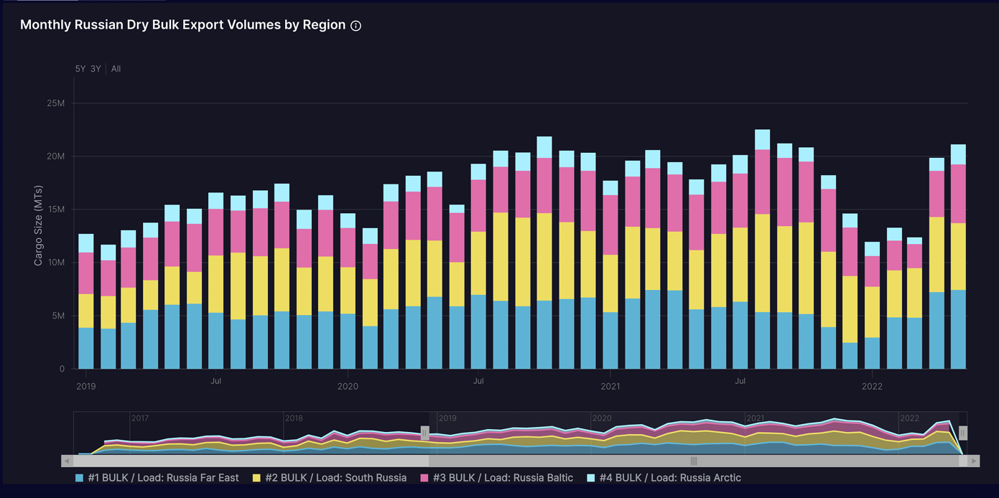
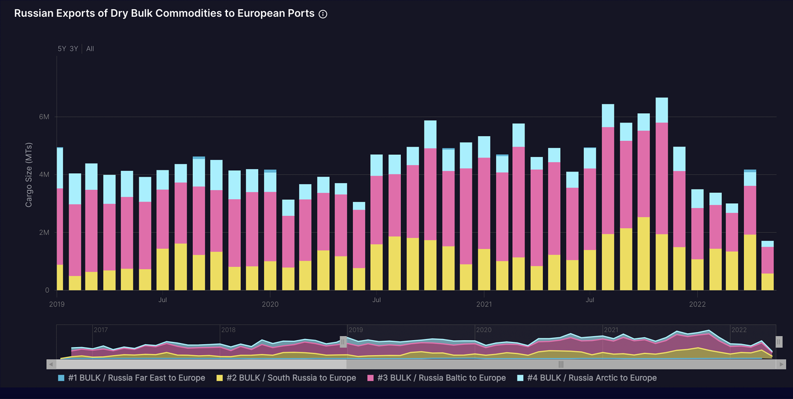
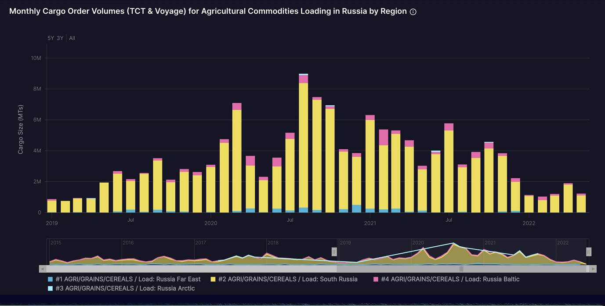
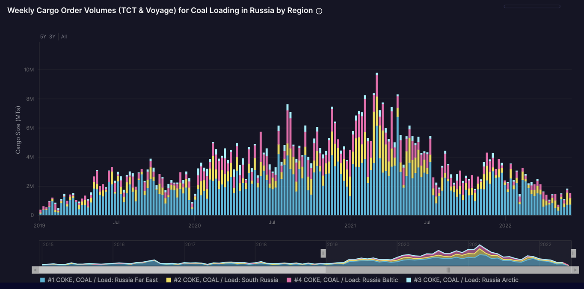
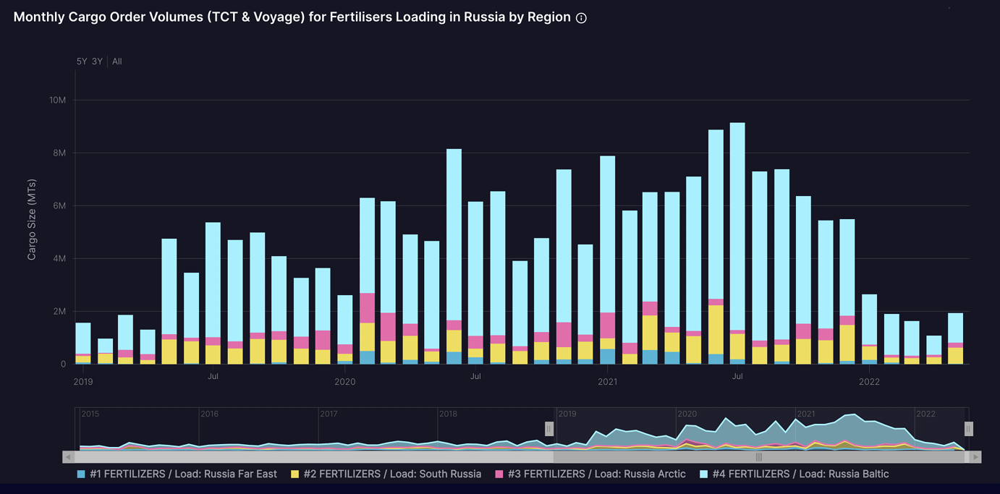

# Russian Exports Surging Despite The War

**Date:** June 03, 2022  
**Publisher:** Breakwave Advisors | **Category:** Market Insights  
**Original URL:** [https://www.breakwaveadvisors.com/insights/2022/6/3/russian-exports-surging-despite-the-war](https://www.breakwaveadvisors.com/insights/2022/6/3/russian-exports-surging-despite-the-war)  

---

*By*[*Ulf Bergman*](https://www.linkedin.com/in/ulf-bergman-81570425/)

The Russian assault on Ukraine has passed the 100 days mark, and no end to the conflict appears to be in sight. While Russian military and political leaders are likely to be disappointed over how the war has evolved, it has galvanised the US and many of its allies to put up a united front politically. Beyond the physical deliveries of weapons and other materials for the Ukrainian armed forces, several rounds of extensive economic sanctions on Russian interests have perhaps been the most tangible results of the allies' newfound unity. However, the extensive dependency on many Russian exports, most notably within the energy sector, has seen the agreements and implementations taking time.

Russian dry bulk export volumes during the early parts of the war were considerably lower than what had been observed during the same period in previous years. However, volumes started to decline during the latter part of last year, well before the invasion began, with monthly data remaining stable during the first three months of the year. Perhaps somewhat counterintuitive, exports have seen a strong rebound in the past two months, at the same time as the number of sanctions has increased.

> **Figure 1: Ch1**  
> **Interactive Data & Source:** [Blog Shipfix](https://blog.shipfix.com/market/shipfixs-weekly-market-blog-6-fertilizer-trade-under-pressure) | [Local Asset](file:///C:/Users/Dell/Github/Shipping/corpus/03-breakwave/insights/2022/assets/2022-06-03_russian-exports-surging-despite-the-war_img_ch1_87349fa7c58e.png)

Source: Shipfix

Multiple factors are likely to be responsible for the recent surge. Many countries around the world are not participating in the efforts to limit Russian access to the global markets and are still trading freely with the country’s exporters. Notable among those countries are the world’s two most populous nations, India and China, which also have expressed a readiness to increase their imports of discounted Russian commodities. Beyond the countries that are not affected by any sanctions, many buyers have increased their purchases of Russian raw materials ahead of impending sanctions. Such a development was particularly notable for the flow of Russian commodities to Europe, which recovered to some extent during April. However, shipments to Europe declined last month as buyers started to look for replacements.

> **Figure 2: Ch2**  
> **Interactive Data & Source:** [Blog Shipfix](https://blog.shipfix.com/market/shipfixs-weekly-market-blog-6-fertilizer-trade-under-pressure) | [Local Asset](file:///C:/Users/Dell/Github/Shipping/corpus/03-breakwave/insights/2022/assets/2022-06-03_russian-exports-surging-despite-the-war_img_ch2_90968ed81bac.png)

Source: Shipfix

The decline in dry bulk cargo volumes heading for European ports in May, while Russian exports are on the rise in general, highlights the shifting trade flows as a result of the war in Ukraine. While it is possible that Russian cargoes bound for Europe are still at sea and not yet adequately accounted for, the short distance from the country’s western ports to Europe should all but guarantee that total volumes for May remain low in a historical context. European buyers are increasingly shying away from supplies from their eastern neighbour, but Russia has been successful in finding alternative markets for its commodities amid a tight global supply situation.

The recovery in dry bulk export volumes from Russian ports has been spread across most of the main regions, with only the ports in the Arctic failing to register any material increases. Given the proximity of the ports in the Baltic and the Black Sea to the important European markets, the continued growth during May in those regions when European demand eased suggests that the tonne-mile requirements associated with the Russian trade are on the rise.

Exports from the Russian ports in the Far East have recovered particularly strongly in recent months, with volumes registered in May reaching a new high of more than 21 million tonnes. The rising seaborne volumes of dry bulk cargoes originating from Russia’s ports in the Pacific suggest that Asian buyers are benefiting from increasing imports of (discounted) commodities for Russia.

Russian exporters have also been able to profit from the rising prices of agricultural commodities that the war has contributed to. After grains exports in March dropped significantly below what has been observed during the same month in previous years, April and May have seen a significant boost in volumes. Shipfix’s cargo order volumes for agricultural commodities loading in Russian ports have also shown a recovery in recent months. The development may suggest that the flow from the Russian Black Sea ports will continue, especially as weekly volumes were higher during the second half of May than during the first half.

> **Figure 3: Ch3**  
> **Interactive Data & Source:** [Blog Shipfix](https://blog.shipfix.com/market/shipfixs-weekly-market-blog-6-fertilizer-trade-under-pressure) | [Local Asset](file:///C:/Users/Dell/Github/Shipping/corpus/03-breakwave/insights/2022/assets/2022-06-03_russian-exports-surging-despite-the-war_img_ch3_fc495353e8bf.png)

Source: Shipfix

Thermal coal has been seen as fuel heading for the history books for some time. However, last year’s energy crunch saw a renewed interest in the dirtiest of fossil fuels from buyers previously looking to phase it out, notably in Europe. The war in Ukraine has also accelerated the revival of coal, as energy prices soared and natural gas supplies came under pressure. The moves by the European Union and Japan to ban imports of Russian coal have forced many buyers to start to look elsewhere for supplies. Nevertheless, coal from Russia has continued to flow to other parts of the world, notably China. Cargo order data also suggest that Russian coal will continue to find customers, especially in Asia, as volumes for coal loading in the Far East have recovered from recent lows.

> **Figure 4: Ch4**  
> **Interactive Data & Source:** [Blog Shipfix](https://blog.shipfix.com/market/shipfixs-weekly-market-blog-6-fertilizer-trade-under-pressure) | [Local Asset](file:///C:/Users/Dell/Github/Shipping/corpus/03-breakwave/insights/2022/assets/2022-06-03_russian-exports-surging-despite-the-war_img_ch4_410d90cf0c7f.png)

Source: Shipfix

As Shipfix discussed in a[previous blog post](https://blog.shipfix.com/market/shipfixs-weekly-market-blog-6-fertilizer-trade-under-pressure), fertilisers have become increasingly viewed as strategic products. Many countries have imposed export restrictions to safeguard supplies to the domestic market to maintain crop yields. Russia was one of the countries that banned exports of some fertilisers late last year, which led to a substantial drop in volumes leaving Russian ports. However, exports have recovered since April, with significant volumes reportedly ending up in Brazil. During May, cargo orders have also seen an increase, indicating that seaborne volumes of fertilisers from Russian ports will remain robust, especially from the Baltic and Black Seas.

> **Figure 5: Ch5**  
> [Local Asset](file:///C:/Users/Dell/Github/Shipping/corpus/03-breakwave/insights/2022/assets/2022-06-03_russian-exports-surging-despite-the-war_img_ch5_e5c1713a5ee6.png)

Source: Shipfix

Despite a rising number of sanctions imposed on the Russian foreign trade, there is little to suggest that the country’s seaborne export volumes will suffer any time soon. In the short term, at least, the war and the sanctions have merely altered traditional trade flows, with cargoes often having to travel further afield to reach their destinations. Unless more countries join the efforts to sanction Russian interests, seaborne volumes are unlikely to suffer in any material way. However, if the reported European move to target the insurance of vessels carrying Russian oil were to be extended to cover dry bulk cargoes as well, it would provide a potential game-changer.
