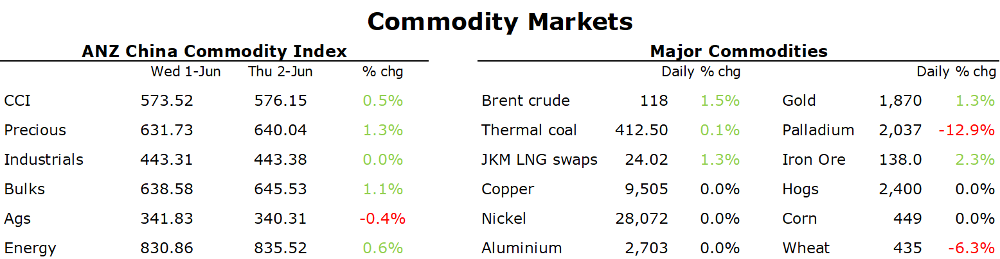

# Oil gains as OPEC's faster increase in output fails to impress the market

**Date:** June 04, 2022  
**Publisher:** Breakwave Advisors | **Category:** Market Insights  
**Original URL:** [https://www.breakwaveadvisors.com/insights/2022/6/3/oil-gains-as-opecs-faster-increase-in-output-fails-to-impress-the-market](https://www.breakwaveadvisors.com/insights/2022/6/3/oil-gains-as-opecs-faster-increase-in-output-fails-to-impress-the-market)  

---

*By*[*Daniel Hynes*](https://www.linkedin.com/in/dahynes/)

Mixed economic data failed to impact sentiment in commodity markets, with supply side issues taking centre stage. Low inventories amid ongoing disruptions pushed most sectors higher.

> **Figure 1: 1654208936795**  
> **Interactive Data & Source:** [Publications Anz](https://publications.anz.com/SingletrackCMS__DownloadDocument?docRef=7c47519a-4844-4961-bc14-7e9f47a1ef68&uid=bd219b92-f5cc-400e-9646-4178791864b7&jobRef=6a14c416-d103-498f-8220-0cdb73a33a38) | [Local Asset](file:///C:/Users/Dell/Github/Shipping/corpus/03-breakwave/insights/2022/assets/2022-06-04_oil-gains-as-opecs-faster-increase-in-output-fails-to-impress-the-market_img_1654208936795_e8210b2c67b9.png)

**Crude oil**prices gained, shrugging off OPEC’s decision to boost output by larger increments in coming months amid signs of strong demand. The OPEC+ alliance agreed to rise its production target by 648,00 b/d in July and August, compared with 432,000 b/d monthly rises that it has implemented since last year. The increases were also divided proportionally among members, which could lead to the actual supply boost being smaller than the official figure. This disappointed the market, with expectations going into the meeting that the group was discussing whether to try and fill the gap left by European sanctions on Russia oil. The fact that Russia was left in the group suggests that production from the alliance will continue to struggle to meet even this modest increase in quota rises. Russian output has already fallen by 1mb/d since the start of the war, and is likely to fall even further as European sanctions kick in. This came as inventories in the US fell further than expected. Commercial inventories in the US fell 5,068k bbls last week, while gasoline and distillate stockpiles were also lower.

**European natural gas**extended recent losses as supply side concerns eased. Dutch front month futures were down as much as 4.3% in early trading as traders don’t expect further cuts to Russian gas flows to European utilities. This follows comments from Gazprom that it doesn’t expect to cut off any more European gas as all customers have either paid adequately or been informed they won’t be receiving more gas. However, prices rebounded strongly into the close amid signs of strong demand. German wind power generation is expected to be well below normal levels, thus providing some incentive to burn more gas for electricity.

**European carbon**gained to hit their highest level in more than two weeks after European lawmakers proposed speeding up emission cuts with the trading system by 2030.

**Iron ore**pushed higher as the market looks to Chinese stimulus measures boosting demand. Futures in Singapore broke above USD140/t to their highest level in more than a month after Beijing ordered state-owned banks to set up an CNY800bn credit line for infrastructure projects. However, the Russia-Ukraine war continues to hang over commodity markets, with iron ore and steel flows now affected. Ukraine is the fourth largest exporter of iron ore; however shipments plunged to zero. India also raised tariffs on exports which could led to lower exports. This comes as Australia and Brazil struggle to maintain current export output. Even so,[**the upside in prices could be limited**](https://publications.anz.com/SingletrackCMS__DownloadDocument?docRef=7c47519a-4844-4961-bc14-7e9f47a1ef68&uid=bd219b92-f5cc-400e-9646-4178791864b7&jobRef=6a14c416-d103-498f-8220-0cdb73a33a38). Constraints on steel output remain, while easing regulations on the housing sector won’t solve its underlying issues.

**Copper**gained as sentiment continues to improve amid easing restrictions in China. Pandemic restrictions in the world’s largest consumer had weighed on demand in recent months. With those now being lifted, the market is looking to a boost to demand as economic activity picks up. Potential supply disruptions in Peru, due to protests at Southern Copper’s Los Chancas mine, are also contributing to rising copper prices.

**Gold**extended gains as a US employment report signalled a softening economy. This raised the prospect of a less aggressive rate hike cycle from the US Federal Reserve. Nevertheless, Fed Vice Chair Lael Brainard said expectations for 50bps increases this month and next were reasonable and saw no case for pausing the banks tightening campaign afterwards.
