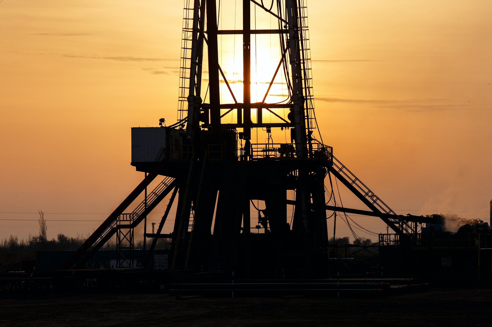
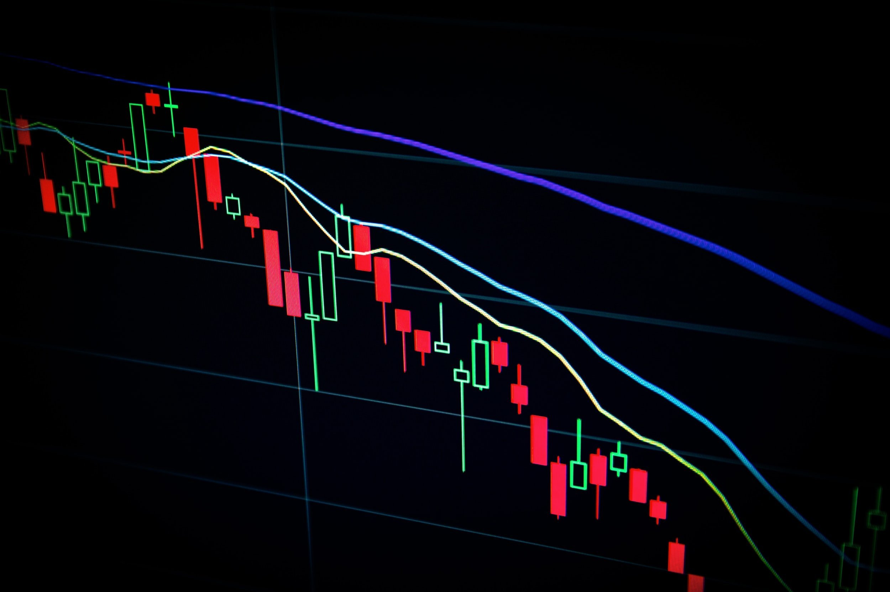

# Weekly Insights Review

**Date:** June 05, 2022  
**Publisher:** Breakwave Advisors | **Category:** Market Insights  
**Original URL:** [https://www.breakwaveadvisors.com/insights/2022/6/4/weekly-insights-review](https://www.breakwaveadvisors.com/insights/2022/6/4/weekly-insights-review)  

---

## Welcome to Our Weekly Insights Review

## Read Here Everything You Need to Know

## Russia’s Seaborne Oil Flows Changing Patterns

## Russia’s Seaborne Crude Oil Flows Are Trying to Find New Destination Countries, While the Us Has Already Set an Embargo on Russian Oil.

Russia’s seaborne crude oil flows are trying to find new destination countries, while the US has already set an embargo on Russian oil.
[Read More](https://www.breakwaveadvisors.com/insights/2022/5/30/russias-seaborne-oil-flows-changing-patterns)

> **Figure 1: 1 (2)**  
> **Interactive Data & Source:** [Breakwave Advisors Market Insights](https://www.breakwaveadvisors.com/insights/2022/5/30/base-metals-gain-as-china-promises-further-economic-support-measures) | [Local Asset](file:///C:/Users/Dell/Github/Shipping/corpus/03-breakwave/insights/2022/assets/2022-06-05_weekly-insights-review_img_128229_da978cbe44a4.jpg)

## Base Metals Gain As China Promises Further Economic Support Measures

> **Figure 2: Unsplash Image 3wwiqmom3gq**  
> **Interactive Data & Source:** [Breakwave Advisors Market Insights](https://www.breakwaveadvisors.com/insights/2022/5/30/base-metals-gain-as-china-promises-further-economic-support-measures) | [Local Asset](file:///C:/Users/Dell/Github/Shipping/corpus/03-breakwave/insights/2022/assets/2022-06-05_weekly-insights-review_img_unsplash-image-3wwiqmom3gq_c1897fa95162.jpg)

## A Risk-On Tone Across Markets Saw Commodities Erase Earlier Losses to End the Week Higher

A risk-on tone across markets saw commodities erase earlier losses to end the week higher. This was supported by rising expectations of stimulus measures in China which saw industrial commodities rebound strongly.
[Read More](https://www.breakwaveadvisors.com/insights/2022/5/30/base-metals-gain-as-china-promises-further-economic-support-measures)

## Crude Oil Gains After Eu Bans Russian Oil Imports

> **Figure 3: Unsplash Image 7syioxllpfa**  
> **Interactive Data & Source:** [Breakwave Advisors Market Insights](https://www.breakwaveadvisors.com/insights/2022/6/1/crude-oil-gains-after-eu-bans-russian-oil-imports) | [Local Asset](file:///C:/Users/Dell/Github/Shipping/corpus/03-breakwave/insights/2022/assets/2022-06-05_weekly-insights-review_img_unsplash-image-7syioxllpfa_555835c0fb2c.jpg)

## Energy Markets Gained Amid Concerns of Further Supply Disruptions

Energy markets gained amid concerns of further supply disruptions. That was offset by concerns of inflation-induced slowdown in economic activity, which weighed on sentiment across metals and agriculture sectors.

## Dead Cats Don't Bounce

## We Should Not Forget That the Fed Continues to Be the “Only Game in Town”

> **Figure 4: Unsplash Image Fixlqxahcfk**  
> **Interactive Data & Source:** [Breakwave Advisors Market Insights](https://www.breakwaveadvisors.com/insights/2022/5/31/dead-cats-dont-bounce) | [Local Asset](file:///C:/Users/Dell/Github/Shipping/corpus/03-breakwave/insights/2022/assets/2022-06-05_weekly-insights-review_img_unsplash-image-fixlqxahcfk_b0d427e67fbd.jpg)

Last week saw the best performing week since November 2020 for equities, after the Fed’s Minutes suggested that the Fed will not be more aggressive than already anticipated.

## Russian Exports Surging Despite the War

## The Extensive Dependency on Many Russian Exports, Most Notably Within the Energy Sector, Has Seen the Agreements and Implementations Taking Time

The Russian assault on Ukraine has passed the 100 days mark, and no end to the conflict appears to be in sight.
[Read More](https://www.breakwaveadvisors.com/insights/2022/6/3/russian-exports-surging-despite-the-war)

> **Figure 5: Unsplash Image V7npjmbwyj4 (1)**  
> **Interactive Data & Source:** [Breakwave Advisors Market Insights](https://www.breakwaveadvisors.com/insights/2022/6/3/oil-gains-as-opecs-faster-increase-in-output-fails-to-impress-the-market) | [Local Asset](file:///C:/Users/Dell/Github/Shipping/corpus/03-breakwave/insights/2022/assets/2022-06-05_weekly-insights-review_img_unsplash-image-v7npjmbwyj428129_cf189d804320.jpg)

> **Figure 6: Unsplash Image Lnpamla Bvq**  
> **Interactive Data & Source:** [Breakwave Advisors Market Insights](https://www.breakwaveadvisors.com/insights/2022/6/3/oil-gains-as-opecs-faster-increase-in-output-fails-to-impress-the-market) | [Local Asset](file:///C:/Users/Dell/Github/Shipping/corpus/03-breakwave/insights/2022/assets/2022-06-05_weekly-insights-review_img_unsplash-image-lnpamla-bvq_1e6f1d502feb.jpg)

## Oil Gains As Opec's Faster Increase in Output Fails to Impress the Market

## Low Inventories Amid Ongoing Disruptions Pushed Most Sectors Higher.

Mixed economic data failed to impact sentiment in commodity markets, with supply side issues taking centre stage. Low inventories amid ongoing disruptions pushed most sectors higher.

## Indonesia and Russia Remain China's Primary Sources of Coal Imports

## Imports From Indonesia Have Remained the Primary Source of Imports and Russia the Second Largest Source of Imports

> **Figure 7: Market Chart 7**  
> **Interactive Data & Source:** [Breakwave Advisors Market Insights](https://www.breakwaveadvisors.com/insights/2022/6/2/indonesia-and-russia-remain-chinas-primary-sources-of-coal-imports) | [Local Asset](file:///C:/Users/Dell/Github/Shipping/corpus/03-breakwave/insights/2022/assets/2022-06-05_weekly-insights-review_img_unnamed28229_42b9ea65b222.jpg)

China's April coal import data by origin was recently released and shows that imports from Indonesia have remained the primary source of imports and Russia the second largest source of imports.
[Read More](https://www.breakwaveadvisors.com/insights/2022/6/2/indonesia-and-russia-remain-chinas-primary-sources-of-coal-imports)
