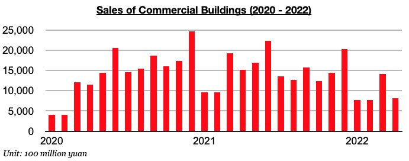
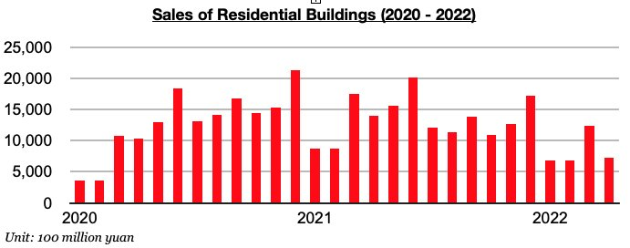

# Even Greater Weakness in China's Home Sales Recently

**Date:** June 09, 2022  
**Publisher:** Breakwave Advisors | **Category:** Market Insights  
**Original URL:** [https://www.breakwaveadvisors.com/insights/2022/6/9/even-greater-weakness-in-chinas-home-sales-recently](https://www.breakwaveadvisors.com/insights/2022/6/9/even-greater-weakness-in-chinas-home-sales-recently)  

---

*By*[*Jeffrey Landsberg*](https://www.linkedin.com/in/jeffrey-landsberg-70ab957/)

As we have been highlighting in Commodore's recent Weekly China Reports, sales of commercial buildings in China (the vast majority of which are residential homes) came under renewed pressure in January/February after previously rising to a six-month high in December. March saw the weakness intensify, and recently released April data has shown even more weakness. Commercial building sales totaled just 814 billion yuan in April. This is down from March by 43% and down year-on-year by 47%. This 47% year-on-year contraction has again marked the largest year-on-year contraction seen this decade. Sales have now contracted on a year-on-year basis for ten consecutive months.

> **Figure 1: Chart 1 (37)**  
> [Local Asset](file:///C:/Users/Dell/Github/Shipping/corpus/03-breakwave/insights/2022/assets/2022-06-09_even-greater-weakness-in-chinas-home-sales-recently_img_chart1283729_464361eb1a6b.jpg)

Also of note is that sales of residential buildings (which last year contributed to 89% of all commercial building sales) continue to experience similar weakness. Sales totaled 718 billion yuan, which is down from March by 42% and down year-on-year by 49% This has also marked the largest year-on-year contraction seen this decade. As with commercial building sales, sales of residential buildings have now contracted on a year-on-year basis for ten consecutive months.

> **Figure 2: Chart 2 (34)**  
> [Local Asset](file:///C:/Users/Dell/Github/Shipping/corpus/03-breakwave/insights/2022/assets/2022-06-09_even-greater-weakness-in-chinas-home-sales-recently_img_chart2283429_003f55ff11aa.jpg)

While May data is likely to show roughly the same amount or even more weakness, we expect that June data will ultimately show improvement. Coronavirus lockdowns and restrictions continue to be lifted, and the central bank is continuing to very clearly work to stimulate the economy. Most recently, a package of over thirty new measures covering fiscal, financial, investment and industrial policies was released last week including issuance of 140 billion yuan ($21 billion) for VAT rebates and 800 billion yuan ($120 billion) in new credit lines for infrastructure projects.
