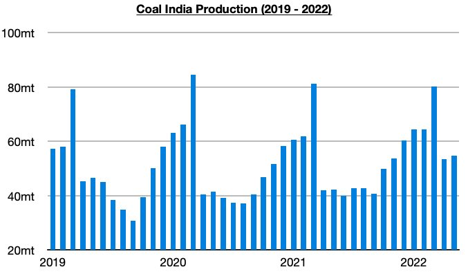
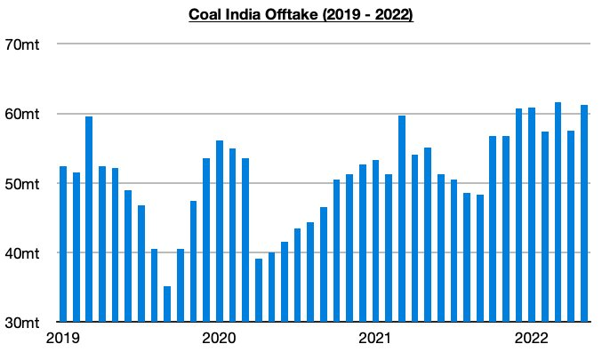
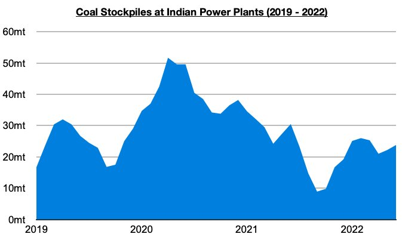

# Ongoing Strength in India (Including Domestic Coal Production)

**Date:** June 10, 2022  
**Publisher:** Breakwave Advisors | **Category:** Market Insights  
**Original URL:** [https://www.breakwaveadvisors.com/insights/2022/6/10/ongoing-strength-in-india-including-domestic-coal-production](https://www.breakwaveadvisors.com/insights/2022/6/10/ongoing-strength-in-india-including-domestic-coal-production)  

---

*By*[*Jeffrey Landsberg*](https://www.linkedin.com/in/jeffrey-landsberg-70ab957/)

The Indian economy has continued to fare particularly well this year and India’s government continues to make very prudent decisions. A record amount of steel has continued to be produced in India this year, India has dispassionately been purchasing discounted energy-inducing commodities from Russia, India’s total electricity generation and coal-derived electricity generation have each continued to enjoy a dramatic recovery, and Coal India's coal production has also continued to grow (even as the company continues to import coal).

Coal India produced approximately 54.7 million tons of coal last month, which marks a month-on-month increase of 1.2 million tons (2%) and a year-on-year increase of 12.6 million tons (30%). This 30% growth marks the largest year-on-year seen since September 2020. Also of note is that the first five months of this year have now seen Coal India’s production grow year-on-year by 29.5 million tons (10%). The strength has helped allow India’s power plant stockpiles to continue to increase.

> **Figure 1: Chart 1 (38)**  
> [Local Asset](file:///C:/Users/Dell/Github/Shipping/corpus/03-breakwave/insights/2022/assets/2022-06-10_ongoing-strength-in-india-including-domestic-coal-production_img_chart1283829_cc0c22e8128b.jpg)

Offtake (amount sent to customers) totaled 61.2 million tons last month, which marks a month-on-month increase of 3.7 million tons (6%) and a year-on-year increase of 6.1 million tons (11%). Offtake has now increased on a year-on-year basis for fifteen straight months (production has increased on a year-on-year basis for fourteen straight months). The first five months of this year have now seen offtake increase year-on-year by 25.1 million tons (9%).

> **Figure 2: Chart 2 (35)**  
> [Local Asset](file:///C:/Users/Dell/Github/Shipping/corpus/03-breakwave/insights/2022/assets/2022-06-10_ongoing-strength-in-india-including-domestic-coal-production_img_chart2283529_f0573facb963.jpg)

The healthy amount of coal production (and imports) has helped to allow India's power plant coal stockpiles to continue to rise in recent weeks. Most recently, last week saw India’s power plant coal stockpiles climb to approximately 23.8 million tons. This is 1.6 million tons (7%) more than was stockpiled at the end of the previous week but is down year-on-year by 5.5 million tons (-19%). Stockpiles have now increased for two straight weeks and can now meet 9 days of demand. The normal requirement for this time of year is still to meet 24 days of demand.

> **Figure 3: Chart 3 (27)**  
> [Local Asset](file:///C:/Users/Dell/Github/Shipping/corpus/03-breakwave/insights/2022/assets/2022-06-10_ongoing-strength-in-india-including-domestic-coal-production_img_chart3282729_93d92af614f7.jpg)
