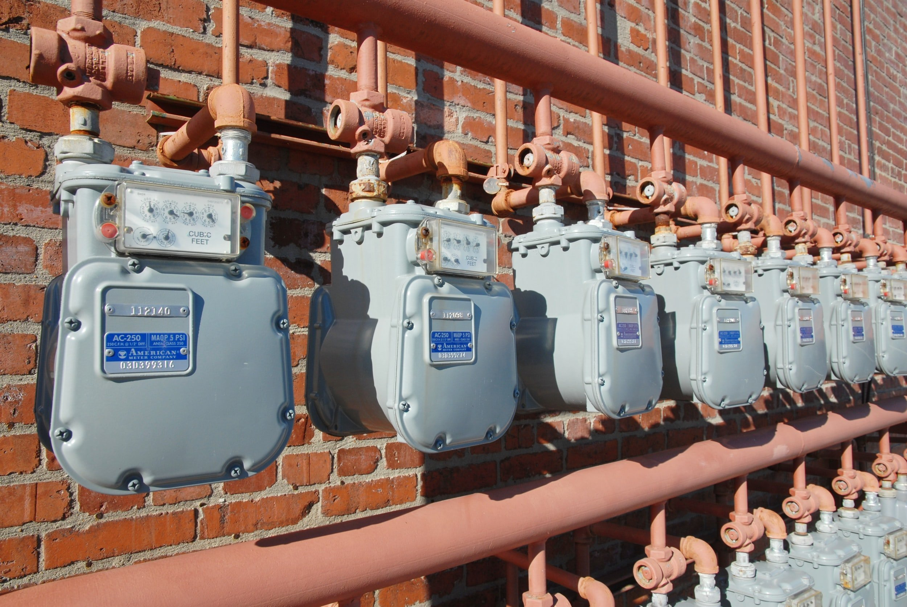

# Weekly Insights Review

**Date:** June 12, 2022  
**Publisher:** Breakwave Advisors | **Category:** Market Insights  
**Original URL:** [https://www.breakwaveadvisors.com/insights/2022/6/11/ssyckvin6i0hsbb0ol4pa5xdzx35kx](https://www.breakwaveadvisors.com/insights/2022/6/11/ssyckvin6i0hsbb0ol4pa5xdzx35kx)  

---

## Welcome to Our Weekly Insights Review

## Read Here Everything You Need to Know

## Shipping Decarbonization Weekly Insights

## Latest Trends on Fuel Transition, Shipyard Actions, Government, Ports, Financing and Industry Players.

LNG is now leading the way for alternative fuels. There are now 805 LNG-fuelled ships in operation or on order, and 229 more ‘LNG-ready’ ships, according to the latest Alternative Fuels Insight from the classification society, DNV.
[Read More](https://www.breakwaveadvisors.com/insights/2022/6/6/shipping-decarbonization-weekly-insights)

> **Figure 1: Unsplash Image Edlbha4davy**  
> **Interactive Data & Source:** [Breakwave Advisors Market Insights](https://www.breakwaveadvisors.com/insights/2022/6/6/schrodingers-put) | [Local Asset](file:///C:/Users/Dell/Github/Shipping/corpus/03-breakwave/insights/2022/assets/2022-06-12_ssyckvin6i0hsbb0ol4pa5xdzx35kx_img_unsplash-image-edlbha4davy_6f761bd42fd7.jpg)

## Schrodinger's Put

## So It Tries to Treat a Global Problem with a Local Remedy

> **Figure 2: Unsplash Image Oxyaufovzyc**  
> **Interactive Data & Source:** [Breakwave Advisors Market Insights](https://www.breakwaveadvisors.com/insights/2022/6/6/schrodingers-put) | [Local Asset](file:///C:/Users/Dell/Github/Shipping/corpus/03-breakwave/insights/2022/assets/2022-06-12_ssyckvin6i0hsbb0ol4pa5xdzx35kx_img_unsplash-image-oxyaufovzyc_01039af0f656.jpg)

One of the most famous cats in the world was one owned by Erwin Schrodinger. In 1935, Mr. Schrodinger, a German physicist, devised an experiment.
[Read More](https://www.breakwaveadvisors.com/insights/2022/6/6/schrodingers-put)

## Even Greater Weakness in China's Home Sales Recently

## As with Commercial Building Sales, Sales of Residential Buildings Have Now Contracted on a Year-on-Year Basis for Ten Consecutive Months.

> **Figure 3: Unsplash Image Uqmob8z9yvm**  
> **Interactive Data & Source:** [Breakwave Advisors Market Insights](https://www.breakwaveadvisors.com/insights/2022/6/9/even-greater-weakness-in-chinas-home-sales-recently) | [Local Asset](file:///C:/Users/Dell/Github/Shipping/corpus/03-breakwave/insights/2022/assets/2022-06-12_ssyckvin6i0hsbb0ol4pa5xdzx35kx_img_unsplash-image-uqmob8z9yvm_870ad3f57c30.jpg)

As we have been highlighting in Commodore's recent Weekly China Reports, sales of commercial buildings in China (the vast majority of which are residential homes) came under renewed pressure in January/February after previously rising to a six-month high in December
[Read More](https://www.breakwaveadvisors.com/insights/2022/6/9/even-greater-weakness-in-chinas-home-sales-recently)

## Oil Gains Amid Increasingly Bullish Fundamentals

> **Figure 4: Unsplash Image Ec5f9hhma6w**  
> **Interactive Data & Source:** [Breakwave Advisors Market Insights](https://www.breakwaveadvisors.com/insights/2022/6/8/oil-gains-amid-increasingly-bullish-fundamentals) | [Local Asset](file:///C:/Users/Dell/Github/Shipping/corpus/03-breakwave/insights/2022/assets/2022-06-12_ssyckvin6i0hsbb0ol4pa5xdzx35kx_img_unsplash-image-ec5f9hhma6w_483038a580ed.jpg)

## A Stronger Usd Also Weighed on Investor Appetite

Weak economic data and warnings that growth will continue to slow due to tighter monetary policies saw sentiment suffer across commodity markets.

> **Figure 5: Unsplash Image 1dfecuwlpdi**  
> **Interactive Data & Source:** [Breakwave Advisors Market Insights](https://www.breakwaveadvisors.com/insights/2022/6/10/ongoing-strength-in-india-including-domestic-coal-production) | [Local Asset](file:///C:/Users/Dell/Github/Shipping/corpus/03-breakwave/insights/2022/assets/2022-06-12_ssyckvin6i0hsbb0ol4pa5xdzx35kx_img_unsplash-image-1dfecuwlpdi_e85abe0a9ff3.jpg)

## Ongoing Strength in India (Including Domestic Coal Production)

The Indian economy has continued to fare particularly well this year and India’s government continues to make very prudent decisions.

## The Big Picture: Supply Update

## Growth to Stay Low

At 914m dwt, the dry bulk fleet has grown by 1.5% so far this year. We have taken a fresh look at our assumptions for supply going forward and outline some of the results below.
[Read More](https://www.breakwaveadvisors.com/insights/2022/6/10/the-big-picture-supply-update)

> **Figure 6: Unsplash Image Fryfh6gap0u**  
> [Local Asset](file:///C:/Users/Dell/Github/Shipping/corpus/03-breakwave/insights/2022/assets/2022-06-12_ssyckvin6i0hsbb0ol4pa5xdzx35kx_img_unsplash-image-fryfh6gap0u_05f76fce6ea2.jpg)
