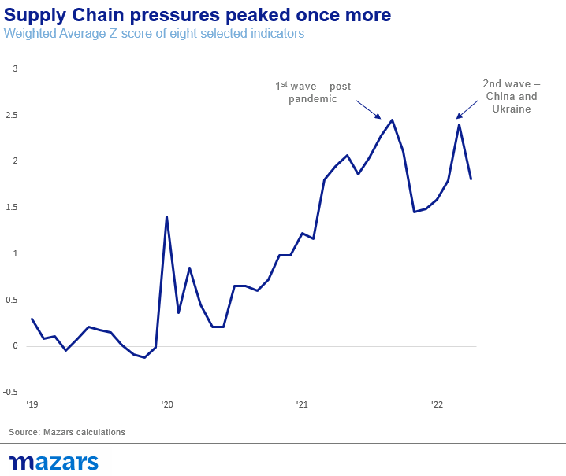

# Morning comment: What do you do when the ‘only game in town’ is a bad one?

**Date:** June 13, 2022  
**Publisher:** Breakwave Advisors | **Category:** Market Insights  
**Original URL:** [https://www.breakwaveadvisors.com/insights/2022/6/13/morning-comment-what-do-you-do-when-the-only-game-in-town-is-a-bad-one](https://www.breakwaveadvisors.com/insights/2022/6/13/morning-comment-what-do-you-do-when-the-only-game-in-town-is-a-bad-one)  

---

*By*[*George Lagarias*](https://www.linkedin.com/in/george-lagarias-mba-3baa769/)

Markets crashed at the back end of last week, as US inflation surprised again on the upside, registering a new cycle-high. The S&P 500 is back below 4000 points, as investors are pricing in a more aggressive policy stance.

Frankly, we are somewhat surprised also. Not by persisting inflation but by the fact that markets seem surprised. Often, forecasters get hung up on the year-on-year effect on the numbers. Inflation was already up 5% in April 2021, the thinking goes. Therefore, this April, the previous inflation effect goes away and the final number should be pressured down. This approach would make sense if we were talking about the same inflation cycle. However, we are not. What we are seeing is two supply-side inflation cycles running back-to-back.

> **Figure 1: Market Chart 1**  
> [Local Asset](file:///C:/Users/Dell/Github/Shipping/corpus/03-breakwave/insights/2022/assets/2022-06-13_morning-comment-what-do-you-do-when-the-only-game-in-town-is-a-bad-one_img_image001_a8e063ac5fc1.png)

Last year, inflation was all about post-pandemic supply chain dislocations. While supply chains remain at the epicentre of rising prices, this time around, the reason is not simply pandemic-related dislocations but a confluence of much more severe and impactful events:

- The war in Ukraine which push up food prices
- The sanctions on resource-producing Russia push up energy and raw materials prices
- The Chinese slowdown, a result of lockdowns and more long-term factors

China especially is a big cause for concern. Its zero-Covid policy, following a crackdown on key industries in the past twelve months, is forcing developed market firms to reconsider their supply chains. This is, in and by itself, a cause for a 2-3 year inflationary bout as firms relocate and redesign their value chains.

We believe that supply-side inflation pressures may continue to build up. Sanctions on Russia are hurting developed markets, especially Europe, as much as their intended targets.

Classic economic cycle theory suggests that first inflation rises, then rates rise, then the economy slows along with inflation, at which point central banks revert to monetary accommodation, kicking off a new bull market cycle.

However, this time around, timing may not be so convenient. The reasons behind this inflationary bout are serious (war, sanctions, China, value chain transformation) and could last for a long time. Thus, inflation could keep rising, even as the economy is taking a nosedive. Investors expecting, or rather wishing, inflation away in the next 3-4 months could be in for a disappointment. Likewise, central banks waiting for the number to come down so they can resume their accomodative policy before the economy crashes, could find themselves in a pickle. They might have to actively choose between an economic recession with unforeseen consequences and continuing the fight against persistent global inflation.

Investors don’t care much about the economy, or inflation, or even interest rates. They remain fixed on the ‘only game in town’, monetary accommodation. As long as numbers persist in their current direction, volatility and sell-offs on any sign of strength, the hallmark characteristics of a bear market, will remain the norm.

Investors need to remain fast, and confident. If solutions don’t come from policy makers, then they will come from lower valuations and a return to more traditional measures of corporate value. It could take time. But in the history of capitalism, long-term systematic investors are rewarded.
