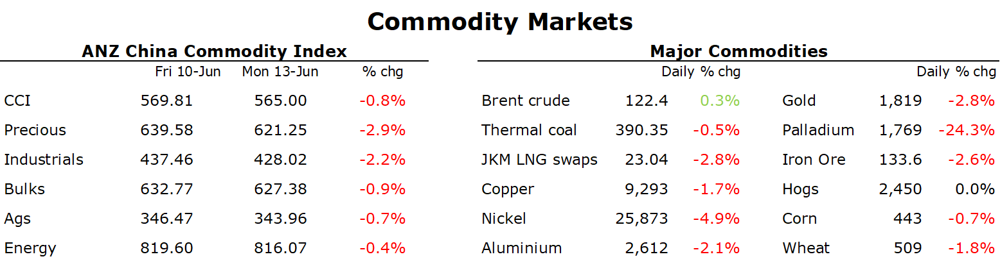

# Metals fall sharply amid a broader risk off across markets

**Date:** June 14, 2022  
**Publisher:** Breakwave Advisors | **Category:** Market Insights  
**Original URL:** [https://www.breakwaveadvisors.com/insights/2022/6/14/metals-fall-sharply-amid-a-broader-risk-off-across-markets](https://www.breakwaveadvisors.com/insights/2022/6/14/metals-fall-sharply-amid-a-broader-risk-off-across-markets)  

---

*By*[*Daniel Hynes*](https://www.linkedin.com/in/dahynes/)

A broad risk-off tone across markets saw commodities start the week under further pressure. Precious and industrial metals led the complex lower as the USD weighed on investor appetite.

> **Figure 1: 1655156938450**  
> **Interactive Data & Source:** [Publications Anz](https://publications.anz.com/SingletrackCMS__DownloadDocument?docRef=28ac1b45-cafe-4332-b93b-5aa0c5d6410d&uid=bd219b92-f5cc-400e-9646-4178791864b7&jobRef=21fbeb7d-267d-4fa8-85d0-2d3bec3f80de) | [Local Asset](file:///C:/Users/Dell/Github/Shipping/corpus/03-breakwave/insights/2022/assets/2022-06-14_metals-fall-sharply-amid-a-broader-risk-off-across-markets_img_1655156938450_b3bb5c298a29.png)

**Gold**fell the most in three months as rampant inflation raised the prospect of aggressive monetary tightening by the US Federal Reserve. The bigger than expected rise in inflation on Friday raised market expectations of a Fed rate hike at the next meeting, with some commentators calling for 75bp. Money market traders are pricing in 175bp of rate hikes by September. The USD rallied and the yields on US Treasuries rose sharply, both reducing gold’s appeal to investors. Gold quickly wiped out its gains on Friday, where it traded as high as USD1,875/oz, to end the session down 2.8%.

Concerns of weaker economic growth as central banks hike rates weighed on sentiment in the**base metals**market.**Aluminium**fell to a six-month low while**copper**was also down sharply as worries about weaker demand in China also came into play. Following the easing of some restrictions in recent weeks, the market was reminded of the rollercoaster ride it is on when authorities in Shanghai sealed a district with 2.65m people last week for mass testing. These little outbreaks of COVID-19 could hinder the economic recovery and weigh on demand. The market had been encouraged by the[**strong level of imports in May**](https://publications.anz.com/SingletrackCMS__DownloadDocument?docRef=28ac1b45-cafe-4332-b93b-5aa0c5d6410d&uid=bd219b92-f5cc-400e-9646-4178791864b7&jobRef=21fbeb7d-267d-4fa8-85d0-2d3bec3f80de). Another strong month in trade is becoming increasingly unlikely amid the issues in China.

**Crude oil**managed to shrug off the broader market selloff as expectations of ongoing supply side issues outweighed weakness in demand. The European ban on Russian oil is expected to tighten the market further, even without a strong rebound in demand from China. Inventories continue to fall in most major consuming nations, with product fuel prices subsequently rising to record highs. The lack of response from oil producers to the tightness in oil market was reflected by EIA data that showed they spent only USD244bn on exploration and development in 2021. This is 28% below the average over the five years before the pandemic. The lack of investment is also a reason why OPEC has struggled to raise output even as it’s raised its quotas by 400kb/d per month under its production agreement. Adding further pressure in the physical market is a plunge in Libyan output. A political crisis is leading to a shutdown of ports and fields, according to Oil Minister, Mohamed Oun. Production has fallen to only 100kb/d, compared with 1.2mb/d last year.

**European natural gas**also managed to gain as supply issues perked up. Reduced flows from Norway and lower US LNG volumes added to concerns about the risk of Russian supply cuts. Despite the rising level of gas storage in Europe, it still requires large volumes of LNG to withstand any further disruptions before next winter. However, its main source, the US, may see reduced volumes following a fire at the Freeport facility in Texas. Initial investigations have found the source of the explosion; however, it’s still unclear how long it will remain shut according to safety authorities in the US. Freeport said last week that it could be curtailed for at least three weeks.**North Asian LNG**prices remained well bid, with warmer weather in the region raising the spectre of strong demand. This could be offset by ongoing lockdowns in China and a truck strike in South Korea that could weigh on industrial demand.

**European carbon**prices were steady amid the gains in energy prices. However, the market is awaiting developments from the European Parliament's environment committee, which meets this week to discuss a revamped report on the Fit for 55 ETS reform package, after the original version was rejected.

Data source:[Commodities Wrap](https://www.linkedin.com/newsletters/commodities-wrap-6692196755876012032/?fbclid=IwAR3kiXJqZdxmp9ZcRwBNI7FsBySI-XSC0pfPur1qzjt7OZp7PTE59Tsl1QI)
