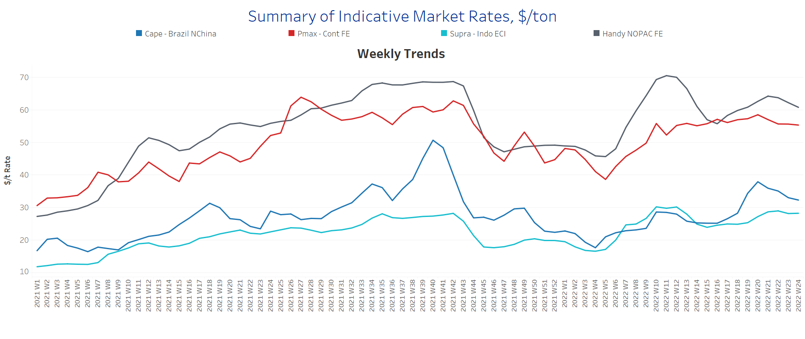
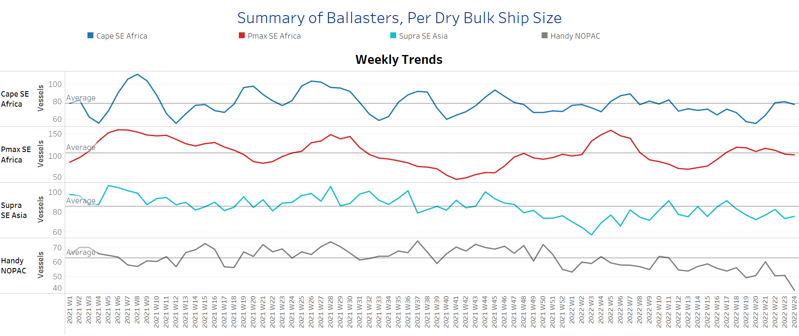
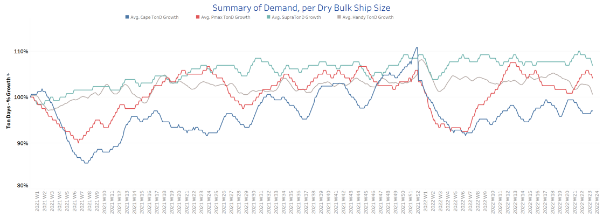
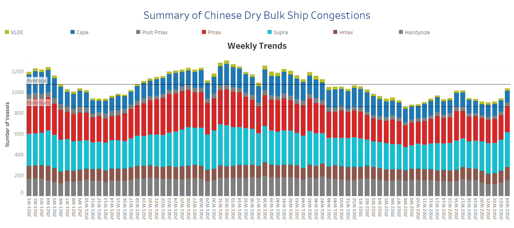

# Signal Dry Bulk Weekly Report

**Date:** June 15, 2022  
**Publisher:** Breakwave Advisors | **Category:** Market Insights  
**Original URL:** [https://www.breakwaveadvisors.com/insights/2022/6/15/signal-dry-bulk-weekly-report](https://www.breakwaveadvisors.com/insights/2022/6/15/signal-dry-bulk-weekly-report)  

---

Freight rates are in a downward trend after mid-May, with the Capesize segment recording the firmest decline as the Chinese economy is still trying to tackle covid-19 outbreaks.

Prices for iron ore cargoes with a 63.5% iron content for delivery into Tianjin tumbled to an over two-week low of around $135-per-tonne Monday morning, as renewed coronavirus outbreaks in China sparked fears of lockdowns, dampening demand in the world’s top steel producer.

Recent lockdowns in China, which has a zero-covid policy, have sharply slowed economic activity, adding to a grim global outlook amid the fallout from the ongoing Russia-Ukraine geopolitical tensions and a worldwide monetary policy tightening to curb inflation.

In the coal segment, Newcastle coal futures were trading below the $400-per-tonne mark, a level not seen in a month, as surging inventories and weaker demand continued to pressure the market. Still, coal prices remained elevated, rallying to as high as $430 in late May, supported by a tightening market as the geopolitical tensions and the unprecedented economic sanctions, including the EU's ban on oil and coal imports from Russia, have thrown the global energy market into chaos.

The weakening Chinese demand for coal seems to persist with the last month ending with lower levels of Chinese imports. According to the General Administration of Customs, China brought in 20.55 million tons in May, 2.3 percent lower than a year ago, which was also lower than the 23.55 million tons that arrived in April.

In the grain market, the situation is still crucial with India emerging as an active player in wheat exports over the last few days. India’s food ministry said it may reintroduce wheat exports to selected neighbors depending on availability, including major exporter Indonesia, backtracking the decision to ban shipments that supported prices to near record-highs in May. Meanwhile, investors continued to monitor diplomatic developments regarding possible Ukrainian grain shipments. Expectations for the resumption of exports from Ukraine remain subdued as the West is unlikely to relax sanctions on Moscow, a requirement by the Kremlin to open trade corridors in the Ukrainian Black Sea and Sea of Azov ports. Latest estimates indicated that 22 million tons of Ukrainian grain are now stuck in port silos since shipments were halted on February 24.

## Section 1 - Freight -Market Rates ($/T) - Weaker

‘The Big Picture’ - Capesize and Panamax Bulkers and Smaller Ship Sizes

> **Figure 1: Market Chart 1**  
> **Interactive Data & Source:** [Signal Ocean Platform](https://www.thesignalgroup.com/signal-ocean-platform) | [Local Asset](file:///C:/Users/Dell/Github/Shipping/corpus/03-breakwave/insights/2022/assets/2022-06-15_signal-dry-bulk-weekly-report_img_unnamed282029_5cf1f404ac0f.png)

A weaker sentiment of freight rates persisted in all vessel size categories, with the Capesize and Handysize segments recording a noticeable downward trend following the last peak of Week 20.

- **Capesize**Brazil-to-North China freight rates dropped to $32.5/t, $5.5/t less than the ending of Week 20.
- **Panamax**Continent-to-Far East freight recorded a slight decrease to $55/t, while rates seemed to follow the pace of Week 10.
- **Supramax**Indo-to-ECI freight rates held almost similar levels to one week ago at around $28/t, however, slightly weaker than Week 20.
- **Handysize**NOPAC-to-Far East freight rates fell to $61/t with room for a further decrease. The current levels are now in a steep fall of $10/t less than the levels of Week 10.

## Section 2 - Supply - Ballasters View

## Number of Vessels -Increasing

> **Figure 2: Supply Trend Lines for Key Load Areas**  
> **Interactive Data & Source:** [Signal Ocean Platform](https://www.thesignalgroup.com/signal-ocean-platform) | [Local Asset](file:///C:/Users/Dell/Github/Shipping/corpus/03-breakwave/insights/2022/assets/2022-06-15_signal-dry-bulk-weekly-report_img_unnamed282129_a0fd10aea429.png)

The number of ballasters increased over the last two weeks, with the number of ships standing nearly at the one-year average for the Capesize and Panamax segments.

- **Capesize**SE Africa: The number of vessels sailing in ballast increased to 78 vessels, 23 vessels more than the ending of Week 20.
- **Panamax**SE Africa: The number of vessels sailing in ballast is standing at nearly the one-year average, around 105 vessels, over the last two weeks.
- **Supramax**SE Asia: The number of vessels sailing in ballast increased to 77 vessels, 4 vessels more than the last week, however, 10% down from the one-year average trend.
- **Handysize**NOPAC: The number of vessels sustained very low levels over the last three weeks and stood at 49 vessels, 18% down from the peak of Week 21.

## Section 3 - Demand - In Ton Days

## Decreasing

> **Figure 3: Decreasing**  
> **Interactive Data & Source:** [Signal Ocean Platform](https://www.thesignalgroup.com/signal-ocean-platform) | [Local Asset](file:///C:/Users/Dell/Github/Shipping/corpus/03-breakwave/insights/2022/assets/2022-06-15_signal-dry-bulk-weekly-report_img_unnamed282229_9c6b6c84513b.png)

The overall trend of demand ton-days sustained a decreasing trend except for signs of recovered demand growth in the Capesize segment.

- **Capesize**demand ton-days: There are signs of revival over the last two weeks following the Chinese economy's return from lockdown.
- **Panamax**demand ton-days: There is a downward revision following the last peak of Week 22, however, the current growth is significantly higher than the low of Week 20.
- **Supramax**demand ton-days: There is a noticeable drop down in the last week, while the current levels seemed to be the weakest since the ending of Week 4, for the current year.
- **Handysize**demand ton-days: There is a sustained decrease week over week, and seems likely to continue through the end of the current month.

## Section 4 - Chinese Port Congestions -

## Number of Vessels - Increasing

> **Figure 4: Dry Bulk Ships Congested at Chinese Ports**  
> **Interactive Data & Source:** [Signal Ocean Platform](https://www.thesignalgroup.com/signal-ocean-platform) | [Local Asset](file:///C:/Users/Dell/Github/Shipping/corpus/03-breakwave/insights/2022/assets/2022-06-15_signal-dry-bulk-weekly-report_img_unnamed282329_bc5ff3497551.png)

Dry bulk ships in congestion seemed to have sustained an increasing pace during the first two weeks of June.

- **Capesize:**The number of ships in congestion increased to 114 vessels, up by 8% from last week’s levels.
- **Panamax:**The number of ships recorded a remarkable increase to 249, up by 11% from the lows of Week 20.
- **Supramax:**The number of ships in congestion surpassed the barrier of 300 vessels and stood at 330. It is interesting to note that the current levels are the highest seen since the beginning of this year.
- **Handysize**: The number of ships in congestion increased to 149, a 28% increase from the low of Week 22.

Data Source:[Signal Ocean Platform](https://www.thesignalgroup.com/signal-ocean-platform)
