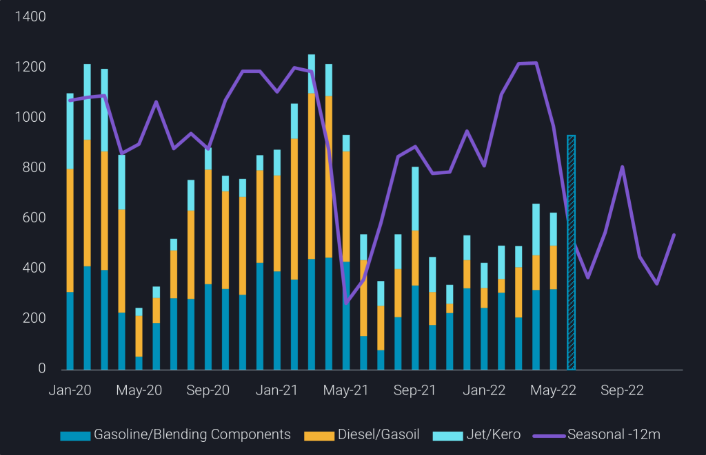
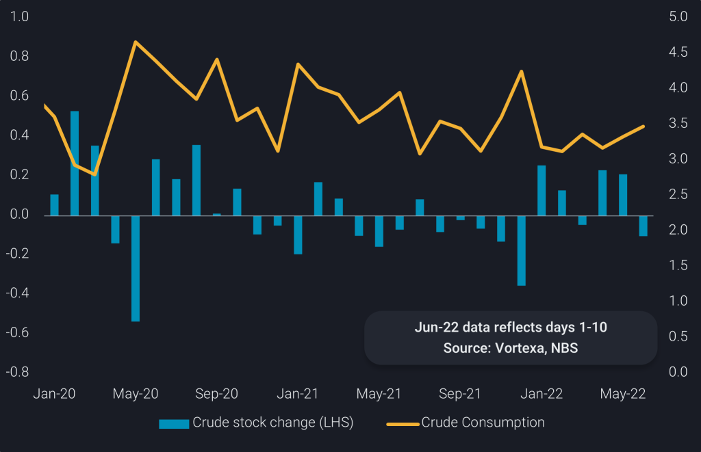
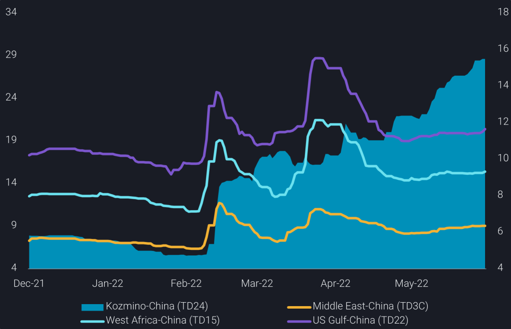

# A bumpy road to recovery for Chinese refiners

**Date:** June 16, 2022  
**Publisher:** Breakwave Advisors | **Category:** Market Insights  
**Original URL:** [https://www.breakwaveadvisors.com/insights/2022/6/16/a-bumpy-road-to-recovery-for-chinese-refiners](https://www.breakwaveadvisors.com/insights/2022/6/16/a-bumpy-road-to-recovery-for-chinese-refiners)  

---

*By*[*Emma Li*](https://www.linkedin.com/in/emma-li-73003443/)

Chinese refiners have gone through a tough spring season this year, as the Russia-Ukraine war has driven up global crude prices while prolonged Covid lockdowns in the country have dented domestic fuel demand. The country now aims to stabilise and bring its economy back on track by rolling out a slew of incentives, including more tax credits and fiscal stimuli to combat inflation and bolster consumption for the rest of the year. As domestic demand shows signs of recovery, refiners have been ramping up operating rates in key manufacturing centres since late May, but the road to full recovery will be a slow one as the country maintains strict adherence to its zero-Covid strategy.

## Additional Product Export Quotas a Sign of a Bigger Second Batch?

Last week, China issued additional clean product (gasoline, diesel, and jet) export quotas to selected refiners that were facing high product inventories resulting from poor domestic consumption. The additional quotas are not an indicator for a bigger second batch of quotas to come, as the government remains committed to consolidating the country’s refining sector to meet its long-term carbon emissions goal. The 4.5mt of additional quotas, equivalent to nearly 35% of the first batch, are meant to cover the refiners’ June and July export needs and are not considered as the second batch of quotas since they came earlier and were only given to selected refiners. Sinopec and PetroChina won the lion’s share among the four awardees, while no independent refiners received any allocations.

China has granted a total of 17.5mt of export quotas so far this year, still relatively low compared with the 29.5mt in the same batch last year. Refiners exported around 10mt of clean products in the first five months, compared to more than 20mt in the same period last year. With the additional quotas, refiners will likely boost gasoline and diesel exports in the coming weeks, as domestic diesel demand has weakened towards the end of a busy farming and fishing season, and construction activities have been hampered by frequent rain in the southern regions. Gasoline demand has shown signs of a pick-up with passenger mobility rising after major lockdowns have been lifted. But the road to recovery remains a bumpy one with the government’s swift lockdowns whenever there is a new covid outbreak. Higher export over domestic margins for gasoline have encouraged refiners to send their surplus supplies to the international market, instead of stockpiling them locally

> **Figure 1: Picture1 1024x661**  
> **Interactive Data & Source:** [Analytics Vortexa](https://analytics.vortexa.com/?dateRange=2019-01-01T00%3A00%3A00.000Z__2022-05-31T23%3A59%3A59.999Z&filtersEnabled=%5B%22p%22%2C%22o%22%2C%22d%22%2C%22d_r%22%2C%22v%22%2C%22intra%22%2C%22sts_o%22%2C%22c_o%22%2C%22v_o%22%2C%22c%22%2C%22w%22%5D&from=%5B%22b5fafce6e20de2dc307fb7e0b89978ee91a49a7b6ec6f5461daf2633f3c56674%22%5D&metric=bpd&page=Flows&products=%5B%22deda35eb9ca56b54e74f0ff370423f9a8c61cf6a3796fcb18eaeeb32a8c290bb%22%2C%229256907ba7e4ed11ff03aa297a7e62e14484ce5a85c8118c7495b9120ad0e268%22%2C%22d72edbab2b5e2e249d8c216909945922a02eb017dd200f90876fee6fa180c743%22%5D&tabId=0a0fa6d3-b422-46d0-b49c-e3784637df5f&timeSeriesHiddenSeries=%5B%22d7c97202bcb916580fb554245b1ed66965c0bb2ac71b55f34883d91bfdadcdda%22%2C%22seasonal_comparison_24%22%5D&timeSeriesProperty=product_group_product) | [Local Asset](file:///C:/Users/Dell/Github/Shipping/corpus/03-breakwave/insights/2022/assets/2022-06-16_a-bumpy-road-to-recovery-for-chinese-refiners_img_picture1-1024x661_d7de71f53bee.png)

## Independent Refiners Raise Runs Using Discounted Russian Crude

High crude prices are posing another impediment to China’s refining recovery, as the cascading impact on rising transport fuel and petrochemical prices is dampening consumer demand. Fortunately, discounted Russian crude (imports of which are on-track to breach 1.2mbd in June), together with even cheaper Iranian and Venezuelan barrels, have boosted refining margins, driving Chinese independent refiners to ramp up runs this month. Shandong’s implied crude consumption, calculated based on Vortexa’s net seaborne crude inflows and crude stock changes, on top of official data on Shandong crude output, was near 3.5mbd in Jun 1-10, the highest seen in 2022 so far, albeit still down from a year ago. Higher refinery runs have led to a drawdown of Shandong’s onshore crude inventories in the week ending Jun 9 after a two-month building period.

China’s overall refining run rates are expected to extend gains in the coming weeks as more refiners complete their seasonal maintenance, and extra product export quotas will incentivise state-run refiners to ramp up runs. However, currently high crude prices will limit the upside to China’s crude imports, as not all Chinese refiners are prepared to risk buying Russian or sanctioned crudes, and domestic refining and petchem margins tend to be lacklustre in crude price settings above the $100/b mark.

> **Figure 2: Shandong Crude Stock Change (Mbd**  
> *Shandong crude stock change (mbd, LHS)vs. implied crude consumption (mbd, RHS)*  
> **Interactive Data & Source:** [Analytics Vortexa](https://analytics.vortexa.com/?dateRange=2020-05-01T00%3A00%3A00.000Z__2022-06-10T06%3A09%3A09.612Z&hiddenSeries=%5B%22b5fafce6e20de2dc307fb7e0b89978ee91a49a7b6ec6f5461daf2633f3c56674%22%2C%22a63890260e29d859390fd1a23c690181afd4bd152943a04c00cd6a5ecf3f7d1e%22%2C%22781cacc7033f877caa4b4106d096b74afe006a96391bf5a56a4f55b849359a42%22%2C%22total_capacity%22%5D&onshoreInventoriesLocations=%5B%22b5fafce6e20de2dc307fb7e0b89978ee91a49a7b6ec6f5461daf2633f3c56674%22%2C%220fddbfd0d90bad306a92fcb483a19276f101a5f7f0783363f9f2a9d40c10558d%22%5D&page=OnShoreCrudeInventories&selectedRegion=%5B%220fddbfd0d90bad306a92fcb483a19276f101a5f7f0783363f9f2a9d40c10558d%22%5D&tabId=0cd16ff6-30e9-4ff7-a5c6-915250d00cc2&tankCrude=%5B%22confirmed%22%2C%22probable%22%5D&timeSeriesTotalCapacityToggle=1) | [Local Asset](file:///C:/Users/Dell/Github/Shipping/corpus/03-breakwave/insights/2022/assets/2022-06-16_a-bumpy-road-to-recovery-for-chinese-refiners_img_picture2-1024x661_8cb04e1f111b.png)

## Aframax Rates Up While Vlccs Struggle

Growing imports of Russian crude have squeezed imports of the more expensive spot barrels from West of Suez, which has impacted shipping demand.[China’s crude imports from Africa, Brazil and Norway](https://analytics.vortexa.com/?dateRange=2020-01-01T00%3A00%3A00.000Z__2022-06-15T23%3A59%3A59.999Z&from=%5B%22c4a371acd7c3df8bd70e49805e76cb39b1309ccac3d0f4289120079a9ad68bcd%22%2C%226ac49669e238276d51719480fddfee2e18cf265f43678ed995071d363ee943f5%22%2C%22459d056652a0b7aa7f630bd2a26c97d192a61154e4c2c7afeaa06ce2880fc91f%22%5D&metric=bpd&movementEvent=unloading_start&page=Flows&products=%5B%2254af755a090118dcf9b0724c9a4e9f14745c26165385ffa7f1445bc768f06f11%22%5D&tabId=a973444c-c834-4af9-b649-efe99b8a6877&timeSeriesHiddenSeries=%5B%22seasonal_comparison_24%22%5D&timeSeriesProperty=origin_country&to=%5B%22b5fafce6e20de2dc307fb7e0b89978ee91a49a7b6ec6f5461daf2633f3c56674%22%5D)registered a m-o-m decline for a fourth consecutive month in the first half of June, down nearly 30% from a year ago. This has seen VLCC demand for these long-haul voyages cooling significantly over the past few months, putting downward pressures on tanker rates.

In contrast, Aframax rates have risen almost four-fold compared to pre-war levels as most Russian crude cargoes, whether from the east or the west travel on the relatively small vessel class, amid constrained vessel supply as some ship owners are reluctant to get involved in shipping Russian oil.

> **Figure 3: VLCC Freight Rates Ontd3c**  
> *VLCC freight rates onTD3C,TD15,TD22($/t, LHS) vs. Aframax freight rate onTD24($/t, RHS)*  
> **Interactive Data & Source:** [Analytics Vortexa](https://analytics.vortexa.com/?dateRange=last-exact-six-months&page=FreightPricing&preset=TD3C&ratesBreakdownProperty=cost&tabId=55b2af8a-973e-464e-a9bd-83466720fa8c) | [Local Asset](file:///C:/Users/Dell/Github/Shipping/corpus/03-breakwave/insights/2022/assets/2022-06-16_a-bumpy-road-to-recovery-for-chinese-refiners_img_picture3-1024x661_2d3683d679ea.png)

Data Source:[Vortexa](https://www.vortexa.com//oil-gas-data-traders-analysts-data-scientists?gclid=Cj0KCQjw8_qRBhCXARIsAE2AtRZKOvMnbilZ_6_91d7huSFFy71pWLrnPwGwOHVzXsmsG-1a1mZnQw8aAt89EALw_wcB&hsa_acc=1782073842&hsa_ad=548425387665&hsa_cam=14746637662&hsa_grp=125038601902&hsa_kw=&hsa_mt=&hsa_net=adwords&hsa_src=g&hsa_tgt=dsa-1431852288425&hsa_ver=3&utm_campaign=%5BCD%5D%20-%20DSA%20-%20EMEA&utm_medium=cpc&utm_medium=ppc&utm_source=google&utm_source=adwords&utm_term=)
