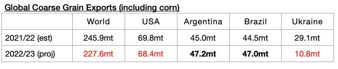
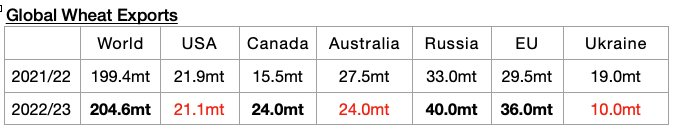
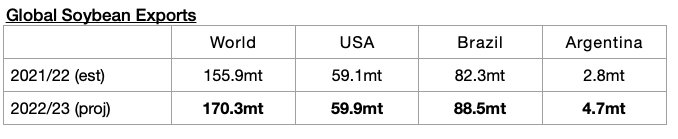
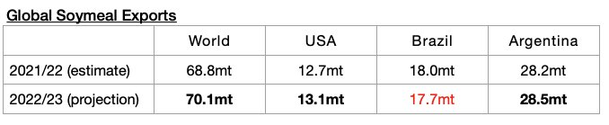

# Small Reduction in Global Grain Trade Forecast

**Date:** June 17, 2022  
**Publisher:** Breakwave Advisors | **Category:** Market Insights  
**Original URL:** [https://www.breakwaveadvisors.com/insights/2022/6/17/small-reduction-in-global-grain-trade-forecast](https://www.breakwaveadvisors.com/insights/2022/6/17/small-reduction-in-global-grain-trade-forecast)  

---

*By*[*Jeffrey Landsberg*](https://www.linkedin.com/in/jeffrey-landsberg-70ab957/)

The United States Department of Agriculture (USDA) recently released their second global grain export forecast for the upcoming 2022/23 season. The forecast is still very preliminary, but of note is that only 486.3 million tons of exports are expected. This is 1 million tons less than was forecast a month ago and would mark a year-on-year decline of 11.9 million tons (-2%) from the 498.2 million tons that is now expected for the current 2021/22 season. Wheat exports are still expected to rebound, while coarse grain exports are still expected to decline.

The USDA is now forecasting that global coarse grain exports in 2022/23 will total 227.6 million tons, which 600,000 tons less than was forecast a month ago and would mark a year-on-year decline of 18.3 million tons (-7%) from the 245.9 million tons that is now for the current 2021/22 season.

> **Figure 1: Chart 1 (34)**  
> [Local Asset](file:///C:/Users/Dell/Github/Shipping/corpus/03-breakwave/insights/2022/assets/2022-06-17_small-reduction-in-global-grain-trade-forecast_img_chart1283429_b80201486718.jpg)

Global wheat exports are expected to total 204.6 million tons. This is 300,000 tons less than was forecast a month ago but would mark a year-on-year increase of 5.2 million tons (3%) from the 199.4 million tons that is now for the current 2021/22 season.

> **Figure 2: Chart 2 (31)**  
> [Local Asset](file:///C:/Users/Dell/Github/Shipping/corpus/03-breakwave/insights/2022/assets/2022-06-17_small-reduction-in-global-grain-trade-forecast_img_chart2283129_4488e47373d5.jpg)

Global soybean exports (soybeans are not technically classified as a grain) are expected to total 170.3 million tons. This is 300,000 tons more than was forecast a month ago and would mark a year-on-year increase of 14.4 million tons (9%).

> **Figure 3: Chart 3 (26)**  
> [Local Asset](file:///C:/Users/Dell/Github/Shipping/corpus/03-breakwave/insights/2022/assets/2022-06-17_small-reduction-in-global-grain-trade-forecast_img_chart3282629_0a3f851dbbea.jpg)

Global soymeal exports are expected to total 70.1 million tons. This is 300,000 tons more than was forecast a month ago and would mark a year-on-year increase of 1.3 million tons (2%).

> **Figure 4: Chart 4 (15)**  
> [Local Asset](file:///C:/Users/Dell/Github/Shipping/corpus/03-breakwave/insights/2022/assets/2022-06-17_small-reduction-in-global-grain-trade-forecast_img_chart4281529_6f6b382a6079.jpg)
