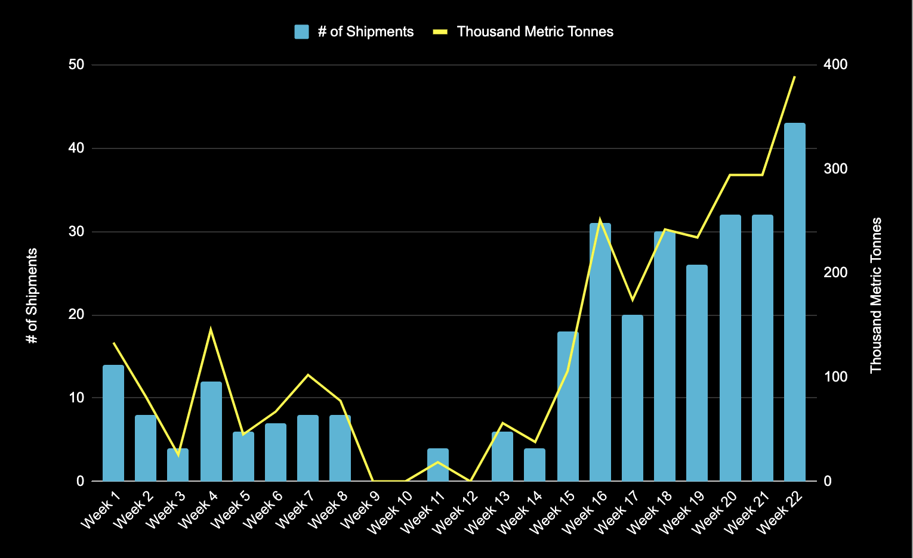

# Ukraine Finds New Routes to Export Grains by Sea

**Date:** June 17, 2022  
**Publisher:** Breakwave Advisors | **Category:** Market Insights  
**Original URL:** [https://www.breakwaveadvisors.com/insights/2022/6/17/ukraine-finds-new-routes-to-export-grains-by-sea](https://www.breakwaveadvisors.com/insights/2022/6/17/ukraine-finds-new-routes-to-export-grains-by-sea)  

---

*By*[*Alex Stuart*](https://www.linkedin.com/in/alex-s-a4671644/)

Ukrainian grain exports from Danube River ports have been surging in recent weeks with Ukraine trying to find alternative export routes with other larger commercial ports such as Odessa and Mariupol either shut or under Russian control.

Ukraine has faced difficulties exporting commodities since the beginning of the invasion with most of the country’s commercial ports remaining shut since then. The country is known as ‘the breadbasket of Europe’, and is the world’s fourth-largest grain exporter, with Middle Eastern and Northern African countries, too, heavily reliant on the country for grain.

> **Figure 1: Using Shipfix Ais Trade Flows Data**  
> *Chart: using Shipfix AIS Trade Flows data, this chart shows shipments so far this year from the Ukrainian Danube River Ports of Kiliya, Izmail and Reni. The chart shows that over the last few months exports from these ports have been surging as Ukraine finds a way to ship grains to international markets.*  
> **Interactive Data & Source:** [Shipfix](https://shipfix.com/) | [Local Asset](file:///C:/Users/Dell/Github/Shipping/corpus/03-breakwave/insights/2022/assets/2022-06-17_ukraine-finds-new-routes-to-export-grains-by-sea_img_1_3e437ab98d39.png)

Only the Ukrainian ports of Reni, Izmail, and Kiliia on the Danube river have been able to start up again to export grains. Last week there were over 40 vessels leaving these ports laden with grain, well above the volumes exported from these river ports pre-invasion.

Further volumes have found foreign markets by other means, such as through Polish ports. Crucially, these ports are able to handle larger stem sizes than is operationally possible on the Danube. An ESL Shipping bulker, named the Alppila loaded 18,000 Mt of corn with the cargo set to be discharged at A Coruna port in Spain.

Along with the economic reward from selling these grains, there is also limited grain silo availability in Ukraine. With the new harvest starting in September, there is the potential for significant volumes of grains to go to waste if last year’s grains are unable to quickly find foreign markets. An estimated 30 million metric tonnes of grains are stored in territory held by Ukraine, with the country desperately trying to export by any means necessary - including via road, rail, and road.

The International Grains Council (IGC) estimates that 15 million metric tonnes of Ukrainian grains are now in Russian-occupied areas. Some of these stolen grain volumes have reportedly started to be exported, with a few willing customers such as Syria continuing to import regardless of origin. Several vessels have also reportedly been arrested, a trend which is expected to grow over the coming months as countries become increasingly desperate in face of rising grain prices.

From UN estimates, 49 million people in 43 countries globally are now at risk of hunger, so what happens to these ‘stuck’ grains remains of critical importance. Dry bulk shipping is key to solving this puzzle with there being extensive challenges for shipowners to navigate, including considerable insurance premiums and crew safety concerns.

Data Source:[Shipfix](https://shipfix.com/)
