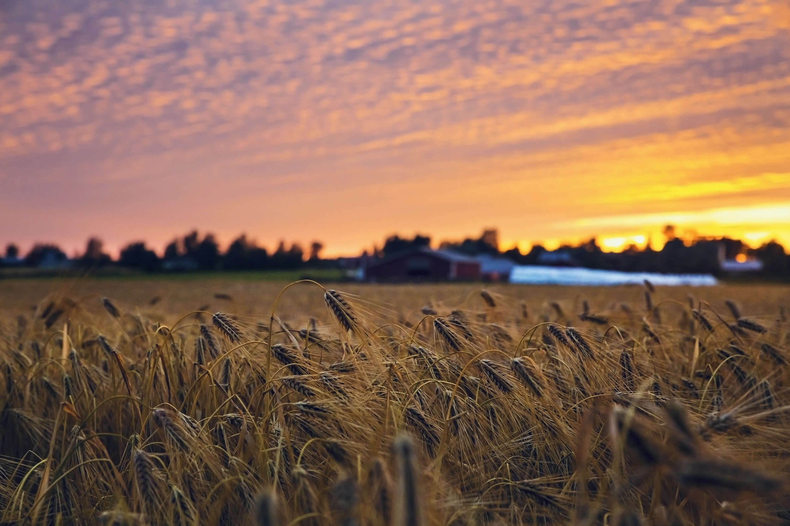
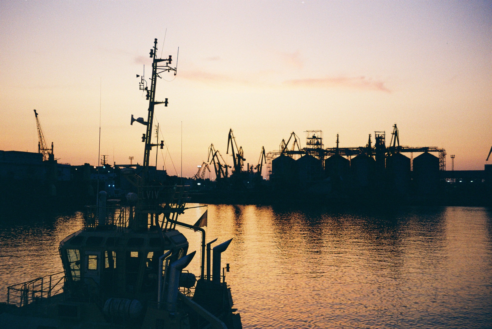

# Weekly Insights Review

**Date:** June 19, 2022  
**Publisher:** Breakwave Advisors | **Category:** Market Insights  
**Original URL:** [https://www.breakwaveadvisors.com/insights/2022/6/19/weekly-insights-review](https://www.breakwaveadvisors.com/insights/2022/6/19/weekly-insights-review)  

---

## Welcome to Our Weekly Insights Review

## Read Here Everything You Need to Know

> **Figure 1: Unsplash Image Axsovglahmc**  
> **Interactive Data & Source:** [Breakwave Advisors Market Insights](https://www.breakwaveadvisors.com/insights/2022/6/13/shipping-decarbonization-weekly-insights) | [Local Asset](file:///C:/Users/Dell/Github/Shipping/corpus/03-breakwave/insights/2022/assets/2022-06-19_weekly-insights-review_img_unsplash-image-axsovglahmc_bc7c64878b4d.jpg)

## Shipping Decarbonization Weekly Insights

## Latest Trends on Fuel Transition, Shipyard Actions, Government, Ports, Financing and Industry Players.

The transition of the shipping industry to green future is in full force with 63% of orders for newbuilding vessels this year to have been for alternative fuel capable units. LNG remains the leading alternative fuel today, featuring in 59% of orders in 2022 so far where as it factored into just 28% of orders last year.

[Read More](https://www.breakwaveadvisors.com/insights/2022/6/13/shipping-decarbonization-weekly-insights)

## Morning Comment: What Do You Do When the ‘Only Game in Town’ Is a Bad One?

## Markets Crashed at the Back End of Last Week Registering a New Cycle-High

Markets crashed at the back end of last week, as US inflation surprised again on the upside, registering a new cycle-high.
[Read More](https://www.breakwaveadvisors.com/insights/2022/6/13/morning-comment-what-do-you-do-when-the-only-game-in-town-is-a-bad-one)

> **Figure 2: Unsplash Image 5fd2jdygo 8**  
> **Interactive Data & Source:** [Breakwave Advisors Market Insights](https://www.breakwaveadvisors.com/insights/2022/6/15/ongoing-strength-in-india-including-domestic-coal-production) | [Local Asset](file:///C:/Users/Dell/Github/Shipping/corpus/03-breakwave/insights/2022/assets/2022-06-19_weekly-insights-review_img_unsplash-image-5fd2jdygo-8_5aa5989d9240.jpg)

## Ongoing Strength in India (Including Domestic Coal Production)

> **Figure 3: Unsplash Image Amlbxs8syig**  
> **Interactive Data & Source:** [Breakwave Advisors Market Insights](https://www.breakwaveadvisors.com/insights/2022/6/15/ongoing-strength-in-india-including-domestic-coal-production) | [Local Asset](file:///C:/Users/Dell/Github/Shipping/corpus/03-breakwave/insights/2022/assets/2022-06-19_weekly-insights-review_img_unsplash-image-amlbxs8syig_e22bb997f5d2.jpg)

## The Indian Economy Has Continued to Fare Particularly Well This Year and India’s Government Continues to Make Very Prudent Decisions

The Indian economy has continued to fare particularly well this year and India’s government continues to make very prudent decisions.
[Read More](https://www.breakwaveadvisors.com/insights/2022/6/15/ongoing-strength-in-india-including-domestic-coal-production)

## Metals Fall Sharply Amid a Broader Risk Off Across Markets

> **Figure 4: Unsplash Image J5ywvdec394**  
> **Interactive Data & Source:** [Breakwave Advisors Market Insights](https://www.breakwaveadvisors.com/insights/2022/6/14/metals-fall-sharply-amid-a-broader-risk-off-across-markets) | [Local Asset](file:///C:/Users/Dell/Github/Shipping/corpus/03-breakwave/insights/2022/assets/2022-06-19_weekly-insights-review_img_unsplash-image-j5ywvdec394_18a5dc003ce2.jpg)

### Precious and Industrial Metals Led the Complex Lower As the Usd Weighed on Investor Appetite

In October of 1974, five previously all-male colleges of the University of Oxford admitted female undergraduates for the first time in its 878 years of history.
[Read More](https://www.breakwaveadvisors.com/insights/2022/6/14/metals-fall-sharply-amid-a-broader-risk-off-across-markets)

## A Bumpy Road to Recovery for Chinese Refiners

> **Figure 5: Unsplash Image Hbbj6ws2iaq**  
> **Interactive Data & Source:** [Breakwave Advisors Market Insights](https://www.breakwaveadvisors.com/insights/2022/6/16/a-bumpy-road-to-recovery-for-chinese-refiners) | [Local Asset](file:///C:/Users/Dell/Github/Shipping/corpus/03-breakwave/insights/2022/assets/2022-06-19_weekly-insights-review_img_unsplash-image-hbbj6ws2iaq_996889d379f5.jpg)

## China’s Refining Sector Is Recovering From a COVID-Related Recession Amidst a Series of Push and Pull Factors, However, the Road to Full Recovery Will Be a Slow One.

Chinese refiners have gone through a tough spring season this year, as the Russia-Ukraine war has driven up global crude prices while prolonged Covid lockdowns in the country have dented domestic fuel demand.

[Read More](https://www.breakwaveadvisors.com/insights/2022/6/16/a-bumpy-road-to-recovery-for-chinese-refiners)

## Signal Dry Bulk Weekly Report

## Snapshot of Spot Freight Rates, Supply-Demand Trends, Port Congestions

> **Figure 6: Unsplash Image U7vum Kpfao**  
> **Interactive Data & Source:** [Breakwave Advisors Market Insights](https://www.breakwaveadvisors.com/insights/2022/6/15/signal-dry-bulk-weekly-report) | [Local Asset](file:///C:/Users/Dell/Github/Shipping/corpus/03-breakwave/insights/2022/assets/2022-06-19_weekly-insights-review_img_unsplash-image-u7vum-kpfao_1bdd842a17cd.jpg)

Freight rates are in a downward trend after mid-May, with the Capesize segment recording the firmest decline as the Chinese economy is still trying to tackle covid-19 outbreaks.
[Read More](https://www.breakwaveadvisors.com/insights/2022/6/15/signal-dry-bulk-weekly-report)

## Small Reduction in Global Grain Trade Forecast

> **Figure 7: Unsplash Image Qltogcr Mzc**  
> **Interactive Data & Source:** [Breakwave Advisors Market Insights](https://www.breakwaveadvisors.com/insights/2022/6/17/ukraine-finds-new-routes-to-export-grains-by-sea) | [Local Asset](file:///C:/Users/Dell/Github/Shipping/corpus/03-breakwave/insights/2022/assets/2022-06-19_weekly-insights-review_img_unsplash-image-qltogcr-mzc_d869f691e5d0.jpg)

## Wheat Exports Are Still Expected to Rebound, While Coarse Grain Exports Are Still Expected to Decline

The United States Department of Agriculture (USDA) recently released their second global grain export forecast for the upcoming 2022/23 season.
Read More

## Ukraine Finds New Routes to Export Grains by Sea

> **Figure 8: Unsplash Image Kek Yvtbtfi**  
> **Interactive Data & Source:** [Breakwave Advisors Market Insights](https://www.breakwaveadvisors.com/insights/2022/6/17/ukraine-finds-new-routes-to-export-grains-by-sea) | [Local Asset](file:///C:/Users/Dell/Github/Shipping/corpus/03-breakwave/insights/2022/assets/2022-06-19_weekly-insights-review_img_unsplash-image-kek-yvtbtfi_deb26a6bf710.jpg)

## Αlternative Export Routes with Other Larger Commercial Ports Such As Odessa and Mariupol Either Shut or Under Russian Control

Ukrainian grain exports from Danube River ports have been surging in recent weeks with Ukraine trying to find alternative export routes with other larger commercial ports such as Odessa and Mariupol either shut or under Russian control.
[Read More](https://www.breakwaveadvisors.com/insights/2022/6/17/ukraine-finds-new-routes-to-export-grains-by-sea)
