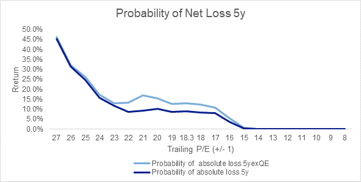

# Stocks don’t capitulate at 18x. They capitulate at 15x.

**Date:** June 21, 2022  
**Publisher:** Breakwave Advisors | **Category:** Market Insights  
**Original URL:** [https://www.breakwaveadvisors.com/insights/2022/6/21/stocks-dont-capitulate-at-18x-they-capitulate-at-15x](https://www.breakwaveadvisors.com/insights/2022/6/21/stocks-dont-capitulate-at-18x-they-capitulate-at-15x)  

---

*By*[*George Lagarias*](https://www.linkedin.com/in/george-lagarias-mba-3baa769/)

Cycles of boom and bust often end with money printing and money devaluation. It’s pretty clear we are seeing the end of one this time. However, we don’t know how long it will last, nor can we be sure we have seen the end of money-printing. it’s an open question how cycle-end mechanics would work without a direct challenge to the Dollar’s supremacy -the US Greenback still accounts for 59% of global Forex reserves.

Last week, it became evident that we have entered a new era for markets and central banks. The Fed’s triple rate hike on Wednesday marked the end of a 14-year cycle markets had entered after the 2008 Global Financial Crisis. That much has become apparent and a market consensus is forming around the idea.

Quantitative Easing, the primary driver of asset prices in the past fourteen years, is, for the time being and for all intents and purposes off the table. Instead, quantitative tightening, its opposite operation, coupled with steep rate hikes, is now the name of the game.

### The Question in Every Investor’s Mind Is Where Do We Go From Here?

For one, investors should de-anchor from previous stock market levels. The S&P may have fallen more than one thousand points (22%) from its highs, but this movement alone should not inform us about the possibility of capitulation (in essence the rebound). The previous high is not what we should be looking at, especially when that high was achieved during a previous paradigm. The NASDAQ peaked in 2000. It took fifteen years to reach its precious highs. The Nikkei peaked in 1989. At its best (2020), it managed to recover 76% of its losses.

Instead of looking at market levels, investors should be going back to fundamentals and looking at valuations. Currently, on a trailing earnings basis, the S&P 500 is trading at 18.3 times its earnings, a full point above its long term average. From where we are today, ex-QE investors should expect returns around the average, at 7.4% per annum on average.

**Historically, stocks don’t capitulate at 18 P/E. They capitulate at 14-15 P/E.**

> **Figure 1: Market Chart 1**  
> [Local Asset](file:///C:/Users/Dell/Github/Shipping/corpus/03-breakwave/insights/2022/assets/2022-06-21_stocks-dont-capitulate-at-18x-they-capitulate-at-15x_img_unnamed282429_0ce9955dbd83.png)

At current earnings this would mean the S&P 500 at 2800-3000. Assuming a 10% drop in earnings as the economy slows down, we would be looking at capitulation levels nearly one more thousand points below where we are today, 2550-2700 points for the S&P 500 or another 30% drop from current levels.

And that is without accounting for possible dislocations for financial markets, further pressures on the financial system, exploding inflation and other systematic variables.

### What Does It All Mean?

The point I’m making is that we have scruples about the Fed’s willingness to allow things to go so far.

The US central bank has acknowledged, after all, it’s limited impact on supply-side inflation.

The system does have a lot of leverage, but this is mostly due to government and non-corporate lending. So the immediate effect of high interest rates would be that governments would borrow less (thus slowing the economy a bit more) and private investors would pay less to participate in new ventures. Over the medium term, higher rates will attack expensive real estate valuations all over the world, and even further reduce the accumulated wealth of consumers.

Hardly the stuff of nightmares. But no nightmares are needed for valuations (and prices) to come down to capitulation levels.

When the smoke of inflation subsides, we will have our definitive answer: Will the US Federal Reserve ever go back to money printing again?

For all its newfound hawkishness, the Fed is fighting +8% inflation with a 1.75% rate and a deficient transmission mechanism, as bank lending to consumers and business has slowed down in the past few years. Despite a very tight jobs market, the rate at which prices go up could slow withing the next twelve months independently of what the Fed does. At that time, pressures on the economy and the financial system will have already built. The US Federal Reserve could easily revert back to QE-form once it makes sure inflation is no longer a threat.

And this is what keeps investors from selling off their equity exposure: the probability of another shift in Fed policy.

Currently, we can’t be sure whether we will revisit some version of the previous paradigm. And where we can’t be sure, we need to remain cautious. This is not a dip for traders or even long-term allocators.

This is the market searching for a new paradigm. As long as we don’t have one and valuations remain significantly above their traditional capitulation levels, client portfolios need to run conservatively.
