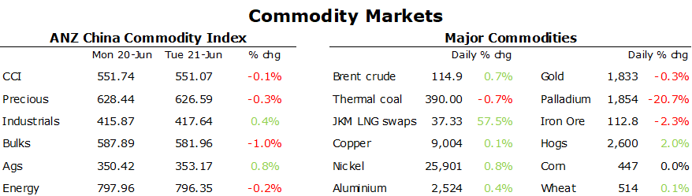

# Commodities rebound as sentiment improves

**Date:** June 22, 2022  
**Publisher:** Breakwave Advisors | **Category:** Market Insights  
**Original URL:** [https://www.breakwaveadvisors.com/insights/2022/6/22/commodities-rebound-as-sentiment-improves](https://www.breakwaveadvisors.com/insights/2022/6/22/commodities-rebound-as-sentiment-improves)  

---

*By*[*Daniel Hynes*](https://www.linkedin.com/in/dahynes/)

An improving mood across markets saw commodity markets stabilise after the recent sell-off. The improving sentiment saw metals push higher, while energy remained well bid amid supply side issues.

> **Figure 1: 1655849130006**  
> **Interactive Data & Source:** [Publications Anz](https://publications.anz.com/SingletrackCMS__DownloadDocument?docRef=2149df4a-4910-4706-8912-fb084b59e0f0&uid=bd219b92-f5cc-400e-9646-4178791864b7&jobRef=f56b1b25-d71b-4487-9e9e-12fd2647e807) | [Local Asset](file:///C:/Users/Dell/Github/Shipping/corpus/03-breakwave/insights/2022/assets/2022-06-22_commodities-rebound-as-sentiment-improves_img_1655849130006_ce825930ee37.png)

**Base metals**rebounded as sentiment improved across commodity markets. Risk appetite was helped by comments from US President Joe Biden, who said that a US recession is not inevitable. The focus also returned to the fundamentals, with shrinking inventories supporting the gains. Zinc led the sector higher after inventories recorded another strong drawdown at London Metal Exchange warehouses. Stockpiles are now down more than 60% since the start of the year. Some of this tightness has been driven by declining output in Europe where[**high energy prices have curtailed smelters**](https://publications.anz.com/SingletrackCMS__DownloadDocument?docRef=2149df4a-4910-4706-8912-fb084b59e0f0&uid=bd219b92-f5cc-400e-9646-4178791864b7&jobRef=f56b1b25-d71b-4487-9e9e-12fd2647e807). This could be exacerbated by flooding in Guangxi province, which is home to 8% of China’s total zinc capacity. Copper gained after data showed China’s shipments of cars rebounded in May. That gain was driven by electric vehicle sales, which more than doubled.

The improving sentiment also saw**iron ore**futures in Singapore stage a recovery. Front month futures gained 2.7% to USD113.95/t following a 23% fall over the previous eight sessions. While construction activity has been weak, mills have continued to pump out steel. This has led to a sharp increase in inventories. Iron ore should find some support from supply side issues, with exports out of Australia and Brazil easing back from recent levels.

**Crude oil**climbed higher as markets recovered from last week’s rout. Sentiment was supported by comments from oil trader, Vitol, who said Chinese demand is recovering in a market that is struggling to increase supplies. This has been driven by easing lockdowns in cities such as Shanghai and Beijing. Vitol expects the country’s oil consumption to rise by 1mb/d by the end of the year. The market is still coming to terms with the increasing disruption to Russian oil. European sanctions have yet to kick in. In fact, Europe has received close to 14mbbls of diesel-type fuel from Russia since the invasion of Ukraine according to Bloomberg data. That’s a relatively limited drop off from pre-war levels. ExxonMobil warned that global oil markets will remain tight for another 3-5 years because of lack of investment. This was backed up by the International Energy Forum, which said global investment will be stagnant this year and may even decline as producers deal with volatile prices.

**European gas**pushed higher as the market continues to fret about further disruptions to Russian supplies. Gas flows have dropped sharply in recent days, with the pipeline operating at only 40% of its capacity. Gazprom continues to point to trouble gaining parts for its turbines that pump oil through the Nord Stream pipeline. However, Germany’s Economy Minister Robert Habeck accused Vladimir Putin of mounting an economic attack on Europe by cutting supplies. European countries are preparing for further cuts by turning to coal-fired power. Major German industries are also ready to lower consumption to allow gas to go into storage so there’s enough stockpiled for heating in the winter.**North Asian LNG**futures rallied sharply, with Japan-Korea Marker gaining nearly 10% to end the session at USD37.32/MMBtu. The shortages of pipeline gas in Europe is likely to lead increase competition for LNG cargo in Asia. This could come as Chinese demand rebounds amid easing lockdowns.

**Gold**struggled to keep its head above water as US bond yields rose. The losses could have been even greater, with safe-haven demand from investors remaining strong as economic concerns weigh on equity markets.

Data source:[Commodities Wrap](https://www.linkedin.com/newsletters/commodities-wrap-6692196755876012032/?fbclid=IwAR3kiXJqZdxmp9ZcRwBNI7FsBySI-XSC0pfPur1qzjt7OZp7PTE59Tsl1QI)
