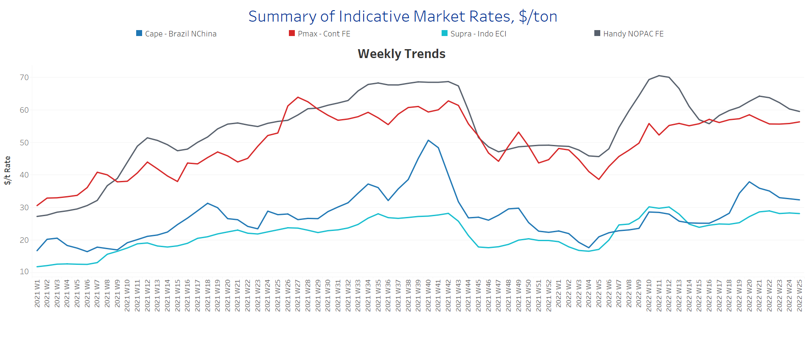
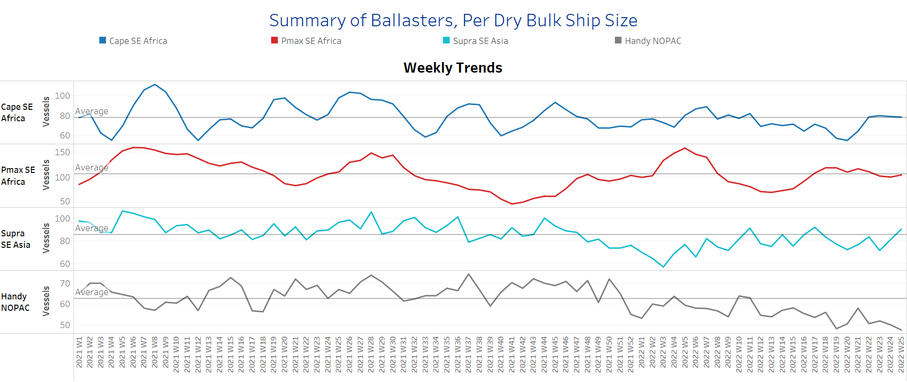
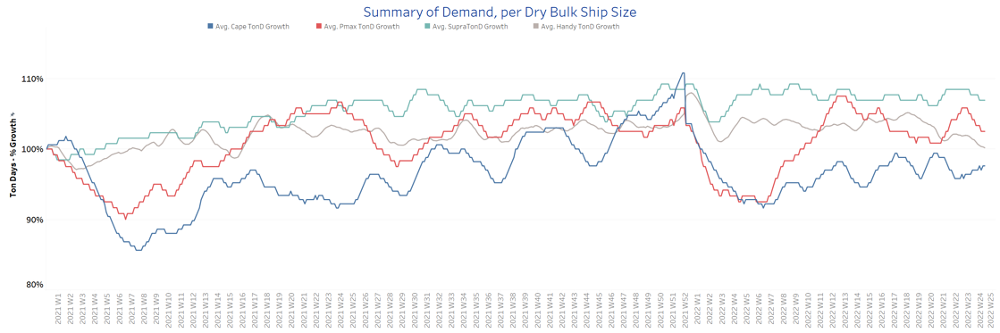

# Signal Dry Bulk Weekly Report

**Date:** June 22, 2022  
**Publisher:** Breakwave Advisors | **Category:** Market Insights  
**Original URL:** [https://www.breakwaveadvisors.com/insights/2022/6/22/signal-dry-bulk-weekly-report](https://www.breakwaveadvisors.com/insights/2022/6/22/signal-dry-bulk-weekly-report)  

---

Freight rates kept dropping, as seen in the last few weeks, while the number of ballasters increases, excluding the Handysize segment.

In the iron ore market, prices for iron ore cargoes with a 63.5% iron content for delivery into Tianjin slid to a six-month low of $111.35/ton following an 8% drop on Monday, pursuant to reports of Chinese steel mills cutting production. This last movement reflected a ninth straight session of declines, while analysts have warned that it could now fall to as low as $100/ton, for the first time since November. The Chinese property market is still in a slump, triggering continued price drops.

In the coal segment, BHP has announced that it will retain New South Wales Energy Coal (NSWEC) in its portfolio and seek the relevant approvals to continue mining beyond its current mining consent that expires in 2026. The decision follows BHP's review of its lower-grade metallurgical and energy coal assets that was first announced back in August 2020 and has also resulted in the divestment of the company's interests in Cerrejón and BHP Mitsui Coal (BMC) in January and May.

Newcastle coal futures, the benchmark for top consuming region Asia, were still trading below the barrier of $400/ton while surging inventories and weaker demand continued to exert pressure on the market. However, market expectations predict an increase in prices as the EU's ban on Russian oil and coal imports have sparked chaos and confusion in the global energy market.

In the grain market, Chicago wheat futures slid to $10 per bushel in June, the lowest in 10 weeks, as the beginning of winter wheat harvesting in North America and Europe and expectations of a large crop from Russia are expected to ease supply concerns. However, the resumption of Ukraine exports remains muted, while the Indian food ministry recently announced that the country would potentially allow exports of up to 500,000 mt of wheat to Egypt and Jordan at a time when both countries are finding it challenging to secure wheat supplies.

## Section 1 - Freight -Market Rates ($/T) - Weaker

‘The Big Picture’ - Capesize and Panamax Bulkers and Smaller Ship Sizes

> **Figure 1: Market Chart 1**  
> **Interactive Data & Source:** [Signal Ocean Platform](https://www.thesignalgroup.com/signal-ocean-platform) | [Local Asset](file:///C:/Users/Dell/Github/Shipping/corpus/03-breakwave/insights/2022/assets/2022-06-22_signal-dry-bulk-weekly-report_img_unnamed282529_c2f1409b2519.png)

This week sees a continued drop in freight rates, while small signs of a rebound could be seen in the Panamax segment.

- **Capesize**Brazil-to-North China freight rates dropped further to $32/t, $6/t less than the end of Week 20.
- **Panamax**Continent-to-Far East freight rates climbed to $56/t. The current levels stand higher than the end of Week 20.
- **Supramax**Indo-to-ECI freight rates remained steady in the last three weeks, still holding at around $28/t.
- **Handysize**NOPAC-to-Far East freight rates slipped to under $60/t for the first time since the end of Week 18.

## Section 2 - Supply - Ballasters View

## Number of Vessels -Increasing

> **Figure 2: Supply Trend Lines for Key Load Areas**  
> **Interactive Data & Source:** [Signal Ocean Platform](https://www.thesignalgroup.com/signal-ocean-platform) | [Local Asset](file:///C:/Users/Dell/Github/Shipping/corpus/03-breakwave/insights/2022/assets/2022-06-22_signal-dry-bulk-weekly-report_img_unnamed282629_e72a1307c161.png)

The number of ballasters kept rising, as seen in the last couple of weeks, with the exception of the handysize segment, where the last three weeks have seen a sharp drop.

- **Capesize**SE Africa: The number of vessels sailing in ballast stayed at the yearly average of 78 vessels, 23 more than the end of Week 20.
- **Panamax**SE Africa: The number of vessels sailing in ballast did not really fluctuate much, holding at 105, close to the one-year average.
- **Supramax**SE Asia: The number of vessels sailing in ballast increased to 91 vessels, 19 more than the end of Week 23, and 6% above the one-year average.
- **Handysize**NOPAC: The number of vessels kept dropping, reaching the low of 48, 18% down from the peak of Week 21.

## Section 3 - Demand - In Ton Days

## Decreasing

> **Figure 3: Decreasing**  
> **Interactive Data & Source:** [Signal Ocean Platform](https://www.thesignalgroup.com/signal-ocean-platform) | [Local Asset](file:///C:/Users/Dell/Github/Shipping/corpus/03-breakwave/insights/2022/assets/2022-06-22_signal-dry-bulk-weekly-report_img_unnamed282729_4323b28ffbd2.png)

The third week of June saw demand growth recovering in the Capesize segment, whereas there is still a decrease in ton days growth for the other vessel class categories.

- **Capesize**demand ton-days: The last four weeks have seen a steady increase; having said that, the current levels are still lower than the high of Week 20.
- **Panamax**demand ton-days: The downward trend of the last few weeks remains unchanged, perhaps even steeper than recently; this means that June will probably close at a low level, lower than recent weeks.
- **Supramax**demand ton-days: The drop seen last week was maintained in recent days; at the same time, the current levels are still higher than the low seen in Week 20.
- **Handysize**demand ton-days: A negative trend is still visible, similar to the levels of Week 23.

## Section 4 - Chinese Port Congestions -

## Number of Vessels - Decreasing

## Dry Bulk Ships Congested at Chinese Ports

Dry bulk ships in congestion appear to have plateaued in recent days, remaining level in the last days of June. Be that as it may, the Handysize segment still exhibits an upward trend.

- **Capesize:**The number of ships in congestion stood at around 105, holding at similar levels to the previous week of June.
- **Panamax:**The number of ships dropped to under 230 vessels in the third week of June, 5% lower than the end of Week 23.
- **Supramax:**The number of congested vessels eventually decreased to 278, despite indications that they would break the barrier of 300 vessels in the last week.
- **Handysize**: The number of ships in congestion increased to 147, a 30% increase from the low of Week 22.

Data Source:[Signal Ocean Platform](https://www.thesignalgroup.com/signal-ocean-platform)
